# 内存管理基础-2知识点总结

## 第1节 内存管理的基石与目标

### 1.1 存储器硬件概览

-   **存储器的分类**
    -   **易失性存储器**：如RAM（随机访问存储器），断电后数据丢失。
        -   **SRAM**（静态RAM）：速度快，成本高，集成度低，用于高速缓存（Cache）。
        -   **DRAM**（动态RAM）：速度较慢，成本低，集成度高，用于主存（内存条）。包括SDRAM、DDR SDRAM等。
    -   **非易失性存储器**：断电后数据不丢失。
        -   **ROM**（只读存储器）：如PROM、EPROM、EEPROM。
        -   **Flash Memory**（闪存）：如NOR Flash、NAND Flash，用于SSD、U盘。
        -   **外存**：磁盘（Disk）、磁带（Tape）等。
    -   **新型非易失性内存（NVM）**：如PCM、忆阻器、自旋电子器件，是未来的发展方向。

-   **存储器的层次结构**
    -   **组织结构**：为了在速度、容量和价格之间取得平衡，现代计算机采用层次化存储结构，如“寄存器-缓存-内存-外存”。
    -   **设计目标**：各层次存储器应处于均衡的繁忙状态，例如通过提高缓存命中率来使主存读写保持繁忙。
    -   **性能趋势**：处理器与内存（DRAM）之间的速度差距（Memory Gap）日益扩大，成为系统性能的一大挑战。

### 1.2 内存管理的目标

内存管理需要同时满足用户（程序员）和系统（资源管理者）的双重需求。

-   **程序员（用户）视角**
希望能做到大容量、高速度（性能）、独立性与安全性

-   **系统（资源管理者）视角**
希望能做到多用户服务、高效率与利用率、低能耗控制

-   **内存管理的核心需求与基石**
    -   **需求分析**：计算机中至少存在操作系统和用户程序，必须保证它们的地址空间相互独立且受到保护。
    -   **两大基石**：
        1.  **地址独立**：程序发出的地址（逻辑地址）应与物理地址无关，使得程序可以加载到内存的任何位置运行。
        2.  **地址保护**：一个程序不能未经允许访问另一个程序的地址空间。

-   **内存管理的主要功能**
    1.  **内存分配与回收**：负责记录内存使用情况，为程序分配所需空间，并在程序结束后回收空间。
    2.  **地址变换**：将程序使用的逻辑地址转换为真实的物理地址。涉及链接、加载、运行时动态重定位等技术。
    3.  **内存共享与保护**：允许多个程序共享同一段代码或数据（如动态链接库），并设置访问权限（读、写、执行）来实施保护。
    4.  **内存扩充**：利用覆盖、交换、虚拟内存等技术，在逻辑上扩充内存容量，解决大作业在小内存中运行的问题。

## 第2节 内存分配方法

### 2-1 单道程序的内存管理

-   **背景**：在单道程序环境下，内存中仅存在一个用户程序（当前正在运行的唯一任务）和一个操作系统。不存在说一边听歌一边写文档。
-   **方法**：**静态地址翻译**。由于操作系统位置固定，用户程序可以加载到固定的起始地址。加载器在程序运行前就计算出所有指令和数据在物理内存中的**绝对物理地址**。程序一旦装入内存，它里面所有的访问地址都变成了写死的物理地址，运行时直接拿着物理地址去取数据。不需要像现代系统那样每次访问内存都要通过MMU（内存管理单元）转换一次。
-   **操作系统在内存中的位置**：

  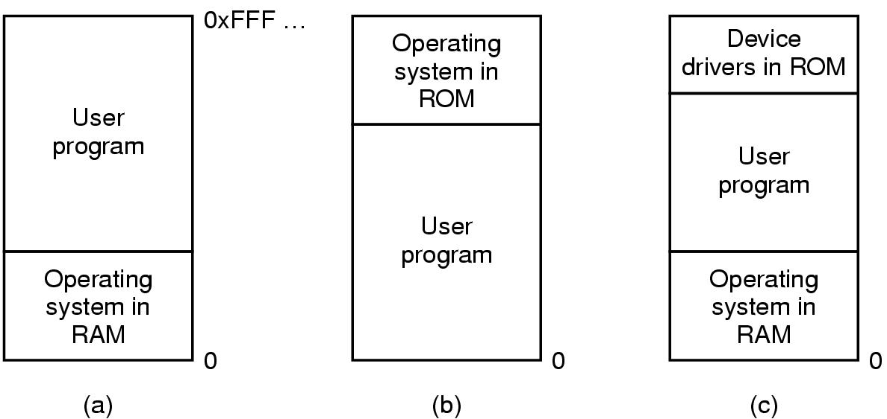

    - （a）操作系统在底部（低地址），用户程序在顶部（高地址）。这是最常见的情况，OS放在RAM的最底端。早期大型机常采用这种模式。
    - （b）操作系统在顶部（高地址，常在ROM中），用户程序在底部（低地址）。一些早期的掌上电脑或嵌入式系统可能这样设计。
    - （c）混合型：最底部的RAM放操作系统，最顶部的ROM放设备驱动，用户程序夹在中间。早期的个人计算机（如MS-DOS）常常采用这种布局。
    - 不管图片具体画的是哪一种，其核心思想是一致的：内存被简单粗暴地切成了两块（或三块），一块专门给操作系统雷打不动，剩下的一大块连续空间全部包场给当前的用户程序使用。
-   **分析**：
    -   **地址独立**：程序员在写代码的时候，无需了解物理内存条的布局。
    -   **地址保护**：系统里只有一个用户程序。
-   **优点**：运行时CPU直接读写物理总线，无需地址翻译，执行速度快。
-   **缺点**：
    1.  无法运行比物理内存大的程序。
    2.  资源浪费严重。小程序造成内存空间浪费，程序I/O时造成CPU资源浪费。
-   **思考**：
    1.  程序可加载到内存中，就一定可以正常运行吗？
    Answer：不一定。首先程序可能包含自身的逻辑错误；其次，即使全装进去了，如果程序在运行过程中动态申请的内存超过了物理内存的剩余量，也会崩溃。
    2.  用户程序运行会影响操作系统吗？
    Answer：会。所谓的`地址保护`是对`其他用户程序`的保护（因为没有其他用户程序）。在单道程序环境下，用户程序和操作系统共享同一块内存空间且没有`硬件级别的越界检查`，如果用户程序出现错误（如指针越界访问、死循环等），可以直接覆盖掉底部的操作系统代码，会直接影响操作系统的稳定性，甚至导致系统崩溃。

### 2-2 多道程序的内存管理：分区式分配

为了支持多道程序并发执行，引入了分区式分配，将内存划分为多个区域（分区），每个程序占用一个或多个分区。

#### 2-2-1 固定式分区(静态, 程序适应分区)

-   **原理**：在系统初始化时，将内存划分为若干个大小固定（相等或不等）的分区（一般是多个小分区、适量的中等分区、少量的大分区）。程序加载时，选择一个足够大且空闲的分区放入。
-   **分配策略**：
    -   **单一队列**：
    所有用户程序在一个队列中等待任何一个空闲且容量足够大的分区。
    -   **多队列**：
    为每个分区设立一个队列，程序根据大小进入对应队列，避免小程序占用大分区。
    在这个机制下，系统在完成固定分区后（例如划分了 10KB、50KB、100KB、500KB 等不同大小的分区），会为每一个确定的分区（或每一种大小的分区）建立一个专属的等待队列。
    当一个新的用户程序准备装入内存时：
    1. 操作系统首先检查该程序所需的内存大小。
    2. 然后，系统会寻找到能够装下该程序，且容量最小的那个分区（是的，只能拥有这个大小的分区）。
    3. 把这个程序放入那个专属分区的等待队列中排队。
-   **数据结构**：使用**分区表**记录每个分区的大小、起始地址和状态（已分配/未分配）。
-   **优点**：实现简单，开销小。
-   **缺点**：
    1.  **内部碎片**：程序大小与分区大小不匹配时，分区内未被利用的空间造成浪费。
    2.  分区总数固定，限制了可并发执行的程序数量。

#### 2-2-2 可变式分区

-   **原理**：分区的大小和边界是动态的，根据程序的实际需求在**程序装入内存时**“量身定制”（但并非`100%严丝合缝`）。 
    - 事先规定 size 是不再切割的剩余分区的大小。本质上，它定义了**一个空闲分区最小能有多小，才值得被系统登记管理**。
    - 设请求的分区大小为`u.size`，空闲分区的大小为`m.size`。
    - 若 `m.size-u.size ≤ size`，将整个分区分配给请求者
    - 否则，从该分区中按请求的大小划分出一块内存空间分配出去，余下的部分仍留在空闲分区表/链中
-   **优点**：没有内部碎片，内存利用率高。
-   **缺点**：会产生**外部碎片**，即许多零星的小空闲分区无法被有效利用。
-   **示例**：
假设你想要 u.size = 40KB 的内存空间，系统帮你找到了一个 m.size = 42KB 的空闲块。
  
如果不设阈值： 系统严格切给你 40KB，剩下的 2KB 作为一个新的空闲块放回链表。但是，2KB 太小了，几乎没有程序能用得上它。这个 2KB 就成了纯粹的由于切割产生的外部碎片，系统每次还要花精力去遍历、管理这块无用的垃圾空间。

设定阈值后（假设 size = 5KB）：m.size - u.size = 42 - 40 = 2KB。

因为 2KB ≤ 5KB（即 m.size - u.size <= size 条件成立），系统认为“剩下的这点缝头不值得再切了”，干脆将整个 42KB 的分区全部分配给你（即文档第96行）。虽然你会浪费掉 2KB（这里产生了一点点类似内部碎片的浪费），但大大降低了系统的链表管理开销。

反之，如果 m.size = 100KB，切走 40KB 后剩 60KB，60KB $> 5$KB，系统就会痛快地切开（文档第98行），把剩下的 60KB 留在空闲链表中供别人使用。

-   **图示**：

  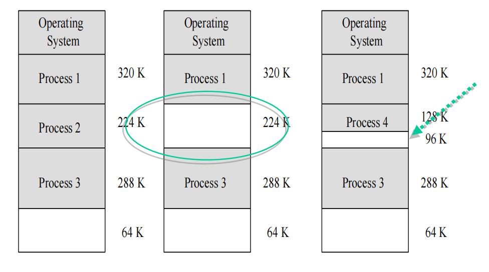

##### 2-2-2-1 空闲空间的管理数据结构

-   **位图表示法**：将内存划分为若干分配单元，每个单元用一个bit（0表示空闲，1表示占用）表示。
    **特点**：
    -   空间成本固定，不依赖内存中的程序数量，且时间复杂度低，直接修改位图值即可。操作简单。
    -   但无容错能力。如果一个分配单元为1，不能肯定应该为1还是因错误变成1。
    -   图示

  

-   **链表表示法**：将所有空闲分区（或所有分区）通过链表链接起来。表项通常是内存控制块（MCB），分为已分配（AMCB）和空闲（FMCB）。
    **特点**：
    -   空间成本动态变化，链表操作（如扫描、插入、删除、修改）速度较慢。
    -   但有一定容错能力。因为链表有被占空间和闲置空间的表项，可以相互验证。
    -   图示

  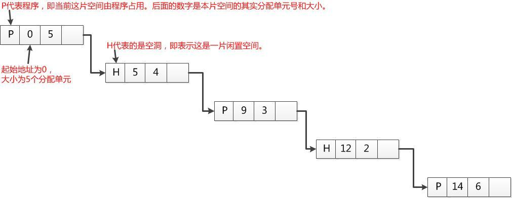

##### 2-2-2-2 基于顺序搜索的分配算法

注意，这个只用于很小的系统。当空闲分区链较短时，顺序搜索效率较高。

1.  **首次适应算法（First Fit）**
    -   **原理**：空闲分区按**地址递增**顺序排列。从链首开始查找，找到第一个大小满足要求的空闲分区。
    -   **特点**：优先利用低地址空间，有利于大分区保留在高地址。但低地址会留下许多小碎片，增加后续查找开销。
    -   **图示**：
2.  **下次适应算法（Next Fit）**
    -   **原理**：空闲分区构成**循环链表**（首尾相接）。每次查找从上一次查找结束的位置开始，找到第一个大小满足要求的空闲分区。
    -   **特点**：内存分配更均衡，避免小碎片集中在一端。但这样会导致全内存的“大块分区”被均匀地切得七零八落，最后系统里连一个完整的大块都找不出来了。
3.  **最佳适应算法（Best Fit）**
    -   **原理**：空闲分区按**容量递增**顺序排列。查找第一个（即最小的）大小能满足要求的空闲分区，是`最小气`算法。
    -   **举例**：系统从头找 [5MB, 10MB, 30MB, 60MB]。发现只有 30MB 是恰好大于等于 15MB 且最小的，于是切它。如果在其他场景下，你要 15MB，系统恰好有个 16MB 的块，就一定会切 16MB 给你（查找最小的更大值）。
    -   **特点**：切割后留下的剩余部分往往非常小，成为难以利用的碎片。**该算法在分配和释放时平均时间之和最大**，因为释放时查找和合并的开销大。
4.  **最坏适应算法（Worst Fit）**
    -   **原理**：空闲分区按**容量递减**顺序排列。总是选择**最大**的空闲分区进行分配，是`最土豪`算法。
    -   **举例**：系统从头找 [60MB, 30MB, 10MB, 5MB]。发现最大的 60MB 就大于等于 15MB 的，就直接选他。
    -   **特点**：切割后剩余的空闲分区依然可能较大（60-15=45MB），有利于容纳其他作业。但最大的分区会迅速被分配殆尽，**当有大作业到来时可能无法满足需求**。
5.  **例题**
    系统中的空闲分区表如下表示，现有三个作业分配申请内存空间 100K、30K 及 7K，给出按首次适应算法、下次适应算法、最佳适应算法和最坏适应算法的内存分配情况及分配后空闲分区表

    

    -  **首次适应算法**：100K 分配给 120K，30K 分配给 32K，7K 分配给 8K。如图：

    

    -  **下次适应算法**：100K 分配给 120K，30K 分配给 331K，7K 分配给 32K。如图：

    

    -  **最佳适应算法**：100K 分配给 120K，30K 分配给 30K，7K 分配给 8K。在本例中和首次适应算法一样。
    -  **最坏适应算法**：由于 100K + 30K + 7K = 137K < 331K，直接全部分配给这个 331K 的分区，剩余 194K 仍然是一个大分区。

##### 2-2-2-3 基于索引搜索的分配算法

适用于大型系统，当空闲分区链很长时，顺序搜索效率低下。为了提高搜索空闲分区的速度，大中型系统采用了基于索引搜索的动态分区分配算法

-   **快速适应算法**
    -   **原理**：将空闲分区按大小分类，为每类设立一个独立链表，并用一张管理索引表来管理这些链表。
    -   **示例**：
    1. 初始状态设定（举例），假设系统规定空闲分区按以下大小归类：
    *   分类链表1：存放大小为 **4KB ~ 8KB** 的所有空闲块。
    *   分类链表2：存放大小为 **8KB ~ 16KB** 的所有空闲块。
    *   分类链表3：存放大小为 **16KB ~ 32KB** 的所有空闲块。
    *   分类链表4：存放大小为 **32KB及以上** 的所有空闲块。
    现在，内存中有以下空闲块：5KB, 6KB, 10KB, 15KB, 20KB, 50KB。此时系统的**索引表**长这样：
    *   **Index[0] (4~8KB)** $\rightarrow$ 链表：[5KB] $\rightarrow$ [6KB]
    *   **Index[1] (8~16KB)** $\rightarrow$ 链表：[10KB] $\rightarrow$ [15KB]
    *   **Index[2] (16~32KB)** $\rightarrow$ 链表：[20KB]
    *   **Index[3] (>32KB)** $\rightarrow$ 链表：[50KB]
    2. 假设现在来了一个用户进程，它请求 **12KB** 的内存空间，系统立刻算出它属于 **Index[1] (8~16KB)** 这个区间。系统**直接拿着索引查找**，一步到位跳到 Index[1] 对应的链表上，不需要像以前那样去遍历 5KB、6KB 或者 20KB 的块。时间复杂度接近 $O(1)$！
    3. 顺着 Index[1] 链表，看到的第一个空闲块是 **10KB**，放不下（10 < 12），顺着链表看第二个空闲块是 **15KB**，能放下（15 > 12）。
    4. 系统不会切割这个内存块！它不会把 15KB 切成 12KB 和 3KB。它直接把这整个 **15KB 的物理内存块一股脑全部分配给这个请求只有 12KB 的进程**，然后把这个 15KB 从 Index[1] 链表上摘除。
    -   **优点显而易见**：
    1.  **极快**：查到符合条件的块直接摘掉链表节点，没有复杂的算数切割逻辑。
    2.  **绝对没有外部碎片**：因为从不切割（不会割出一个尴尬的 3KB 塞回链表），内存条中保留的空闲块全都是非常完整的大块或中块。能保留大的分区，也不会产生内存碎片
    -   **缺点同样明显**：
    1.  **内部碎片存在**，分配的块往往比请求的块大，剩余部分无法利用。那个例子中，进程只要 12KB，系统给了 15KB 的独立分区。这意味着有 **3KB 的物理空间被划给了这个进程，但进程永远不会去用它**。“在分配空闲分区时是以进程为单位，一个分区只属于一个进程，存在一定的浪费。”
    2.  **分区归还时算法复杂**。假设刚才那个 15KB 内存块的上游是一个 10KB 的空闲块，下游是一个 5KB 的空闲块。在物理内存条上，它们三个是紧挨着的物理邻居（10KB + 15KB + 5KB = 30KB）。在进程释放 15KB 时，系统必须做以下复杂操作：
    - 物理合并：检查物理地址上相邻的两块是不是也空闲，发现都是空闲的，于是把它们合并成一个超大的 30KB 空闲块。
    - 地毯式搜索删除旧节点：系统必须去查找那张庞大的索引表，找到 Index[1] 里的 10KB 节点并把它删除；再去找到 Index[0] 里的 5KB 节点并把它删除。
    - 插入新节点**：最后把全新的 30KB 块，插入到属于它的 Index[2] 链表中。
    这套合并和清理多条链表的操作极其繁琐，消耗大量的 CPU 资源。

-   **伙伴系统（Buddy System）**
    -   **原理**：介于固定分区和可变分区之间。所有分区大小均为2的k次幂。系统为每种大小的空闲块维护一个链表。分配时，将请求大小向上取整为2的幂，若没有合适大小的块，则从更大的块中不断分裂出两个大小相等的“伙伴”块，直至找到合适大小。
    -   **释放**：释放时，检查其“伙伴”块是否也空闲，若是，则合并成一个更大的块，并继续向上合并，直到无法合并为止。
    -   **特点**：利用二进制特性，合并速度快。但存在**内部碎片**（如请求257KB需分配512KB块），且不如虚拟内存技术有效。用于Linux等系统。
  
  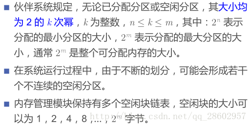

  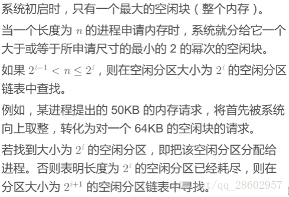

  

  

  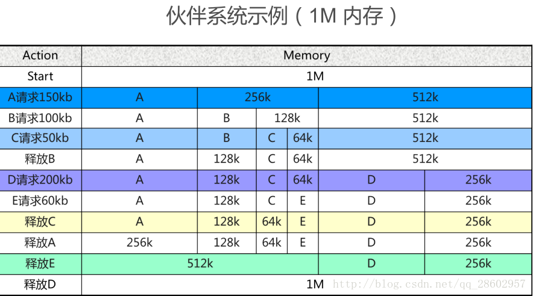

  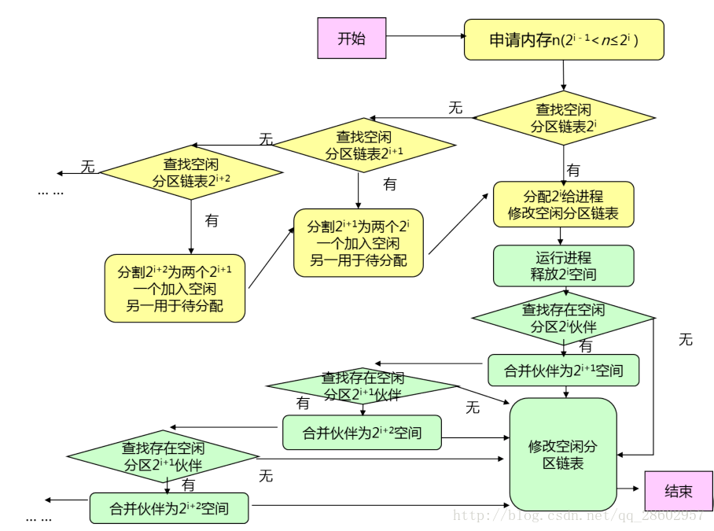
  
  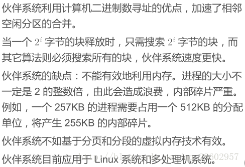

##### 2-2-2-4 碎片与紧凑技术

-   **内部碎片**：已分配给作业但未被利用的内存空间（如固定分区），无法被整理。
-   **外部碎片**：空闲但过于分散无法被利用的小分区（如可变分区），可以被整理。
-   **紧凑技术（Compaction）**
    -   **目标**：通过移动已分配的程序，将多个分散的小空闲分区拼接成一个大的连续空闲分区，**消除外部碎片**（内部碎片不能被消除）。图示：

    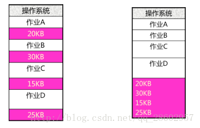
    -   **时机**：当找不到足够大的连续空闲分区，但所有空闲分区总容量可以满足作业要求时。
    -   **实现支撑**：需要**动态重定位**技术，即在程序运行时能够修改其地址（通过重定位寄存器）。图示：

    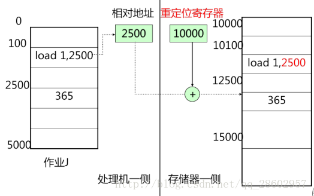

#### 2-2-3 多重分区与内存保护

-   **多重分区分配**：允许一个作业的不同程序段和数据段被装入到内存中多个不连续的区域，可以提高内存利用率和分配的灵活性。
-   **分区的内存保护**：防止一个程序非法访问另一个程序或操作系统的空间。
    -   **界限寄存器方法**：
        -   **上下界寄存器**：存放程序在内存的起始地址和结束地址。
        -   **基址/限长寄存器（BR/LR）**：基址寄存器存放起始物理地址，限长寄存器存放程序长度。每次访问时，硬件自动将逻辑地址与基址相加，并与限长比较以检查是否越界。
        图示（虽然已经很明显了）：

        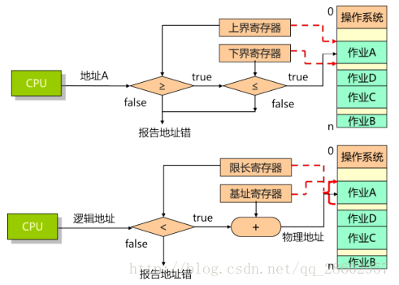

    -   **内存保护键方法**：为每个内存块分配一个“锁”（保护键），为进入系统的每个作业（程序本身）分配一个“钥匙”（保护键）。二者必须匹配才能work，不匹配则触发保护性中断。
-  **分区式分配的局限性**：无法运行比物理内存大的程序。就好像你在运行程序时，先提前给B分配了15KB的内存，但后来B进一步运行，发现需要20KB内存（如递归嵌套函数调用的时候会造成栈空间的增长），这时就需要引入内存扩充技术来解决这个问题。

#### 2-2-4 内外协同：内存扩充技术

为了解决大作业在小内存中运行的问题，引入了内存扩充技术。

-   **覆盖技术（Overlay）**
    -   **原理**：将程序划分为若干功能相对独立的模块，规定好模块间的调用结构。让那些不会同时被调用的模块共享同一块内存区域（覆盖区）。当需要执行某个模块时，再从外存调入，覆盖掉原有模块。
    -   **实现**：由程序员向系统指明覆盖结构。
    -   **特点**：可在小内存中运行大程序，但对程序员不透明，增加了编程负担。

-   **交换技术（Swapping）**
    -   **原理**：把暂时不运行的整个进程或部分数据从内存移到外存（换出），腾出空间；再把准备好运行的进程从外存读到内存（换入），并让其运行。
    -   **优点**：增加并发程序数目，对用户透明，不影响程序结构。
    -   **缺点**：换入换出操作增加了CPU开销；且交换的是整个进程空间，未考虑进程执行的局部性原理。
    -   **关键问题**：
        -   **选择原则**：通常选择等待I/O或优先级低的进程换出。
        -   **交换时机**：当内存空间不够或有不够的危险时。
        -   **位置确定**：换入回内存时，需要进行动态重定位以确定新位置。
  
-   **举个例子**:
1. **覆盖技术（Overlay）**：假设你的计算机只有 **100KB** 给用户用的主存。但是，你写了一个超级游戏，编译出来有 **150KB**。怎么办？直接运行肯定会报“内存不足”。
- 核心原理与举例
仔细分析这个游戏（程序），发现它的模块调用其实是有先后或互斥关系的：
*   **主控模块**（常驻，30KB）：负责大厅界面和统筹。
*   **模块A（闯关模式）**（60KB）：玩家打怪时用。
*   **模块B（商城模式）**（60KB）：玩家买装备时用。
你会发现：**闯关模式和商城模式，是绝对不可能同时进行的！**
- 覆盖技术怎么做？
程序员在写代码的时候，手动写一个特殊的**覆盖结构说明逻辑（告诉操作系统）**：
  - 系统先在内存里划一块 **30KB 常驻区**，把主控模块装进去（此时内存用掉 30KB）。
  - 系统再在内存里划一块 **60KB 覆盖区**（此时内存用掉 90KB）。总共 90KB，完美装入 100KB 的物理内存！
- 运行过程：
  - 玩家点“开始游戏”，操作系统把**模块A（闯关模式）**从磁盘提出来，塞进那 60KB 的覆盖区里运行。
  - 玩家打完怪要买装备（点退堂鼓），操作系统去磁盘里把**模块B（商城模式）**提出来，**直接覆盖（覆盖掉A）**在这 60KB 的区域里运行。
下面是一个108KB大作业装载到64KB内存的示例：

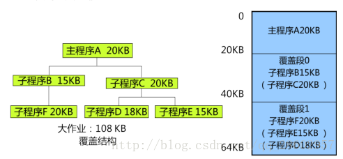

2. 覆盖技术的特点
*   **微观层面（程序内）**：它是拿**同一个程序**里面不同时运行的函数块在捣鼓。
*   **给程序员增加巨大负担**：模块到底谁跟谁不冲突？哪几个可以共用一块内存？这**全部需要程序员自己去研究函数的调用树**，并在编译时指定。（这在现代编程看来简直是灾难，所以现在几乎被淘汰了）。对用户是**不透明**的。

3. **交换技术（Swapping）**：这次内存有 **500MB**。此时有三个程序在跑：微信（200MB）、Word（200MB）和浏览器（200MB）。这需要 600MB 内存，但内存条只有 500MB，塞不下，系统卡死了。
- 核心原理与举例
系统发现，虽然三个程序都在“运行”，但用户现在正全神贯注地用 Word 打字，微信只是挂在后台，而且用户还去上了个厕所。
- 交换技术怎么做？
  - **换出（Swap out）**：操作系统一看，内存快爆了。系统自动挑出一个“最没存在感”的进程（比如正等着网络消息的、处于**阻塞/挂起状态**的微信）。操作系统直接把微信这 200MB 的**全部内存状态（包括代码、数据、甚至运行到哪里的指针状态）**，原封不动地打包成一个大文件，扔进硬盘（外存）的“交换区（Swap space）”里。
  - **腾出空间**：此时内存一下空出了 200MB，变成了可用 300MB，浏览器和Word可以极其丝滑地运行。
  - **换入（Swap in）**：十分钟后，微信来了一个视频通话！它立刻变成“就绪/高优先级”状态。操作系统赶紧去内存里找个不活跃的倒霉蛋（比如当时在发呆的浏览器）打包扔进硬盘，然后把硬盘里的微信解包，重新读回内存中。微信继续运行，什么数据都没丢。

4. 交换技术的特点
*   **宏观层面（进程间）**：它不关心你微信内部的函数怎么跳，它只讲究“要把你赶走，就整个人连同铺盖卷（整个进程空间）一起扔出内存”。
*   **对程序员透明**：程序员写微信的时候不需要管这段代码会不会被扔进硬盘，操作系统自动操控。
*   **致命缺点（极其耗时）**：硬盘的读写速度比内存慢成百上千倍。每次换入换出都是极为庞大的几百兆数据搬家。如果系统不停地把程序在内存和硬盘间搬来搬去（这种现象叫**抖动/颠簸 Thrashing**），CPU 的时间全浪费在等硬盘复制数据了，电脑会慢得像死机一样。

5. 总结两者的区别

| 维度 | 覆盖技术 (Overlay) | 交换技术 (Swapping) |
| :--- | :--- | :--- |
| **解决对象** | 一个体型巨大的作业（程序内） | 很多个挤在一起的小/中型作业（进程间） |
| **目的** | 减少大程序所需的空间 | 腾出整个内存空间，让多程序在有限内存中并发运行 |
| **颗粒度** | 模块/代码段，微观 | 整个（大部分）进程空间，宏观 |
| **谁来操心** | 程序员强制指定（操作系统辅助完成）| 操作系统全自动完成（对程序员透明） |
| **所处时代** | 极早期系统（几百KB内存） | 分时系统/现代操作系统（作为虚拟内存的基石之一） |
