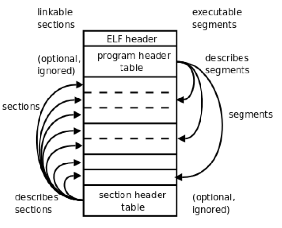
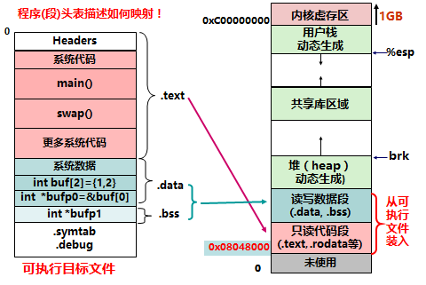
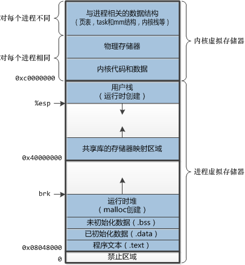
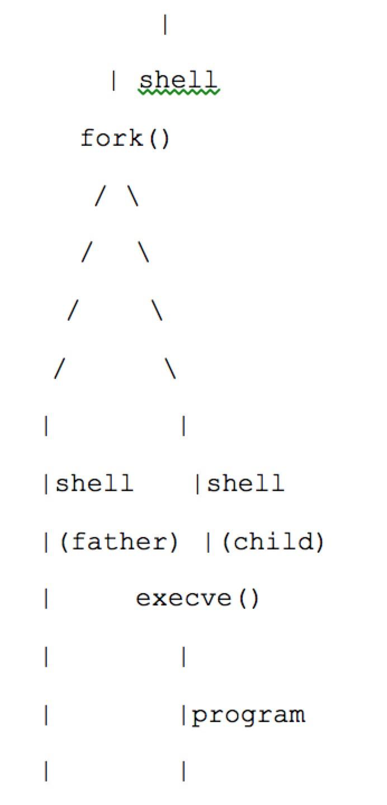

# 内存管理基础知识点总结

## 1. 概述：从源码到进程
- **编译单元**：每个 `.c` 文件独立编译成可重定位目标文件 (`.o`)。
- **链接**：将多个 `.o` 文件和库合并成一个可执行目标文件，解决符号引用。
- **加载**：将可执行文件装入内存，并启动进程。

## 2. ELF 文件格式（Executable and Linkable Format）
ELF 是现代 Unix 系统（如 Linux）使用的主流目标文件格式。

### 2.1 文件结构
ELF 文件主要由以下部分组成：
1.  **ELF 头**：描述文件属性。
2.  **程序头表**：描述如何将文件加载到内存（用于可执行文件）。
3.  **节头表**：描述各个节（section）的信息（用于链接）。
4.  **节（Sections）**：存放具体内容的数据区域。

### 2.2 重要的节（Sections）
顺序：从低地址0到高地址

- **`ELF Headers`**: 一个表头
- **`.text`（代码段）**：存放程序的机器指令，通常只读。
- **`.rodata`**：存放只读数据，如字符串常量。
- **`.data`（数据段）**：存放已初始化的全局变量和静态变量。
- **`.bss`（Block Started by Symbol）**：存放未初始化的全局变量和静态变量。它不占用文件空间，加载时在内存中初始化为零。
- **`.symtab`（符号表）**：存放符号（函数名、全局变量名等）的信息。
- **`.rel.text` / `.rel.data`（重定位表）**：存放需要链接器修正的地址位置信息。

### 2.3 ELF 头关键字段
- `e_ident[0..3]`：共4个字节,魔数 (`0x7f`, `'E'`, `'L'`, `'F'`)，标识为 ELF 文件。
- `e_type`：文件类型（可重定位文件、可执行文件、共享库、动态连接库等）。
- `e_machine`：目标体系结构（x86、MIPS等）。
- `e_version`：文件版本。
- `e_entry`：程序入口点的虚拟地址。
- `e_phoff`：程序头表在文件中的偏移量。
- `e_shoff`：节头表在文件中的偏移量。
- `e_shstrndx`：节名字符串表在节头表中的索引。
  
### 2.4 补充
看看这个图



从上到下看这个图，中间那根“大柱子”就是整个 ELF 文件的布局。最上面是 ELF header，然后是 program header table，中间是一堆真正的数据内容，最下面是 section header table。

- 左边写的是 linkable sections，意思是“如果把 ELF 当成给链接器看的文件”，那么它内部是按一个个 section 来组织和描述的。
- 右边写的是 executable segments，意思是“如果把 ELF 当成给加载器看的文件”，那么它内部是按一个个 segment 来装入内存的。

所以这张图不是在说 section 和 segment 是两套互不相关的东西，而是在说：

section 是面向链接的逻辑划分。
segment 是面向运行的装载划分。
一个可执行 ELF 文件里，这两套信息可以同时存在。
运行程序时，操作系统主要看 program header table 和各个 segment。
链接、分析、调试时，工具更关心 section header table 和各个 section。

#### 2.4.1 section是个啥？

链接器处理多个 .o 文件时，就是按 section 来合并、重定位、解析符号。比如把很多个 .o 里的 .text 合成一个更大的代码区，把多个 .data 拼起来，把所有未定义符号补齐。

所以 section 的关键词是：1、给链接器看 2、细粒度 3、按内容和语义分类 4、便于重定位、符号解析、静态分析

#### 2.4.2 segment是个啥？

segment 可以理解成“操作系统真正要映射进进程虚拟地址空间的装载单元”。

它不是像 section 那样按语义切得很细，而是把**若干 section**按权限和运行需求打包起来。加载器不会说“我要把 .text 单独读进去、再把 .rodata 单独读进去、再把 .data 单独读进去”，而是更倾向于说：

这里有一个可读可执行的 segment，把它映射到内存。
那里有一个可读可写的 segment，把它映射到内存。
如果某段内存是 .bss，对应文件里可能没有实际内容，但需要在内存里额外分配并清零。
这就是图右边那些弯箭头的含义：program header table 描述的是 segment，而不是 section。加载器根据 program header table 里的记录，决定把文件中的哪些字节映射到进程空间的哪些虚拟地址，并赋予什么权限。

典型情况下会出现这样的对应关系：

代码段 segment：通常包含 .text 和一部分 .rodata，权限通常是 只读 + 可执行
数据段 segment：通常包含 .data 和 .bss，权限通常是 可读 + 可写

所以 segment 的关键词是：
1、给加载器看
2、粒度更粗
3、按装载需求和内存权限组织
4、直接对应进程的虚拟内存映射

#### 2.4.3 program header table 和 section header table 

左边那些箭头，是 section header table 在“描述 sections”。也就是说，节头表里每一项都在说明某个 section 的名字、类型、偏移、大小、属性等。是给链接器用的

右边那些箭头，是 program header table 在“描述 segments”。也就是说，程序头表里每一项都在说明某个 segment 从文件哪里取、装到内存哪里、文件大小是多少、内存大小是多少、权限是什么。是给加载器用的

#### 2.4.4 .bss的说法
.bss 很能体现“文件组织”和“内存组织”不是一回事。.bss 不占文件空间，加载时在内存中初始化为零 (3-内存管理基础.md:24-27)。

这说明：
从 section 角度，.bss 是一个明确存在的 section
从 segment 角度，它通常属于某个可读可写的加载段
但这个 segment 的“内存大小”可以大于“文件大小”

#### 2.4.5 实际例子
详见补充例子文件'<document name = '3-补充1.md'>`

## 3. 可执行文件的加载
多个程序是怎么加载到一起的



还有这个,下面是用户可见的进程逻辑空间, 上面是用户不可见的进程空间，由OS使用



### 3.1 加载流程

- 读取ELF头部的魔数(Magic Number)，以确认该文件确实是ELF文件
    - ELF文件的头四个字节依次为’0x7f’、’E’、‘L’、‘F’
    - 加载器会首先对比这四个字节，若不一致，则报错
- 找到段表项
ELF头部会给出的段表起始位置在文件中的偏移，段表项的大小，以及段表包含了多少项.根据这些信息可以找到每一个段表项
- 对于每个段表项解析出各个段应当被加载的虚地址，在文件中的偏移。以及在内存中的大小和在文件中的大小。（段在文件中的大小小于等于内存中的大小）
- 对于每一个段，根据其在内存中的大小，为其分配足够的物理页，并映射到指定的虚地址上。再将文件中的内容拷贝到内存中
- 若ELF中记录的段（segment）在内存中的大小大于在文件中的大小，则多出来的部分用0进行填充
- 设置进程控制块中的PC为ELF文件中记载的入口地址
- 控制权交给进程开始执行！
  
注意：
- text和data段都在可执行文件中，由系统从可执行文件中加载，而bss段不在可执行文件中，由系统初始化。
- 一个装入内存的可执行程序，除了bss、data和text段外，还需构建一个栈（stack）和一个堆（heap）。
- 栈(stack)：存放、交换临时数据的内存区
• 用户存放程序局部变量的内存区域，（但不包括static声明的变量，static意味着在数据段中存放变量）
• 保存/恢复调用现场。在函数被调用时，其参数也会被压入发起调用的进程栈中，并且待到调用结束后，函数的返回值也会被存放回栈中
- 堆（heap）：存放进程运行中动态分配的内存段
• 它的大小并不固定，可动态扩张或缩减。当进程调用malloc等函数分配内存时，新分配的内存就被动态添加到堆上（堆被扩张）；当利用free等函数释放内存时，被释放的内存从堆中被剔除（堆被缩减）

## 5. 概述
从源代码到可执行程序并运行，需要经过**编译**、**汇编**、**链接**和**加载**四个阶段。
- **编译**：将 `.c` 文件翻译成汇编语言（`.s`）。
- **汇编**：将汇编语言转换成机器指令，生成**可重定位目标文件**（`.o`，ELF格式）。函数定义在不同文件，无法知道地址：–E 重定位目标文件；–U 未解析符号；–D 已定义符号。
- **链接**：将多个 `.o` 文件和库合并成一个**可执行目标文件**，解决符号引用（重定位，将之前未填写的地址填写）。
- **加载**：由操作系统将可执行文件装入内存，并启动进程运行。

## 5. 实例程序分析
使用两个源文件说明编译、链接和加载过程。

### `program.c`（主程序文件）
```c
int read_something(void);
int do_something(int);
void write_something(const char*);

int some_global_variable;          // 全局变量（未初始化 → BSS段）
static int some_local_variable;     // 静态局部变量（已初始化 → data段？这里未初始化，实际也是BSS）

main() {
    int some_stack_variable;        // 局部变量（栈上）
    some_stack_variable = read_something();
    some_global_variable = do_something(some_stack_variable);
    write_something("I am done");
}
```

### `extras.c`（子程序文件）
```c
#include <stdio.h>
extern int some_global_variable;

int read_something(void) {
    int res;
    scanf("%d", &res);
    return res;
}

int do_something(int var) {
    return var + var;
}

void write_something(const char* str) {
    printf("%s: %d\n", str, some_global_variable);
}
```

### 数据段与代码段
- **已初始化的全局/静态变量** → `.data`段（本例未出现）。
- **未初始化的全局/静态变量**（如 `int some_global_variable`, `static int some_local_variable`） → `.bss`段，不占文件空间，加载时清零。
- **局部变量**（如 `int some_stack_variable`） → 栈上分配。
- **函数代码** → `.text`段。

## 3. 编译到汇编
使用 `gcc -c` 编译每个 `.c` 文件得到 `.o` 文件。
```bash
gcc program.c extras.c
./a.out

gcc -c program.c      → program.o
gcc -c extras.c       → extras.o
gcc program.o functions.o -o exe

./exe
```

编译过程调用工具：
- `cc1`：预处理器 + 编译器（生成 `.s` 汇编文件）。
- `as`：汇编器（生成 `.o` 目标文件）。

### 生成的汇编文件片段（`program.c`）
```assembly
    .file 1 "program.c"
    .section .mdebug.abi32
    .previous
    .nan legacy
    .module fp=32
    .module nooddspreg
    .abicalls
    .option pic0
    
    .comm some_global_variable,4,4      # 声明 
    .local some_local_variable
    .comm some_local_variable,4,4
    .rdata
    .align 2

$LC0: .ascii "I am done\000"
    .ascii "I am done\000"
    .text
    .align 2
    .globl main
    .set nomips16
    .set nomicromips
    .ent main
    .type main, @function

main:
    .frame $fp,40,$31 
    # vars= 8, regs= 2/0, args= 16, gp= 8
    .mask 0xc0000000,-4
    .fmask 0x00000000,0
    .set noreorder
    .set nomacro
    addiu $sp,$sp,-40
    sw $31,36($sp)          # 保存返回地址 ra
    sw $fp,32($sp)          # 保存帧指针 fp
    move $fp,$sp
    jal read_something      # 调用函数，地址未知
    nop

    sw $2,24($fp)           # 将返回值存入栈变量
    lw $4,24($fp)
    jal do_something
    nop
    move $3,$2
    lui $2,%hi(some_global_variable)   # 取全局变量高16位
    sw $3,%lo(some_global_variable)($2) # 存回全局变量
    lui $2,%hi($LC0)
    addiu $4,$2,%lo($LC0)   # 将字符串地址放入参数 a0

    jal write_something
    nop
    move $2,$0
    move $sp,$fp
    lw $31,36($sp) 
    lw $fp,32($sp)
    addiu $sp,$sp,40
    j $31
    nop
    .set macro
    .set
    .end
    reorder
    main
    .size main, .-main
    .ident “GCC: (crosstool-NG crosstool-ng-1.22.0) 5.2.0"
    ...
```

```assembly
00000000 <main>:    
0: 27bdffd8 addiu sp,sp,-40 
4: afbf0024 sw ra,36(sp) 
8: afbe0020 sw s8,32(sp) 
c: 03a0f021 move s8,sp 
10: 0c000000 jal 0 <main> # 计算地址例题1
14: 00000000 nop
18: afc20018 sw v0,24(s8) 
1c: 8fc40018 lw a0,24(s8) 
20: 0c000000 jal 0 <main> 
24: 00000000 nop
28: 00401821 move v1,v0 
2c: 3c020000 lui v0,0x0 
30: ac430000 sw v1,0(v0) # 计算地址例题2
34: 3c020000 lui v0,0x0 
38: 24440000 addiu a0,v0,0 
3c: 0c000000 jal 0 <main>
```

- 编译器对外部函数 `read_something` 等一无所知，所以 `jal` 指令的操作数填为 0，留待链接器修正。
- 全局变量地址也未知，用 `%hi`/`%lo` 占位。
- 特别注意，在`.o`文件中main函数的地址通常为`0x00000000`, 因为这个时候编译器并不知道这个函数最后会在内存中什么位置, 先拿这个地址占位而已。等下在链接之后的`.s`文件中, `main`函数的地址会更新。

## 4. 符号表
使用 `readelf -s program.o` 查看符号表。

### `program.o` 符号表（部分）
```
Num: Value   Size Type    Bind   Vis      Ndx Name
13: 00000004 4    OBJECT  GLOBAL DEFAULT  COM some_global_variable
14: 00000000 96   FUNC    GLOBAL DEFAULT    1 main
15: 00000000 0    NOTYPE  GLOBAL DEFAULT  UND read_something
16: 00000000 0    NOTYPE  GLOBAL DEFAULT  UND do_something
17: 00000000 0    NOTYPE  GLOBAL DEFAULT  UND write_something
```
- `UND`（undefined）表示符号未在本模块定义，需要链接时从其他模块导入。
- `COM`（common）表示未初始化的全局变量，链接时可能合并到 BSS。

### `extras.o` 符号表（部分）
```
12: 00000000 68 FUNC   GLOBAL DEFAULT    1 read_something
13: 00000000 0  NOTYPE GLOBAL DEFAULT  UND _isoc99_scanf
14: 00000044 52 FUNC   GLOBAL DEFAULT    1 do_something
15: 00000078 84 FUNC   GLOBAL DEFAULT    1 write_something
16: 00000000 0  NOTYPE GLOBAL DEFAULT  UND some_global_variable
17: 00000000 0  NOTYPE GLOBAL DEFAULT  UND printf
```
- 这里 `read_something` 等函数已定义，`some_global_variable` 和 `printf` 未定义（需要链接 libc）。

---

## 5. 重定位表
链接的重要流程。链接器需要修正指令中的地址占位符，这些信息记录在重定位节（如 `.rel.text`）中。

### 重定位项结构
```c
typedef struct {
    Elf32_Addr r_offset;   // 需要修改的位置：节内偏移（可重定位文件）或虚拟地址（可执行文件）
    Elf32_Word r_info;      // 符号表索引和重定位类型（低8位为类型，高24位为符号索引）
} Elf32_Rel;
```

### `program.o` 的重定位表（`readelf -r program.o`）
```
Offset   Info     Type              Sym.Value  Sym.Name
0x10     00000f04 R_MIPS_26         00000000   read_something
0x20     00001004 R_MIPS_26         00000000   do_something
0x2c     00000d05 R_MIPS_HI16       00000004   some_global_variable
0x30     00000d06 R_MIPS_LO16       00000004   some_global_variable
0x34     00000705 R_MIPS_HI16       00000000   .rodata
0x38     00000706 R_MIPS_LO16       00000000   .rodata
0x3c     00001104 R_MIPS_26         00000000   write_something
```
- `Offset` 是节内偏移（`.text` 节）。例如 `0x10` 处是一条 `jal` 指令的操作数位置。
- `Type` 指明如何计算最终值（不同架构定义不同）。
- `Sym.Name` 指明需要引用的符号。
  
### 新的符号表

在重定位结束后，链接表会更新。后面链接地址的计算都以新的链接表为准。

链接前的符号表和链接后的符号表都属于“符号表”这个大类，但它们处于不同阶段、服务不同对象、记录的信息粒度和完整程度也不同。

笔记里展示的 program.o 和 extras.o 的符号表，本质上是“可重定位目标文件的符号表”(3-内存管理基础.md:310-333)。这时候它的特点是：

- 里面会有很多 UND，表示本文件里引用了这个符号，但还没找到定义。
- 符号的值往往还不是最终虚拟地址
- 很多值只是节内偏移，或者还是占位状态。

它主要服务于链接器，让链接器知道“谁定义了什么，谁依赖了什么”。

而链接后的符号表，指的是“最终可执行文件或共享库里的符号表”。这时它的特点通常变成：

- 大部分原先能解析的未定义符号，已经被解析掉了
- 符号值更接近或已经是最终运行地址
- 它不再只是给链接器用，也可能给加载器、调试器、动态链接器使用
- 它的内容可能被裁剪
例如最终可执行文件里可能保留 .symtab，也可能被 strip 掉；动态链接还常会单独保留 .dynsym

链接前符号表：面向可重定位目标文件，重点是“定义/引用关系”。
链接后符号表：面向最终产物，重点是“最终符号地址和导出信息”。
eg
```
Num: Value Size Type Bind Vis Ndx Name
62: 00410a1c 4 OBJECT GLOBAL DEFAULT 26 some_global_variable
67: 00400700 68 FUNC GLOBAL DEFAULT 13 read_something
```

### 重定位后的结果

```assembly
004006a0 <main>: 
4006a0: 27bdffd8 addiu sp,sp,-40 
4006a4: afbf0024 sw ra,36(sp) 
4006a8: afbe0020 sw s8,32(sp) 
4006ac: 03a0f021 move s8,sp 
4006b0: 0c1001c0 jal 400700 <read_something> 
4006b4: 00000000 nop
4006b8: afc20018 sw v0,24(s8) 
4006bc: 8fc40018 lw a0,24(s8) 
4006c0: 0c1001d1 jal 400744 <do_something> 
4006c4: 00000000 nop
4006c8: 00401821 move v1,v0 
4006cc: 3c020041 lui v0,0x41
4006d0: ac430a1c sw v1,2588(v0) 
4006d4: 3c020040 lui v0,0x40 
4006d8: 24440930 addiu a0,v0,2352
4006dc: 0c1001de jal 400778 <write_something> 
4006e0: 00000000 nop
4006e4: 00001021 move v0,zero 
4006e8: 03c0e821 move sp,s8 
4006ec: 8fbf0024 lw ra,36(sp) 
4006f0: 8fbe0020 lw s8,32(sp) 
4006f4: 27bd0028 addiu sp,sp,40 
4006f8: 03e00008 jr ra
4006fc: 00000000 nop
```

- 看见了吗，`main`函数的地址被更新了。

## 6. 链接地址的计算（MIPS 示例）
链接器将所有目标文件合并，分配最终虚拟地址，然后根据重定位类型修正指令。

### 常用 MIPS 重定位类型
- **`R_MIPS_26`**：用于 `jal` 指令（26 位跳转地址）。计算公式（外部符号）：
  - `内部符号` : `((A | ((P + 4) & 0xf0000000)) + S) >> 2`
  - `外部符号` : `(sign_extend(A) + S) >> 2`
  其中 `A` 是原指令中的附加值（addend，通常为 0），`S` 是符号的最终地址（从**链接后的符号表查询**）。右移 2 位是因为 MIPS 指令地址按字对齐，`jal` 中存放的是地址的高 26 位（忽略最低 2 位）。

- **`R_MIPS_HI16` / `R_MIPS_LO16`**：用于加载 32 位地址的指令对（如 `lui` + `addiu`/`lw`/`sw`）。公式：
  - `R_MIPS_HI16`：`%high(AHL + S) = ((AHL + S) - (short)(AHL + S)) >> 16` (高 16 位)
  - `R_MIPS_LO16`：`AHL + S`（低 16 位）
  其中 `AHL` 是附加量（addend），通常为 0。

### 例题1：`read_something` 的 `jal` 修正
- 链接前：`program.o` 偏移 `0x10` 处指令为 `0c000000`（`jal` 操作数 = 0,因此`A` = 0, `A` 的值就是这么计算出来的）。
- 符号 `read_something` 最终地址 `S = 0x00400700`（从链接后的符号表获得）。
- 计算：`(0 + 0x00400700) >> 2 = 0x001001C0`。
- 新指令：`0c 1001c0`，即 `0c1001c0`。
- 链接后：`4006b0: 0c1001c0 jal 400700 <read_something>`

### 例题2：`some_global_variable` 的 `lui` + `sw` 修正
- 链接前指令对：
  - `2c: 3c020000 lui v0, 0x0`
  - `30: ac430000 sw v1, 0(v0)`
- 符号地址 `S = 0x00410a1c`, 操作数均为0, 在本例中，相关指令的原始立即数字段均为 0, 因此`AHL`为0。
- 计算：
  - 高16位：`(0x00410a1c - (short)0x00410a1c) >> 16`。`(short)0x00410a1c = 0x0a1c`，所以 `(0x00410a1c - 0x0a1c) >> 16 = 0x41`。
  - 低16位：`0x00410a1c & 0xffff = 0x0a1c`（即十进制 2588）。
- 链接后：
  - `4006cc: 3c020041 lui v0, 0x41`
  - `4006d0: ac430a1c sw v1, 2588(v0)`
  
### A和P到底指代什么? 最后计算出来的地址怎样应用的?

- `A`是指原指令里本来带的附加值（被重定位位置原先的编码字段中提取出来的 addend），
- `AHL`则表示偏移量,在例子
```
lui   $t0, %hi(arr + 4)
addiu $t0, $t0, %lo(arr + 4)
```
下, 如果 arr 的地址是 S，这里的`AHL=4`.
- `P`表示重定位发生位置 place 的地址，也就是待修改那条指令或数据单元所在的位置地址。
- 计算指令高16位和低16位的区别:考虑进位。
假设地址`0x00418000`
由于符号拓展,单纯的低位变为`8000`在拓展时会变成负数,相当于实际`+0x8000`变`-0x8000`
所以这个时候需要在高位打一个偏移量,提前加上`0x10000`
这就是这个公式`((AHL + S) - (short)(AHL + S)) >> 16`的原因
- 最后计算出来的地址覆盖掉（回填）原来地址的操作数字段,如`jal`指令操作数为26位,计算出来的地址就覆盖后26位; `lui`和`sw`指令操作数为16位,计算出来的地址覆盖后16位。
- 这个计算方式的原理和MIPS指令本身的结构高度相关

## 7. 函数调用及其栈帧（MIPS 架构）

这一节进一步说明：当这些地址都已经确定以后，函数究竟是怎样被调用的，参数怎样传递，返回地址怎样保存，栈帧又是怎样建立和释放的。

本节以下面这个函数为例。这一节的重点不是算法，而是“函数调用过程本身”：

```c
void write_something(const char* str) {
    printf("%s: %d\n", str, some_global_variable);
}
```

### 7.1 为什么需要栈帧

一个函数被调用时，通常需要处理下面几类信息：

1. 函数的参数
2. 返回地址
3. 需要临时保存的寄存器
4. 局部变量
5. 调用其他函数时要继续保存的现场

这些信息都需要一个有组织的存放区域，这个区域就叫栈帧, 可以理解为当前函数在栈上给自己临时划出的一块工作区。

函数开始执行时建立栈帧，函数返回前释放栈帧。这样每个函数都有自己独立的一块临时空间，互不干扰。

### 7.2 MIPS 的基本函数调用规则

在本例中，最重要的是 MIPS O32 调用约定的几个基本规则：

1. 前四个参数通过 `a0` 到 `a3` 传递
2. 返回值通常放在 `v0`
3. `jal func` 会跳转到目标函数，并自动把返回地址写入 `ra`
4. 栈从高地址向低地址增长
5. 如果一个函数内部还要调用别的函数，通常要先把 `ra` 保存起来

其中第 5 条尤其关键。

因为一旦函数内部再次执行 `jal`，寄存器 `ra` 会被新的返回地址覆盖。  
如果不提前保存，原来“返回调用者”的地址就丢失了。

---

### 7.3 调用者是怎样传参的

在前面的 `main` 函数中，调用 `write_something` 的代码片段如下：

```assembly
lui   $2,%hi($LC0)
addiu $4,$2,%lo($LC0)
jal   write_something
nop
```

这几条指令的含义是：

1. 先把字符串 `"I am done"` 的地址计算出来
2. 把这个地址放入 `$4`，`$4` 就是寄存器 `a0`（`a0`中的Reg.num是4）
3. 执行 `jal write_something`

因此，进入 `write_something` 时：

1. `a0` 中保存着参数 `str`
2. `ra` 中保存着返回到 `main` 的地址（如果不懂回去查看计组知识04指令系统和MIPS汇编！）
3. `sp` 指向调用前的栈顶位置

也就是说，这个函数一开始就已经拿到了自己的输入参数。

### 7.4 `write_something` 的完整汇编

下面给出链接后的完整反汇编：

```assembly
00400778 <write_something>:
400778: 27bdffe0 addiu sp,sp,-32
40077c: afbf001c sw ra,28(sp)
400780: afbe0018 sw s8,24(sp)
400784: 03a0f021 move s8,sp
400788: afc40020 sw a0,32(s8)
40078c: 3c020041 lui v0,0x41
400790: 8c420a1c lw v0,2588(v0)
400794: 00000000 nop
400798: 00403021 move a2,v0
40079c: 8fc50020 lw a1,32(s8)
4007a0: 3c020040 lui v0,0x40
4007a4: 24440944 addiu a0,v0,2372
4007a8: 0c100260 jal 400980 <printf@plt>
4007ac: 00000000 nop
4007b0: 00000000 nop
4007b4: 03c0e821 move sp,s8
4007b8: 8fbf001c lw ra,28(sp)
4007bc: 8fbe0018 lw s8,24(sp)
4007c0: 27bd0020 addiu sp,sp,32
4007c4: 03e00008 jr ra
4007c8: 00000000 nop
4007cc: 00000000 nop
```

### 7.5 函数开头：建立栈帧并保存现场

函数开头的几条指令是：

```assembly
400778: addiu sp,sp,-32
40077c: sw ra,28(sp)
400780: sw s8,24(sp)
400784: move s8,sp
400788: sw a0,32(s8)
```

#### 1. `addiu sp,sp,-32`

这条指令把栈顶向低地址移动 32 字节，表示当前函数为自己分配了 32 字节的栈帧。
也就是说，从这一刻起，这 32 字节就是 `write_something` 的工作区。

#### 2. `sw ra,28(sp)`

把返回地址保存到当前栈帧sp中。
为什么一定要保存？因为后面这个函数还要调用 `printf`，一旦执行 `jal printf`，`ra` 会被新的返回到`write_something`的地址覆盖，所以必须先把“返回到 `main` 的地址”保存下来。

#### 3. `sw s8,24(sp)`

把旧的帧指针保存起来。这里的 `s8` 常常被当作帧指针 `fp` 来使用。  
这样做的好处是：后面访问栈中数据时，可以始终以固定的基准位置为参考，而不用跟着 `sp` 的变化一起算。

#### 4. `move s8,sp`

把当前的 `sp` 赋给 `s8`，建立新的帧指针，从此以后，当前函数就把 `s8` 当成自己的“栈帧基准地址”。

#### 5. `sw a0,32(s8)`

这条最容易让人疑惑。它的作用是：把传入的参数 `str` 保存到栈上。
注意：
这里的 `32(s8)` 不在当前函数“自己分配的 32 字节局部区”内部，而是在其上方的参数保存区中。这种写法在 MIPS 调用约定中是很常见的。
所以这条指令不是错，也不是越界，而是把寄存器参数落栈，方便后面统一按内存方式访问。

### 总结
用`28(sp)`保存main的地址`ra`,用`24(sp)`保存原来的栈帧,用`s8`保存新的栈帧`sp`,因为在函数体内`s8`保持不变，所以它才能作为稳定基准。别的都可能会被覆盖掉

### 7.6 函数中间：准备 `printf` 的参数

接下来的代码是：
```assembly
40078c: lui v0,0x41
400790: lw v0,2588(v0)
400798: move a2,v0
40079c: lw a1,32(s8)
4007a0: lui v0,0x40
4007a4: addiu a0,v0,2372
4007a8: jal 400980 <printf@plt>
```
这几条的目标只有一个：为 `printf("%s: %d\n", str, some_global_variable)` 准备参数。

#### 1. 读取全局变量

```assembly
lui v0,0x41
lw  v0,2588(v0)
```
这两条配合起来，取出全局变量 `some_global_variable` 的值（看第389-393行，因为`some_global_variable`对应的value是`00410a1c`,就是先在高16位加载0x41,再在低16位偏移2588），并放入 `v0`。
然后：
```assembly
move a2,v0
```
把这个值放入 `a2`，作为 `printf` 的第三个参数。因为：
1. 第一个参数是格式串地址
2. 第二个参数是 `str`
3. 第三个参数是 `some_global_variable`

#### 2. 取回参数 `str`

```assembly
lw a1,32(s8)
```
把之前保存在栈上的 `str` 重新取回，放入 `a1`。所以现在：
1. `a1 = str`

#### 3. 构造格式串地址

```assembly
lui   v0,0x40
addiu a0,v0,2372
```
这两条指令构造出格式串 `"%s: %d\n"` 的地址，并放入 `a0`。所以现在：
1. `a0 = 格式串地址`
2. `a1 = str`
3. `a2 = 全局变量值`
参数已经全部准备完毕。

#### 4. 调用 `printf`

```assembly
jal 400980 <printf@plt>
```
这条指令调用 `printf`。
这里看到的是 `printf@plt`，它和动态链接有关。  
在本节里只需要把它理解成“最终调用了 `printf`”即可，不必展开。

### 7.7 函数结尾：恢复现场并返回

`printf` 调用结束后，函数开始收尾：

```assembly
4007b4: move sp,s8
4007b8: lw ra,28(sp)
4007bc: lw s8,24(sp)
4007c0: addiu sp,sp,32
4007c4: jr ra
4007c8: nop
```

它们的含义分别是：
#### 1. `move sp,s8`

把 `sp` 恢复到当前栈帧基准位置,此时`sp`取出

#### 2. `lw ra,28(sp)`和`lw s8,24(sp)`

把之前保存的返回地址恢复回来。这样函数就重新知道“结束后该回到哪里”,并恢复旧的帧指针。

#### 3. `addiu sp,sp,32`

释放当前函数分配的 32 字节栈帧。也就是说，这个函数的临时工作区到这里就不再使用了。

#### 4. `jr ra`

跳转到 `ra` 指向的位置，返回调用者。对本例来说，就是返回到 `main` 中调用 `write_something` 之后的位置。

### 7.8 这个栈帧长什么样

根据上面的分析，`write_something` 执行期间的栈帧可以理解为：
```text
高地址                    这里s8保存了这个函数的sp(sp通过s8保存)
+---------------------------+
| 参数保存区                 |
| str 的保存位置             | ← s8 + 32
+---------------------------+
| 保存的旧 ra(通过sp保存)     | ← s8 + 28
+---------------------------+
| 保存的旧 fp(通过sp保存)     | ← s8 + 24
+---------------------------+
| 局部临时区/对齐填充         | ← s8 + 0 到 s8 + 23
+---------------------------+
低地址
```
这个图里最重要的点有两个：
1. 当前函数真正为自己分配的局部栈帧大小是 32 字节
2. `s8 + 32` 对应的是参数保存区，不应简单看成“局部变量区的一部分”
这也是阅读 MIPS 栈帧时最容易混淆的地方。

### 7.9 小结

本节的核心可以概括为：
1. 函数调用时，参数优先通过寄存器传递
2. 栈帧用于保存返回地址、旧的帧指针和临时数据
3. `jal` 会改写 `ra`，所以非叶子函数通常要先保存 `ra`
4. `write_something` 先保存现场，再准备 `printf` 的参数，最后恢复现场并返回
5. 栈帧分析要结合具体反汇编来看，不能只背抽象规则
对本例来说，最重要的理解不是背下每条指令，而是看清楚下面这条主线：
`main` 把参数放进 `a0`  
→ `write_something` 建立栈帧并保存现场  
→ 组织好 `printf` 的参数  
→ 调用 `printf`  
→ 恢复现场并返回

## 8. ELF 文件头解析（补充）
ELF 头包含关键信息，用于加载器识别和执行。
```
ELF Header:
  Magic:   7f 45 4c 46 01 01 01 00 ...   # 魔数标识
  Class:   ELF32
  Data:    2's complement, big endian
  Type:    EXEC (Executable file)
  Machine: MIPS R3000
  Entry point address: 0x4004c0           # 程序入口（通常是 _start）
  Start of program headers: 52 (bytes)
  Start of section headers: 5520 (bytes)
```
- 程序头表（Program Header）描述如何将文件映射到内存（`LOAD` 段）。
- 节头表（Section Header）用于链接和调试。

## 9. 加载过程
1. Shell 调用 `fork()` 创建子进程, 子进程调用 `execve()` 执行程序。图示:
   
   

   加载器在加载程序的时候只需要看ELF文件中和segment相关的信息即可。我们用readelf工具将segment读取出来：读出的信息分为两部分，一部分是各segment的具体信息，另一部分是section和segment之间的对应关系, 其中Type为Load的segment是需要被加载到内存中的部分。
2. `execve()`中的函数:`sys_execve()`和`do_execve()`
• int do_execve(char *filename, char **argv, char **envp, struct pt_regs *regs);
• asmlinkage int sys_execve (struct pt_regs regs);
sys_execve()只是函数do_execve()的一个界面，实际的处理动作在do_execve()中完成。
▪ regs.ebx：指向程序文件名的指针；
▪ regs.ecx：指向传递给程序的参数的指针；
▪ regs.edx：程序运行的环境的地址。
1. 为 `LOAD` 段分配虚拟内存，将文件内容拷贝到对应地址。
2. 对 `.bss` 段清零。
3. 设置进程的栈和堆。
4. 将 PC 设置为 `e_entry`（通常是 `_start`，最终调用 `main`）。

## 10. 小结
- **链接**的核心是**重定位**：将目标文件中的占位符替换为真实地址。
- **重定位表**记录了每个需要修正的位置及其计算方法。
- **MIPS 重定位**通过 `R_MIPS_26`（跳转）、`R_MIPS_HI16/LO16`（数据访问）等类型完成。
- **函数调用栈帧**由编译器自动生成，管理局部变量、参数传递和返回地址。
