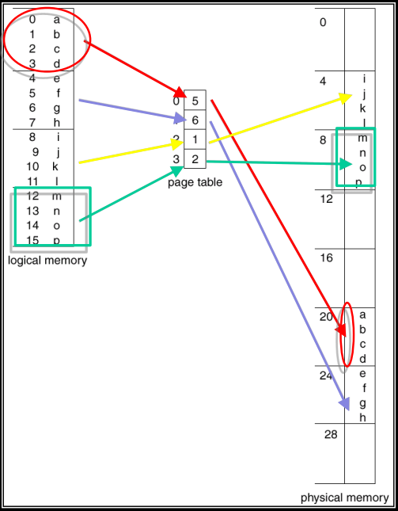
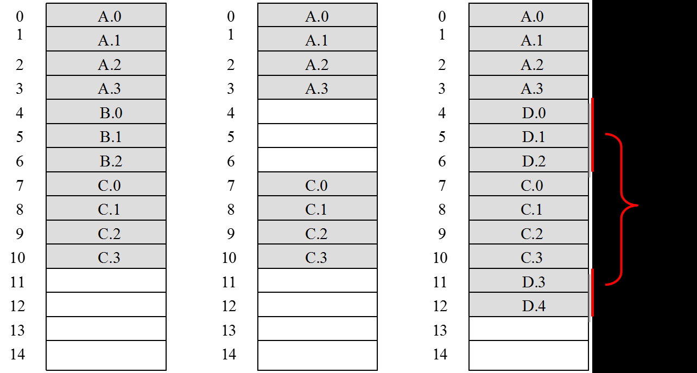
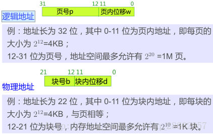
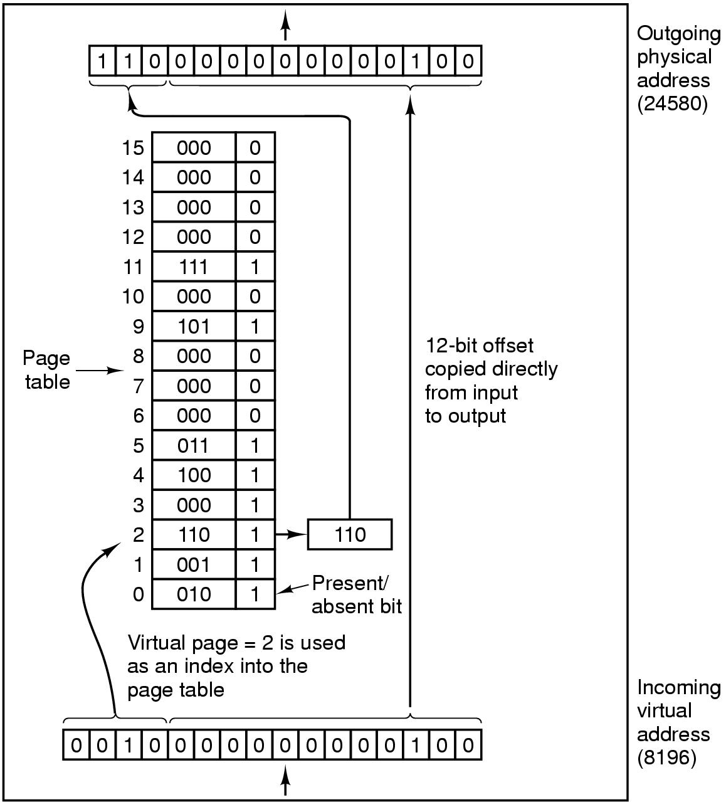
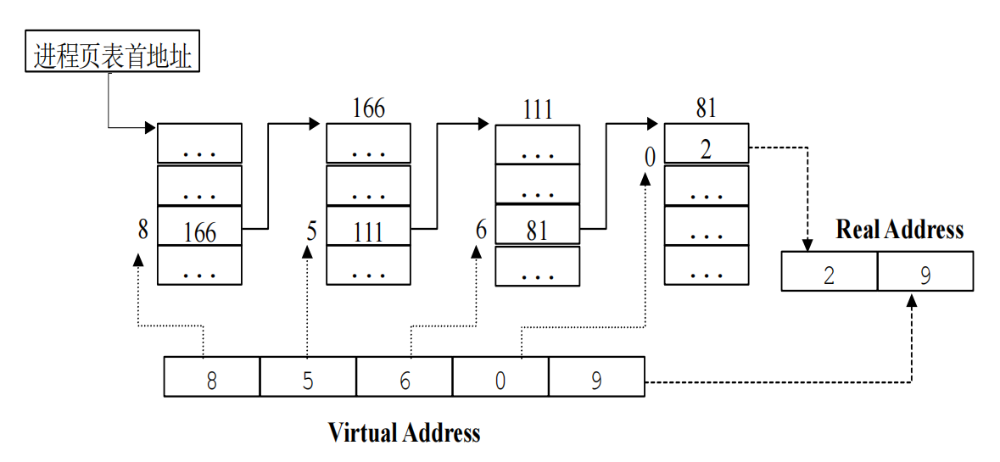
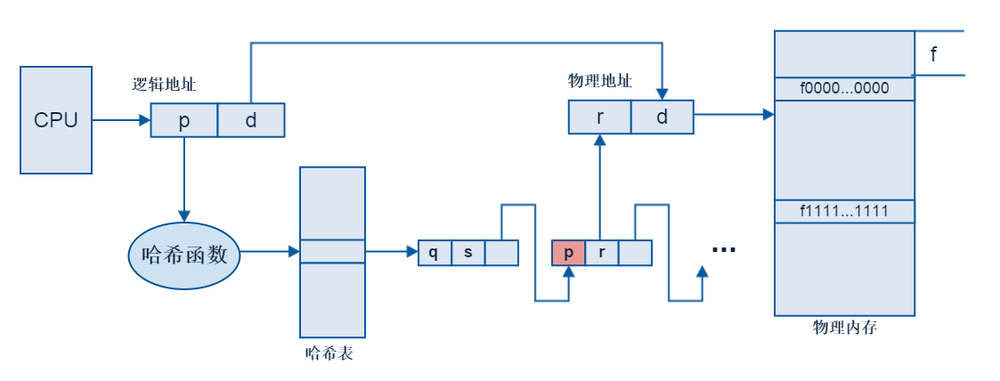
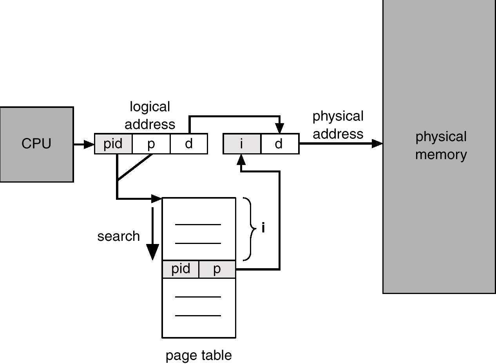
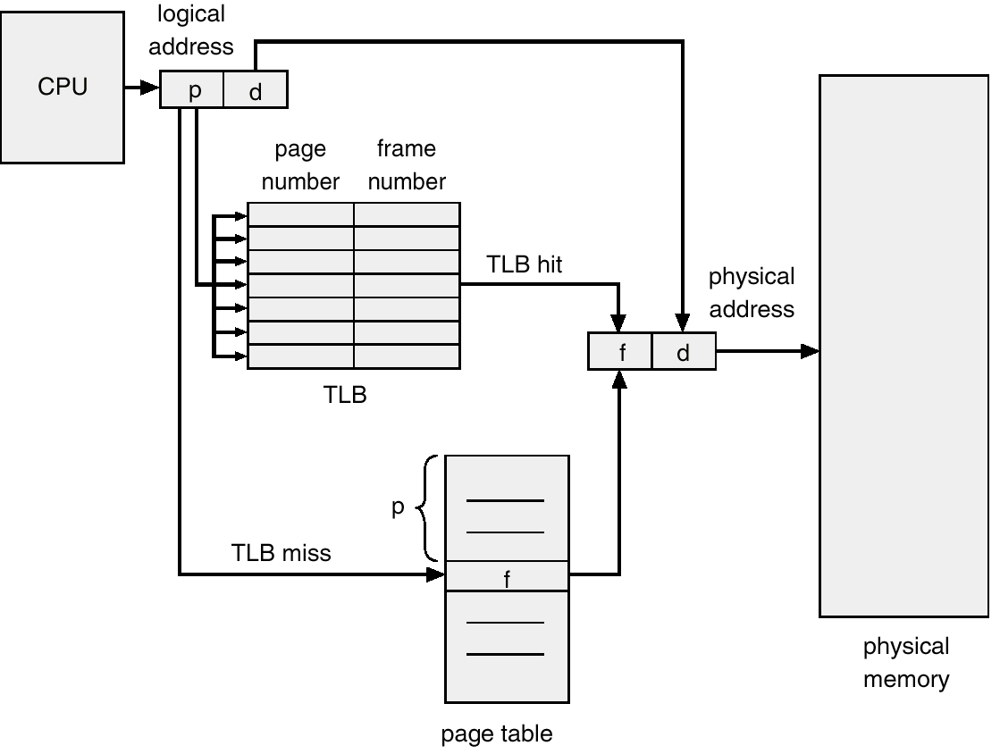
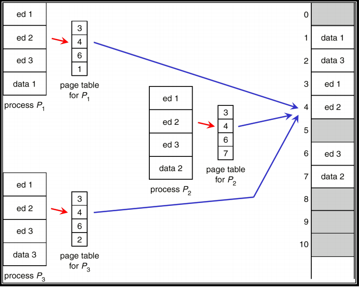

# 页式内存管理知识点总结

- 进程：进程是程序在某个数据集上的一次运行活动（动态的），是操作系统进行资源分配和调度的基本单位。
  - 完成操作系统功能的进程称为系统进程。
  - 完成用户功能的进程则称为用户进程。
- 进程和程序的区别：
  - 进程是竞争计算机系统有限资源的基本单位。进程更能真实地描述并发，而程序不能。
  - 进程有生存周期，有诞生有消亡。是短暂的；而程序是相对长久的。
  - 一个程序可以作为多个进程的运行程序；一个进程也可以运行多个程序。
  - 进程具有创建其他进程的功能；而程序没有
- 作业是用户需要计算机完成的某项任务，是要求计算机所做工作的集合。一个作业的完成要经过作业提交、作业收容、作业执行和作业完成4个阶段。
- 作业是用户向计算机提交任务的任务实体。在用户向计算机提交作业后，系统将它放入外存中的作业等待队列中等待执行。而进程则是完成用户任务的执行实体，是向系统申请分配资源的基本单位。任一进程，只要它被创建，总有相应的部分存在于内存中。
- 一个作业可由多个进程组成，且必须至少由一个进程组成，反过来则不成立。
- 一个作业通常包括程序、数据和操作说明书3部分。每一个进程由进程控制块PCB、程序和数据集合组成。这说明程序是进程的一部分，是进程的实体。

## 一、页式内存管理的基本思想

- **核心目标**：将逻辑地址连续的程序分散存放到不连续的内存区域中，解决连续分配带来的碎片问题，同时保证正确执行。
- **实现方式**：将程序地址空间和物理内存都划分为大小相等的块（页/页框），通过页表建立映射关系。
- **硬件支持**：MMU（内存管理单元）负责动态地址转换。

## 二、基本概念

| 术语 | 定义 |
|------|------|
| 页（Page） | 进程地址空间的划分单位，大小固定且相等，每页从0开始编号 |
| 页框（Frame） | 物理内存的划分单位，大小与页相同，从0开始编号 |
| 页表（Page Table） | 每个进程一张，记录逻辑页号 → 物理页框号的映射（地址一一对应），由多个页表项组成 |
| 页表项（PTE） | 每个页在页表中对应一项，包含物理块号、保护位等信息 |
| 页表寄存器 | 存放页表始址和页表长度，用于地址转换 |

示例如下：

分页的好处详见：

## 三、地址转换机制

### 1. 页表的位置
页表存放在内存中，属于进程的现场信息
- 用途
  - 记录进程的内存分配情况
  - 实现进程运行时的动态重定位
访问一个数据需访问内存 2 次 (页表一次，内存一次)。

### 2. 页表寄存器
**页表寄存器不是放在页表里面的**，它们是两个完全不同的东西。

## 一、页表寄存器是什么？

| 项目 | 页表寄存器 | 页表 |
|------|-----------|------|
| **位置** | CPU 内部（硬件） | 物理内存中（软件数据结构） |
| **内容** | 页表的起始地址 + 长度 | 页号 → 物理块号的映射关系 |
| **数量** | 每个 CPU 一套（当前运行进程的） | 每个进程一张 |
| **作用** | 告诉 CPU 当前进程的页表在哪里 | 存储地址转换所需的核心数据 |

**关系比喻**：
- 页表就像一本书（存放在内存中），页表寄存器就像书签（在 CPU 里），记录这本书放在内存的什么位置、有多厚
- 当 CPU 要做地址转换时，先看页表寄存器找到**这个进程对应的页表的位置**，再去内存中读取页表

### 3. 逻辑地址结构
- 逻辑地址 = 页号 + 页内偏移。给定一个逻辑地址空间中的地址为 A，页面的大小为L，则页号 P 和页内地址 d（从 0 开始编号）为：
  - P = int(A / L)
  - d = A mod L
- 若页大小为 \(2^n\)，则高 \(m-n\) 位为页号，低 \(n\) 位为偏移
下面是图片：

### 4. 地址转换步骤
1. 从逻辑地址中提取前面的页号 \(P\) 和后面的页内偏移 \(d\)
2. 检查 \(P\) 是否超过页表长度，若超过则越界中断
3. 页表始址 + \(P \times\) 页表项长度 → 页表项位置
4. 查询页表，取出物理块号 \(B\)
5. 物理地址 = \(B \times\) 页大小 + \(d\) （用物理页号替代逻辑页号即可）
举例：
- 逻辑地址 21C4H，页大小 4KB
- 页号 = 2，偏移 = 1C4H
- 页表项中块号 = 8
- 物理地址 = 81C4H
  另一个图示：
  
  

### 5. 纯分页系统
在分页内存管理方式中，如果不具备页面对换功能，不支持虚拟存储器功能，这种内存管理方式称为纯分页或基本分页内存管理方式。
在调度一个作业时，必须把它的所有页一次装到主存的页框内。如果当时页框数不足，则该作业必须等待。
优点：
- 没有外碎片，每个内碎片不超过页大小
- 一个程序不必连续存放
- 便于改变程序占用空间的大小
缺点：程序全部装入内存，内存利用率受限
**补充**：页面大小的影响
显然，若页面较小，内存利用率将提高，但页表长度将增加，占用更多内存；页面换入换出速度也降低。反之，页面较大，内存利用率降低，但页表长度小，占用内存少，换页速度快。

## 四、页表结构

### 1. 软件数据结构（在内存）
- **进程页表**：每个进程一个，描述其逻辑页与物理页框的映射
- **物理页框表**：系统级，记录物理内存分配情况（位示图、空闲链表）
- **请求表**：记录系统内各个进程页表的位置和大小（用于地址转换，可放入PCB————进程控制块）
- 可以理解为：请求表是操作系统在软件层面维护的所有进程页表信息的集合；而页表寄存器是 CPU 硬件中当前正在运行的进程的页表信息的副本。

### 2. 多级页表
- 用于解决大逻辑地址空间（如32位、64位）带来的页表过大问题
- 示例：32位地址，页大小4KB，一级页表需 \(2^{20}\) 项，占用4MB
- 多级页表将页表分页，按需加载，减少内存占用
- 结构：虚拟地址分为各级页表的页号 + 偏移。而每级页表项指向下一层页表或真正的被访问物理页框
图示：

### 3. 哈希页表
- 用于超过32位地址空间，将虚拟页号哈希后查找，链式处理冲突。
- 每个哈希值对应一个链表，存储所有映射到该哈希值的页表项，每个页表项包含：虚拟页号、物理帧号、指向下一项的指针。
- 工作图示：

  
  - 虚拟页号哈希后得到哈希表号（哈希值），找到对应链表头
  - 遍历链表，比较虚拟页号，找到匹配项则获取物理帧号（第二个域），反之跳到下一个节点比较

### 4. 反向页表
- 按**物理页框号顺序**组织，每项包含：进程标识符（PID）、在该进程中对应的逻辑页号（P）
- 大小与物理内存大小相关，与进程数无关
- 地址转换：通过PID和逻辑页号检索，找到物理块号（即表项的序号i），图示：
  
  
缺点：
- 可能要检索整个表以匹配，因此检索效率需哈希或TLB优化
- 很难共享内存，因为同一物理页框只能对应一个进程的逻辑页

## 五、快表（TLB）

### 1. 基本概念
- TLB 是页表的高速缓存`（Cache）`，存放最近使用的页表项
- 位于CPU内部，访问速度极快，一般条目数`64`-`1024`

### 2. 地址转换流程
1. CPU 生成逻辑地址，提取页号
2. 在 TLB 中查找页号
   - 命中：直接获取物理块号
   - 未命中：访问内存中的页表，并将页表项加载到 TLB
3. 若 TLB 已满，按替换策略淘汰一项（如 LRU）
图示：

### 3. TLB 条目结构
- 有效位、虚拟页号、物理页号、保护位、修改位、ASID（地址空间标识符，MIPS块表条目中有）

### 4. ASID 的作用
- 唯一标识进程，支持多个进程的 TLB 条目共存
- 无 ASID 时，上下文切换需刷新 TLB

### 5. 有效内存访问时间（EAT）
- 设 TLB 命中率为 \(\alpha\)，TLB 查询时间 \(\varepsilon\)，内存访问时间 \(\tau\)
- \[EAT = (\tau + \varepsilon)\alpha + (2\tau + \varepsilon)(1-\alpha) = 2\tau + \varepsilon - \tau\alpha\]
- 示例：\(\tau=100ns, \varepsilon=20ns, \alpha=80\%\)，EAT = 140ns。分析如下：
  - TLB 命中时，仅需直接访问内存对应字节，访问时间为 \(\tau + \varepsilon = 120ns\)
  - TLB 未命中时，需先访问内存中的页表（\(\tau\)），再访问目标字节（\(\tau\)），总时间为 \(2\tau + \varepsilon = 220ns\)
  - 综合考虑命中率，EAT 为 140ns。
  - 如果没有地址转换（CPU直接访问物理地址），访问时间为 \(\tau = 100ns\)，因此引入页表和TLB后，访问时间增加了40ns，但通过提高TLB命中率，可以将EAT降低到接近100ns。

## 六、页共享与保护

### 1. 页共享
- 多个进程将各自页表中的页（这些页中往往是需要共享的数据/程序）指向相同的物理块
- 实现代码段、库函数等共享
图示：

### 2. 页保护机制
- **地址越界保护**：页号超过页表长度时中断
- **保护位**：在页表中设置读写、执行等权限

### 3. 共享的问题
- 若共享数据与非共享数据在同一页中，可能导致信息泄露
- 更精细的共享需结合分段内存管理
