# 段式内存管理知识点总结

## 一、段式内存管理的目标

1. **方便编程**  
   - 按逻辑关系划分程序段和数据段，用户可通过名字访问。
2. **信息共享**  
   - 共享以信息的逻辑单位为基础，段是逻辑单位，页是物理单位。
3. **信息保护**  
   - 页式管理中，不能通过页面共享实现共享一个逻辑上完整的子程序或数据块。段式管理以逻辑单位进行保护，避免页式中一个页面包含多个逻辑单元（多个不同的子程序段）的问题。
4. **动态增长**  
   - 支持数据段等动态增长，克服固定大小内存管理的局限。
5. **动态链接**  
   - 程序运行时才将主程序与目标程序段链接。

## 二、二维地址空间与段表（纯段式管理）

### 1. 二维地址结构
- 逻辑地址由两部分组成：**段号** + **段内地址**
- 一个段可定义为一组逻辑信息，每个作业的地址空间是由一些分段构成的（由用户根据逻辑信息的相对完整来划分），每段都有自己的名字（通常是段号），且都是连续的地址空间，段内地址从 0 开始
图片：

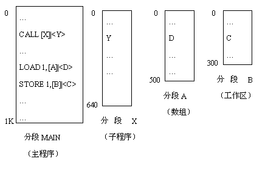

### 2. 段表
- 记录每个段在内存中的位置（基址、段长），保存在内存中

### 3. 段表寄存器
- 存放段表的**基址**和**段表长度**
- 每次访问内存需两次访问：一次段表，一次物理内存

### 4. 地址转换过程

1. 将逻辑地址中的段号 S 与段表长度 TL 比较，若 S ≥ TL，则越界中断
2. 根据段表始址和段号找到段表项，取出段基址和段长 SL
3. 检查段内地址 d 是否超过 SL，若 d ≥ SL，则越界中断
4. 计算内存的物理地址 = 段基址 + d
图示如下：

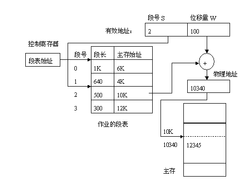

## 三、段共享

### **可重入代码（纯代码）** 
允许多个进程共享同一段代码，但为使各个进程所执行的代码完全相同，**绝对不允许可重入代码在执行中有任何改变（这就框死了不可能出现全局变量和静态变量）**。
- 示例：一个可同时接纳 40 个用户的多用户系统，都执行同一个文本编辑程序
  - 如果文本编辑程序有 160KB 的代码和另外 40 KB 的数据区，如果不共享，则总共需有 8 MB 的内存空间来支持 40 个用户。
  - 如果共享，则只需 1760 KB 的内存空间（160 KB 可重入代码 + 40 KB * 40），大大节省了内存资源。
- 在分段系统中，只需在每个进程的段表中添加一个共享段表项，比页式更简单

### **段共享和页共享比较**
  该例子中（假定页表大小4KB）：
  - 采用页共享，每个进程要使用40个页表项共享160K的editor。
  - 采用段共享，只需每个进程的段表中设置一个段表项，共享160K的editor。
图示：

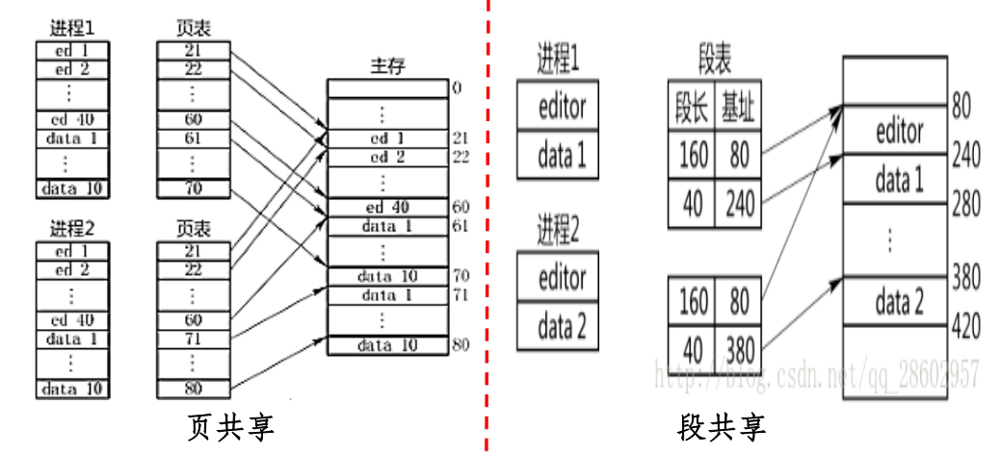

### **分段管理的优缺点**
- 优点
  - 易于实现段共享与保护

- 缺点
  - 地址转换耗时，需额外存储空间（额外存段长）
  - 满足动态增长和处理外部碎片（拼接）
  - 辅存中管理不定长段困难
  - 段大小受主存限制

## 四、分页与分段的对比

| 比较项 | 页式管理 | 段式管理 |
|--------|----------|----------|
| 目的 | 解决碎片，实现非连续分配 | 满足用户逻辑需求 |
| 信息单位 | 页（物理单位，固定大小） | 段（逻辑单位，一组有意义的信息，不定长） |
| 分配单位 | 页 | 段 |
| 地址空间 | 一维线性 | 二维（段号 + 段内地址） |
| 优点 | 无外碎片，内存利用率高，程序不必连续 | 共享与保护方便，支持动态增长和动态链接 |
| 用户可见性 | 不可见（系统对于主存的管理） | 可见（用户编程时确定，可根据段名访问） |

## 五、段页式内存管理

### 1. 基本思想
- 用**分段**管理虚拟存储器
- 用**分页**管理物理存储器
图示：每个进程一张段表，含段号、页表始址、页表长度等信息；每段对应一张页表，含页号、物理块号。段内地址再分页管理。注意：**这里的段表是指段页式管理中的段表，不是纯段式管理中的段表**。

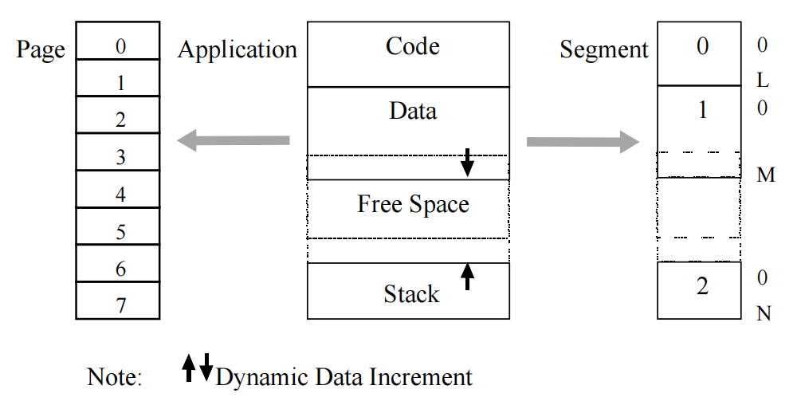

段页式：

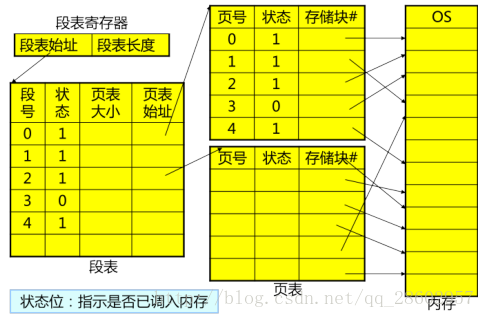

### 2. 实现原理
- 用户程序先分段，为每个段赋段名，每段再分页
- 地址结构：**段号 + 段内页号 + 页内地址**（注意：这只是理论概念）
- 系统中设段表和页表，均存放于内存中。读一字节的指令或数据须**访问内存3次**。为提高执行速度可增设高速缓冲寄存器（TLB）来缓存最近访问的页表项。
- 每个进程一张段表（段表含段号、页表始址和页表长度），每个段一张页表（页表含页号和块号）

### 3. 地址转换过程
1. 从 PCB （进程控制块）获取段表始址和长度，装入段表寄存器
2. 比较段号与段表长度，越界则中断
3. 利用段表始址与段号找到**段表项，获取页表始址和页表长度**
4. 比较页号与页表长度，越界则中断
5. 利用页表始址与页号**找到页表项，获取物理块号**
6. 物理块号 + 页内地址 → 物理地址
图示：

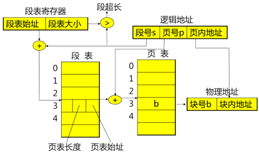

## 六、X86 段页式地址映射实例

### 1. 地址映射两阶段
- **段映射**：逻辑地址 → 线性地址
- **页映射**：线性地址 → 物理地址

### 2. X86的控制寄存器
控制寄存器（CR0～CR3）用于控制和确定处理器的操作模式以及当前执行任务的特性：
- CR0：控制寄存器0，包含PE（保护模式使能位）、PG（分页使能位）等
- CR1：保留未使用
- CR2：存放导致页错误的线性地址
- CR3：页目录基地址寄存器PDBR（Page-Directory Base address Register），存放当前进程的页目录表的物理内存基地址。这里就是为了解决**已知页表虚拟地址，怎么找到对应页表物理基地址**的问题。
如图：

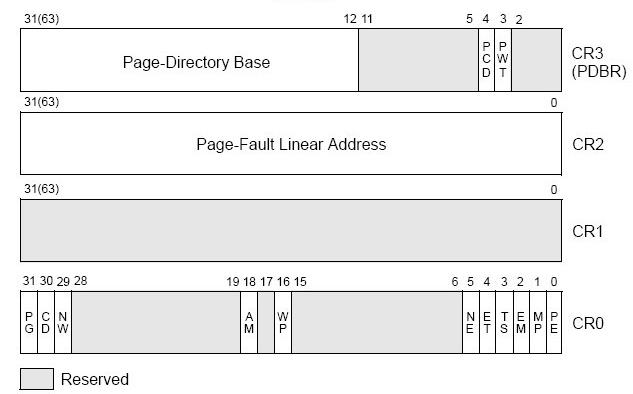

### 3. 段式地址映射过程（举例子）
假设我们有一个 **32 位**的段页式系统（比如 Linux 在 x86 下），逻辑地址为`0x08048123`（这里就是所谓的**段内页号 + 页内地址**），段选择子为`0x0008`。
#### 第一部分：获得线性地址
1. 根据指令类型选择段寄存器（CS、DS、SS 等）
2. 从段寄存器（16位）获取段选择子，定位段描述符表（GDT 或 LDT）。这些段寄存器里装的这个 16位 的值，称之为**段选择子（Segment Selector）**。它不仅仅是一个纯粹的索引数字，而是一个包含三种信息的复合体：
   - 高 13 位： 索引号（Index） —— 这是所谓的**段号**！它用来在全局描述符表（GDT）中寻找段表项。
   - 第 2 位： 表指示位（TI） —— 决定是去查 GDT（全局描述符表）还是 LDT（局部描述符表）。
   - 低 2 位： 请求特权级（RPL） —— 用来实现 CPU 的权限保护（如区分内核态 Ring 0 和用户态 Ring 3）。
   - 如下图：

  

以此题为例，前13位为：`0000000000001(2)=1 (10)`，所以段号为 1；要找 GDT 中的第 1 号段描述符。

3. 从段描述符中获取段的基地址、段长度、访问权限。假如通过 GDTR 找到内存中`0x00001000`处的段表，每个描述符占 8 个字节，那么系统从 `0x00001008`取出该段描述符。假设返回**段基址**`0x00000000`，和**段限长**`4GB`。注意，这里的段表返回**段基址和段长度**，这和之前的理论（包含页表基地址和页表长度）相悖，但好几个AI就是这么说的。
   如图：

   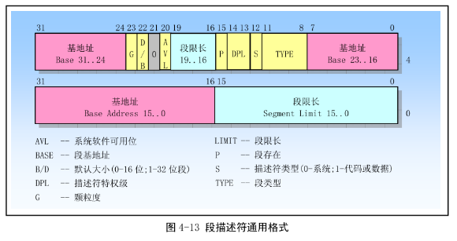

   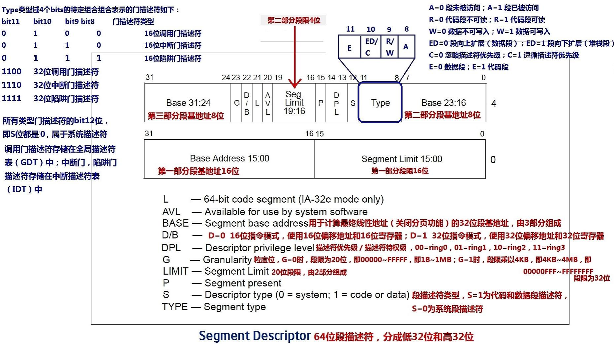

4. 基地址 + 偏移 → 线性地址
   - 检查偏移量 0x08048123 是否超过段限长（4GB），显然没有越界。
   - 线性地址 = 段基址 + 段内偏移量，即0x00000000 + 0x08048123 = 0x08048123
#### 第二部分：获得物理地址
5. 拆分线性地址为页目录号、页表号、页内偏移
   - 线性地址 0x08048123 的二进制表示为：`0000 1000 0000 0100 1000 0001 0010 0011`
   - 页目录号（10位）= `0000100000(2)=32 (10)`
   - 页表号（10位）= `0001001000(2)=72 (10)`
   - 页内偏移（12位）= `000100100011(2)=291 (10)`
   - 页目录号和页表号加起来，在理论上统称为“段内页号”，因为 x86 采用了多级页表结构，把页号拆成了两级查找。
6. 查找页目录，找到页表基地址
   - 从**CR3寄存器获取页目录基址**，假设为 `0x00100000`
   - 页目录项地址 = 页目录基址 + 页目录号 * 页目录项大小（4字节）= `0x00100000 + 32 * 4 = 0x00100080`
   - 从内存地址 `0x00100080` 取出页目录项，假设记录的“下级页表的物理基地址”是`0x00504000`。
7. 查找页表，找到物理页框号
   - 页表项地址 = 页表基址 + 页表号 * 页表项
   - 页表项地址 = `0x00504000 + 72 * 4 = 0x00504120`，从内存地址 `0x00504120` 取出页表项，假设记录的“物理页框（Page Frame）基地址”是`0x01A2B000`（标志位 P=1）。
8. 合成
   - 系统已经找到了物理内存中的数据页基地址 0x01A2B000。
   - 最后，加上一开始拆分出来的 12 位页内偏移 0x123。
   - 物理地址 = 物理页框基地址 + 页内偏移，即0x01A2B000 + 0x00000123 = 0x01A2B123
图示：

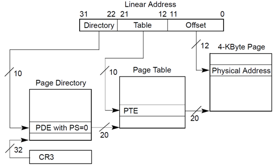

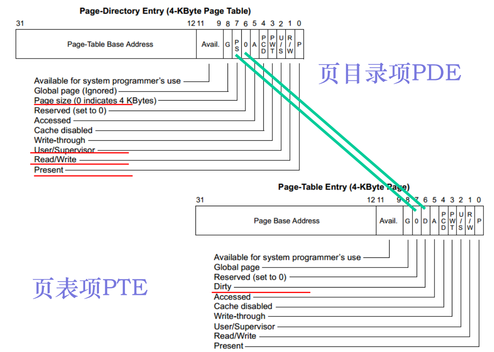

### 4. 扁平化内存管理
- Linux 在 X86 上使用**扁平模型**，段基址为 0，段长为 4GB
- 段机制不可禁用，但通过设置使段映射不产生实际影响

### 5. 页表项标志位
- P：存在位
- R/W：读写权限
- U/S：用户/超级用户
- A：访问位
- D：脏位
- PS：页大小（4KB / 4MB）
- G：全局位
- PWT、PCD：缓存控制

## 七、关键数据结构与寄存器

- **段表寄存器**：段表始址、段表长度
- **段描述符**：基址、长度、权限
- **CR3**：页目录基址寄存器
- **GDT、LDT**：段描述符表
- **PCB**：进程控制块，包含段表信息
