# 虚拟内存管理知识点总结

## 一、常规内存管理的问题
- 特征：
  - 装入一次性：作业必须全部装入内存才能运行
  - 全程驻留性：作业装入后一直驻留直至结束
- 问题：
  - 大作业无法运行
  - 多作业无法并发执行
- 已有解决方式：
  - 增加物理内存
  - 逻辑上扩充内存：覆盖、交换
- 回顾

  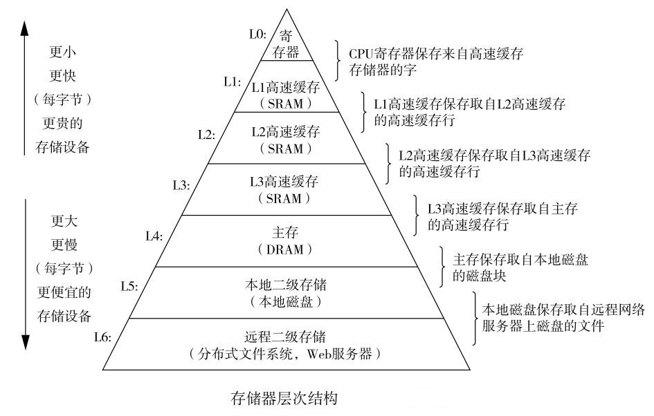

## 二、局部性原理
- 程序执行时：
  - 大部分顺序执行，少部分转移/调用
  - 过程调用嵌套深度 ≤ 5
  - 存在大量循环结构
  - 对数据结构的操作集中在较小范围
- 表现形式：
  - **时间局部性**：指令/数据的重复访问集中在短时间内
  - **空间局部性**：访问的指令/数据集中在邻近区域
- 示例讨论：
  - 快速排序 vs 堆排序：快速排序局部性更好
  - 矩阵乘法的 ijk 与 kij 实现：kij 空间局部性更好，图示：
  
  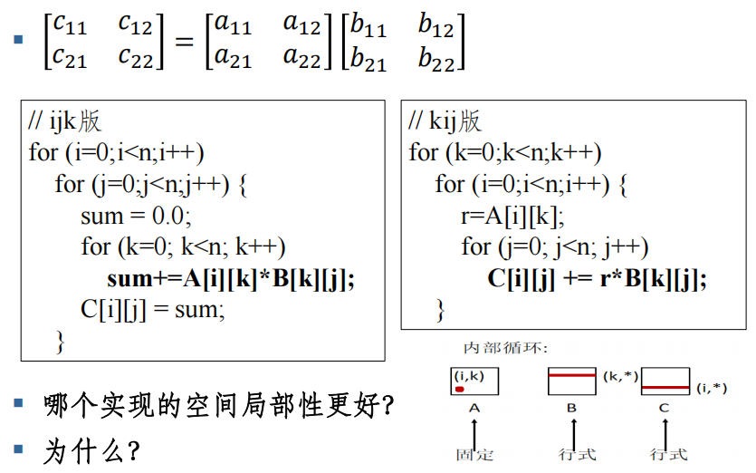

## 三、虚拟内存基本原理
- 核心思想：
  - 程序加载时只装入必需部分（需要执行的部分页）
  - 执行过程中按需调入（请求调页/段）
  - 不使用的部分可被置换出去
- 虚拟内存定义：
  - 为每个进程提供连续、一致、私有的地址空间
- 三大能力：
  1. 统一地址空间
  2. （每个进程的）地址空间隔离与保护
  3. 将主存作为磁盘缓存
- 目标：
  - 借鉴交换技术，运行比物理内存大的程序。但是由 OS 自动完成，对程序员透明
  - 借鉴交换技术，实现进程在内存和外存之间交换，但是以更小粒度（页/段）交换
- 特征：
  - **离散性**：物理内存分配不连续
  - **多次性**：作业分多次调入
  - **交换性**：运行中可换进换出
  - **虚拟性**：允许程序从逻辑的角度访问存储器，逻辑空间大于物理空间
- 优点：
  - 支持大程序、高并发、编程结构不受影响
- 代价：
  - 增加 CPU 与 I/O 开销
- 限制：
  - 虚存容量由地址结构决定（如 32 位系统最大 4GB）

## 四、与 Cache-主存机制的对比
### 相同点：
- 目标：性能接近高速存储器，容量接近低速存储器（过渡带）
- 原理：利用局部性，分层存储

### 不同点：
| 维度 | Cache | 虚存 |
|------|-------|------|
| 侧重点 | 解决速度差异问题 | 容量、管理、保护 |
| 数据通路 | CPU 直接访问主存 | 辅存不与 CPU 直接交互 |
| 透明性 | 全硬件，完全透明 | 软件+硬件，对系统程序员不透明 |
| 未命中损失 | 5~10 倍 | 上千倍 |

## 五、虚拟内存管理类型
- 实存管理：
  - 分区（固定/可变）
  - 分页、分段、段页式
- 虚存管理：
  - 请求分页（主流）
  - 请求分段
  - 请求段页式
  - 交换
- 请求分页/分段系统
  - 增加了请求调页(段)功能、页面(段)置换功能所形成的页(段)式虚拟内存器系统
  - 允许先只装入部分页/段的程序/数据就能够运行
  - 以后通过调页/段功能和置换功能，把暂不运行的页面/段换到外村上，置换时以页面/段为单位
  - 硬件支持
  - 软件

## 六、虚存机制要解决的关键问题

### 0. 基本概念-进程的逻辑空间
- 一个进程的逻辑空间的建立是通过链接器（Linker），将构成进程所需要的所有程序及运行所需环境，按照某种规则装配链接而形成的一种规范格式(布局)。
- 这种格式按字节从0开始编址所形成的空间也称为该进程的逻辑地址空间。
- 其中OS所使用的空间称为系统空间，其它部分称为用户空间。系统空间对用户空间不可见。
- 由于该逻辑空间并不是真实存在的，所以也称为进程的虚拟（地址）空间。
如：Hello Word进程包含Hello Word可执行程序、printf函数（所在的）共享库程序以及OS相关程序.
图示：

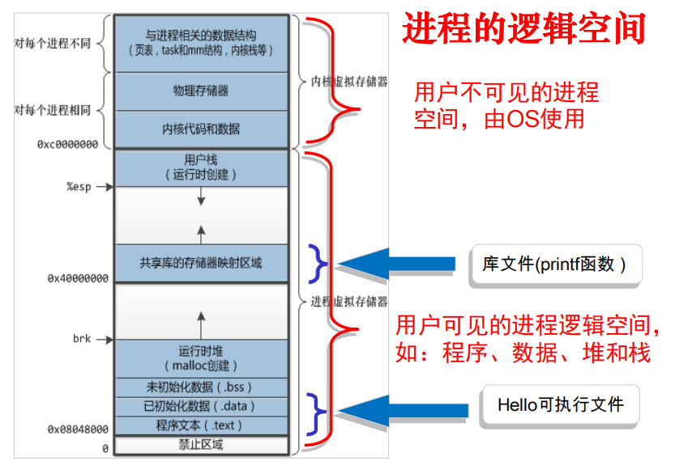

### 0. 基本概念-虚拟地址/内存空间
- 进程的虚拟地址空间即为进程在内存中存放的**逻辑视图**，因此，一个进程的虚拟地址空间的大小和虚拟内存空间的大小相同，且都从0开始编址。
- 含有空白的虚拟地址空间称为 稀疏（sparse） 地址空间

### 0. 基本概念-交换分区
是一段连续的磁盘空间（按页划分的），并且对用户不可见。它的功能就是在物理内存不够的情况下，操作系统先把内存中暂时不用的数据，存到硬盘的交换空间。
- 在Linux系统中，交换分区为Swap
- 在Windows系统中则以文件的形式存在（pagefile.sys）
- 交换器的大小：交换分区的大小应当与系统物理内存（M）的大小保持线性比例关系（Linux中）：
If (M < 2G) Swap = 2*M
else Swap = M+2
- 原因在于，系统中的物理内存越大，对于内存的负荷可能也越大。因此，交换分区的大小也应当相应增加，以满足系统的需要。

### 1. 地址映射问题
- 进程逻辑空间 → 虚拟内存空间
- 进程创建时由**装载器**建立虚拟内存布局，并不会立刻把对应位置的程序数据等（如text、data段）拷贝到物理内存中。
- 只是建立好虚拟内存和磁盘文件之间的映射（又叫**存储器映射**）
- 映射方式：
  - 用户可执行文件+共享库---在页表中的类型为`file backed`---以文件的形式映射到磁盘中
  - 堆+栈---`anonymous`---无文件映射（堆、栈）,地址为空
  - 未分配部分没有对应的页表项，只有在申请时（如使用malloc( )申请内存或用mmap( )将文件映射到用户空间）才建立相应的页表项。
  - 图片如下:

  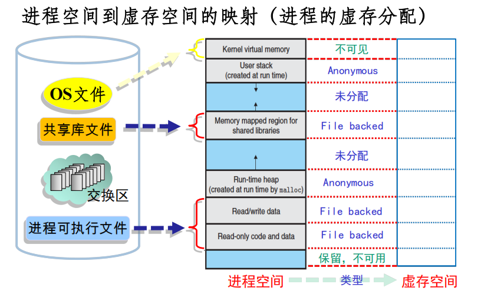
  
- 实际物理页框在运行到对应程序时，缺页时才分配

### 2. 调入问题
- 调入内容：OS 核心 + 用户进程相关
- 调入时机：
  - OS核心数据: 启动时调入
  - 预调页：事先批量调入页面（阻止了大量的缺页错误，部分操作系统如`Solaris`对小文件使用预调页机制）
    - 实际应用中，可以为每个进程维护一个当前工作集合中的页的列表，如果进程在暂停之后需要重启时，根据这个列表使用预调页将所有工作集合中的页一次性调入内存。
    - 预调页有时效果比较好，但成本不一定小于不使用预调页时发生页错误的成本，有很多预调页调入内存的页可能没有被使用
  - 按需调页：缺页时（当且仅当需要时）调入页面
    - 类似于使用交换的分页系统，进程驻留在二级存储器上（磁盘），进程执行时使用 懒惰交换（lazy swapper）换入内存。
    - 需要使用备份存储，保存不在内存中的页，通常为快速磁盘。用于和内存交换页的部分空间称为交换空间（swap space） 。
- 调入机制：缺页错误处理机制
  - 陷入内核态，保存必要的信息（OS及用户进程状态相关的信息）。（现场保护）
  - 查找出来发生页面中断的虚拟页面（进程地址空间中的页面）。这个虚拟页面的信息通常会保存在一个硬件寄存器中，如果没有的话，操作系统必须检索程序计数器，取出这条指令，用软件分析该指令，通过分析找出发生页面中断的虚拟页面。（页面定位）
  - 检查虚拟地址的有效性及安全保护位。如果发生保护错误，则杀死该进程。（权限检查）
  - 查找一个空闲的页框(物理内存中的页面)，如果没有空闲页框则需要通过页面置换算法找到一个需要换出的页框。（新页面调入（1））
  - 如果找的页框中的内容被修改了，则需要将**修改后的内容（不是页面原来有的内容）**保存到磁盘上。（注：此时需要将页框置为忙状态，以防页框被其它进程抢占掉）（旧页面页面写回）
    - 补充假设:
    - 你的程序正在运行，需要读取一份用户数据（比如文件 `data.txt` 中的第 1 页内容）。操作系统去磁盘把这 1 页数据复制了一份，放进了内存的**空闲页框 A** 中。*此时：页框 A 里的内容和磁盘里的内容是**一模一样**的。*
    - 程序在运行过程中，对这页数据进行了修改。比如把原本的 `age = 18` 修改成了 `age = 20`。*此时：页框 A 里的内容变成了最新修改的（`age=20`），而磁盘里的那份还是旧的（`age=18`）。在操作系统中，这个页框会被硬件打上一个标记，称为**“脏页（Dirty Page）”**或者**“已修改位（Modified Bit）设为 1”**。*
    - 过了一会儿，程序突然需要读取一张高清图片（新的虚拟页面），但此时物理内存（书包）已经满了，没有空闲的页框了。操作系统必须**腾出一个页框**来装这张图片。经过算法（如 LRU 算法）挑选，操作系统决定把**页框 A** 腾出来。
    - 这时候操作系统要处理页框 A 了。它一看硬件标记，发现**页框 A 被修改过**。 **如果不保存直接扔掉**：页框 A 被清空换成新图片，那么 `age=20` 这个修改操作就彻底丢失了！下次再从磁盘读这块数据时，读到的还是早期的 `age=18`，程序逻辑就全乱了。
    - **正确的做法（正是你选中的那句话）**：操作系统必须把页框 A 里**最新的、修改过的内容（`age=20`的过程数据）**重新写回到磁盘的对应位置（或者交换区 Swap 中），覆盖掉原来那个 `age=18` 的旧版本。
    - 写回完成后，磁盘上保存的就是最新数据了。此时页框 A 才算真正被“腾干净”，可以安心地把原来的内容抹去，用来装那张新的高清图片了。
    - 如果操作系统挑中淘汰的是**页框 B**（里面装的是只读的代码段，比如 `printf` 函数体），程序在运行期间**从来没有修改过它**。
    - 此时，页框 B 里的内容和刚从磁盘拿出来时一模一样（硬盘里有完美的备份）。
    - 那么操作系统**根本不需要把页框 B 写回磁盘**，直接把页框 B 里的内容丢弃覆盖掉就行了，这样还可以省去一次缓慢的磁盘写入操作（I/O 开销）。
  
  - 页框“干净”后，操作系统将保持在磁盘上的页面内容复制到该页框中。（新页面调入（2））
  - 当磁盘中的页面内容全部装入页框后，向操作系统发送一个中断。操作系统更新内存中的页表项，将虚拟页面映射的页框号更新为写入的页框，并将页框标记为正常状态。（更新页表）
  - 恢复缺页中断发生前的状态，将程序指针重新指向引起缺页中断的指令。（恢复现场）
  - 程序重新执行引发缺页中断的指令，进行存储访问。（继续执行）
  图示:

  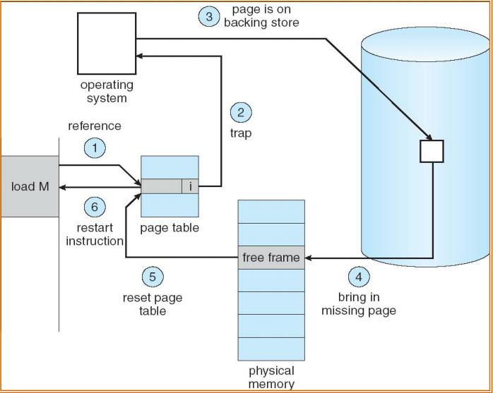

### 3. 替换问题
图示:

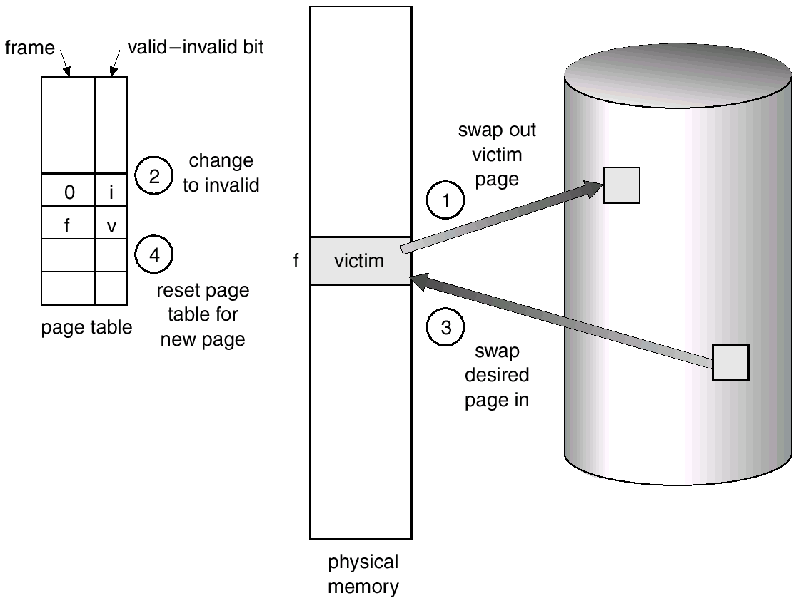

- 页面置换算法：
  - **OPT**：先移出永远不用的页面，如果没有，就移出未来最久不用的页面，理论上性能最好但不可实现。
  - **FIFO**：总选择作业中在主存驻留时间最长的一页淘汰（**先进先出，可用队列方法实现**），可能产生 Belady 异常（**增加内存页数反而增加缺页率**）
  - **Second Chance / Clock**：改进 FIFO，避免频繁换出常用页
  - **LRU**：选择在最近一段时间内最久不用的页面予以淘汰，性能好但硬件开销大
  - **Aging**：LRU 近似实现
  - 其他：NFU、LFU、MRU、ARC、Working Set、WSClock 等

#### 3.1 FIFO算法 
- 一个 Belady 异常的具体示例：
  
  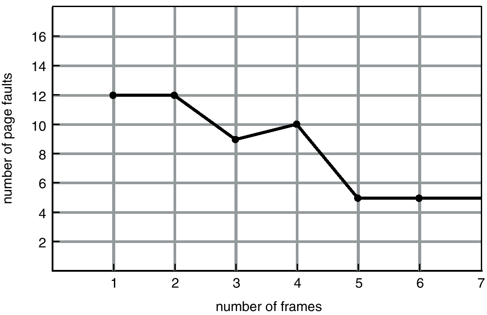

  考虑页面访问序列：  **1, 2, 3, 4, 1, 2, 5, 1, 2, 3, 4, 5**

##### 情况1：物理块数 = 3
- 初始：`[ ]`  
- 访问1：缺页 → [1]  
- 2：缺页 → [1,2]  
- 3：缺页 → [1,2,3]  
- 4：缺页，淘汰队首1 → [2,3,4]  
- 1：缺页，淘汰2 → [3,4,1]  
- 2：缺页，淘汰3 → [4,1,2]  
- 5：缺页，淘汰4 → [1,2,5]  
- 1：命中（已在）→ [1,2,5]  
- 2：命中 → [1,2,5]  
- 3：缺页，淘汰1 → [2,5,3]  
- 4：缺页，淘汰2 → [5,3,4]  
- 5：命中 → [5,3,4]  

**缺页次数 = 9**

##### 情况2：物理块数 = 4
- 初始：`[ ]`  
- 1：缺页 → [1]  
- 2：缺页 → [1,2]  
- 3：缺页 → [1,2,3]  
- 4：缺页 → [1,2,3,4]  
- 1：命中 → [1,2,3,4]  
- 2：命中 → [1,2,3,4]  
- 5：缺页，淘汰队首1 → [2,3,4,5]  
- 1：缺页，淘汰2 → [3,4,5,1]  
- 2：缺页，淘汰3 → [4,5,1,2]  
- 3：缺页，淘汰4 → [5,1,2,3]  
- 4：缺页，淘汰5 → [1,2,3,4]  
- 5：缺页，淘汰1 → [2,3,4,5]  

**缺页次数 = 10**

> 结果：4个物理块时缺页 **10次**，反而比3个块时的 **9次** 还多，这就是 **Belady Anomaly**。

##### 为什么FIFO会发生这种现象？
- FIFO只按进入内存的时间顺序淘汰，不考虑页面的使用频率。增加内存后，某些“早进入但频繁使用”的页面会被保留更久，反而可能淘汰掉即将被再次访问的页面，导致后续更多缺页。
- **LRU（最近最久未使用）** 和 **OPT（最优置换）** 等算法不会出现Belady异常（它们属于 **栈式算法**）。
- Belady异常揭示了：并非所有置换算法都满足“内存越大性能越好”的直觉，FIFO是一个反例。
  
##### 改进版本：
- `Second Chance`:在淘汰前检查页面的访问位，如果访问过则给予“第二次机会”，将其移到队尾并清空访问位，继续检查下一个页面。显然，如果所有页面都被访问过了，那么最终还是会淘汰最早进入的页面（因为访问位被清空）。
  图示：

  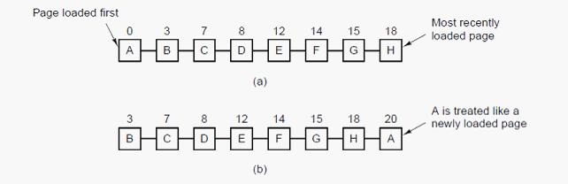
  
- `Clock`:使用一个指针在页面队列上循环，
  - 如果没有缺页错误，被访问到的页面访问位置1，指针不动；
  - 否则检查访问位，若为1，清零且跳过；否则该页被替换，指针指到下一个。
  相比FIFO更智能地保留频繁访问的页面。
  - 可以监视扫描指针的移动速率来调整系统负载，速率快=>负载过轻，速率慢=>负载过重。
  图示：

  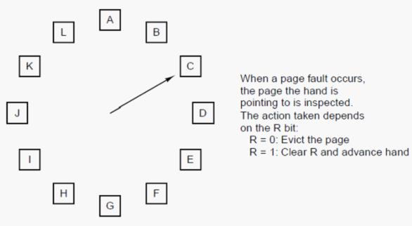

  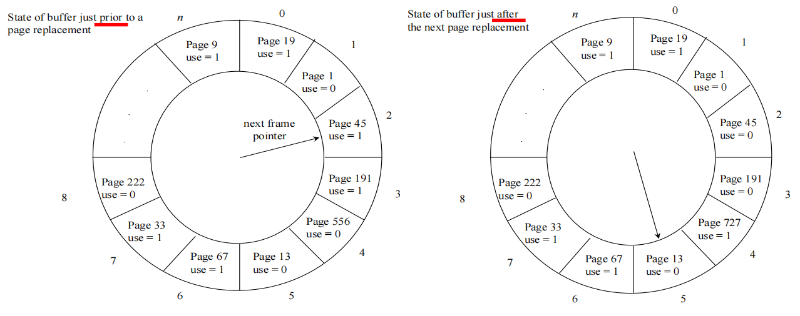

#### 3.2 LRU算法 
- 设置一个特殊的栈，保存当前使用的各个页面的页面号。
- 每当进程访问某页面时，便将该页面的页面号从栈中移出，将它压入栈顶。栈底始终是最近最少使用页面的页面号。
- 平替：Aging算法，是LRU的简化
  - 为每个页面设置一个移位寄存器，并设置一位访问位R，被访问时R=1，否则R=0
  - 每隔一段时间，所有寄存器右移1位，并将R值从左移入(刚开始是最高位，使得数值最大，随着时间推移逐渐变小)
  - 显然，访问频率高的页面寄存器值较大，更可能被保留，每一次选择寄存器值最小的页面淘汰
  图示：

  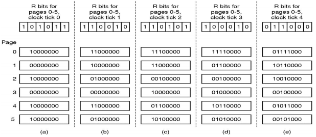

#### 3.3 多算法对比

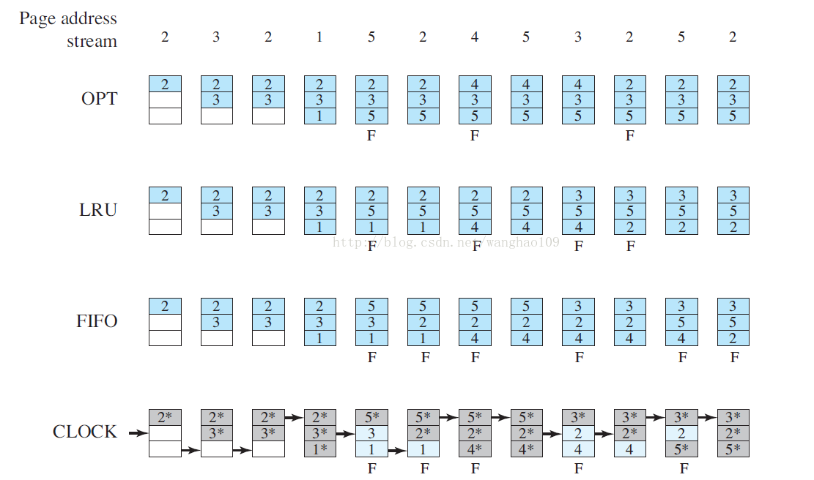

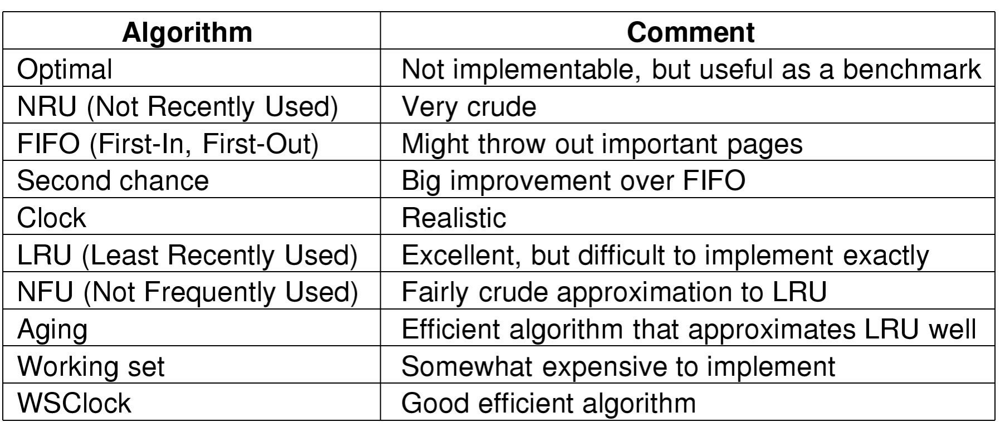

### 4. 换出时更新问题
在虚存系统中，主存作为辅存（磁盘）的高速缓存，保存了磁盘信息的副本。因此，当一个页面被换出时，为了保持主辅存信息的一致性，必要时需要信息更新：
- file backed：
  - 未修改：丢弃，因为磁盘上相同
  - 已修改：写回磁盘原位置
- anonymous：
  - 首次换出：写入 Swap
  - 已修改：写入 Swap
  - 未修改且非首次：丢弃

### 5. 其他问题

#### (1) 工作集与驻留集
- **工作集**：一个进程在时间窗口`Δt`内访问的页面集合，用二元函数|W(t, Δt)| 指执行时刻t时工作集大小即页面数目
- **驻留集**：一个进程在内存中实际分配的页框集合
  - 分配给每个活跃进程的页框数越少，同时驻留内存的活跃进程数就越多，进程调度程序能调度就绪进程的概率就越大。然而，这将导致进程发生缺页中断的概率较大
  - 为进程分配过多的页框，并不能显著地降低其缺页中断率
- 引入工作集的目的：动态调整驻留集，避免缺页过多或资源浪费

#### (2) 页面分配策略
- 固定分配：驻留集大小在运行期间固定
- 可变分配：视缺页率高低动态增减
- 可变分配策略比固定分配策略更灵活，既可以提高系统的吞吐量，又能保证内存的有效利用。然而，可变分配要求统计进程的缺页率，增加系统额外开销。
- 可变分配策略不仅需要操作系统软件专门的支持，而且还需要处理机平台提供的硬件支持

#### (3) 页面置换策略
当系统欲把一个页面装入内存时，应当在什么范围内判断已经没有空闲页框供分配？
当指定的范围内没有空闲页框时，应当从哪里选择哪个页面移出内存？
- 局部置换：仅在进程自身驻留集中判断并置换
- 全局置换：可在所有进程间（包括其他进程驻留集）判断并置换
- 此时，全局置换算法的一个问题是，程序无法控制自己的缺页率。因为一个进程在内存中的一组页面不仅取决于该进程的页面走向，而且也取决于其他进程的页面走向
  图示：

  
- 内存块初始分配方法：
  - 等分法：每个进程分配相同页数
  - 按比例法：根据进程大小占比分配，分给进程的块数=进程地址空间大小 / 全部进程的总地址空间 * 可用块总数
  - 优先权法：高优先级进程分配较多内存

#### (4) 抖动与负载控制
**抖动**：随着驻留内存的进程数目增加，或者说进程并发水平的上升，处理器利用率先是上升，然后下降
- 抖动：驻留集 < 工作集，频繁缺页使得调页开销增大
- 目标：**并发水平**和**缺页率**的平衡
  图示:

  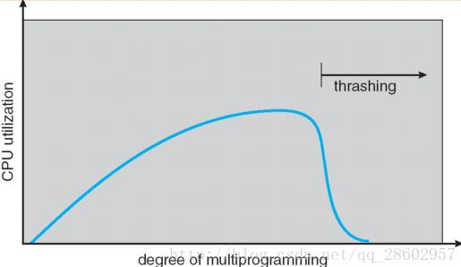
  
- 预防/消除：
  - 局部置换：一个出现抖动的进程不能从另外的进程那里夺取内存块，从而不会引发其他进程出现抖动，但显然不能根治。
  - 工作集算法
  - 预留部分页面
  - 挂起进程：挂起一个或几个进程，以便腾出内存空间供抖动进程使用，从而消除抖动现象。
**负载控制**：主要解决系统**应当保持多少个活动进程驻留在内存**的问题，即控制多道程序系统的度
  - L=S 准则：通过调整多道程序的度，使发生两次缺页之间的平均时间（L）等于处理一次缺页所需要的平均时间（S），此时处理器利用率最高
  - 50% 准则：当分页单元的利用率保持在50%左右时，处理机利用率将达到最大
  - 挂起策略：优先级最低、缺页进程、最后一个被激活、驻留集最小、最大进程等

#### (5) 页面清除与缓冲
- 若被选中的置换页面被修改过，则需要将该页面内容写回外存，然后装入新页内容，此时写出一个页面与读入一个新页的操作是成对出现的，而且写出操作先于读入操作。这可能降低处理机的使用效率
- 页面缓冲：将置换页暂时保留在内存的一个缓冲区，在以后某个合适的时候将这些被置换页批量写出到外存，减少 I/O

#### (6) 写时复制
- 两个进程共享同一块物理内存，每个页面都被标志成了写时复制。共享的物理内存中每个页面都是只读的。如果某个进程想改变某个页面时，就会与只读标记冲突，而系统在检测出页面是写时复制的，则会在内存中复制一个页面，然后进行写操作
- 新复制的页面对执行写操作的进程是私有的，对其他共享写时复制页面的进程是不可见的。如图：

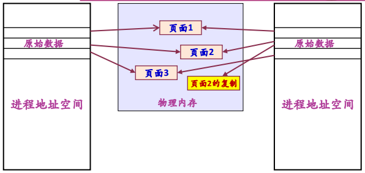

- 传统的fork()系统调用直接把所有的资源复制给新创建的进程，效率低下，首先很多资源是只读的，其次如果新进程打算立即执行一个新的映像（`比如执行 exec() 加载新程序，当前进程的代码段、数据段、堆、栈都会被新程序的对应内容取代`），那么所有的拷贝都将前功尽弃
- Linux的fork()使用写时拷贝实现，它可以推迟甚至免除拷贝数据的技术
  - 内核此时并不复制整个进程地址空间，而是让父进程和子进程共享同一个拷贝
  - 只有在需要写入的时候，数据才会复制，从而使各个进程都拥有各自的拷贝
  - 也就是说，资源的复制只有在需要写入的时候才进行
  
#### (7) 内存映射文件
- 内存映射文件：进程通过一个系统调用（mmap）将一个文件（或部分）映射到其虚拟地址空间的一部分，访问这个文件就像访问内存中的一个大数组（**映射到虚拟地址空间**），而不是对文件进行读写。
- 在多数实现中，在映射共享的页面时不会实际读入页面的内容，而是在访问页面时，页面才会被每次一页的读入，磁盘文件则被当作后备存储
- 当进程退出或显式地解除文件映射时，所有被修改页面会写回文件
- 采用内存映射方式，可方便地让多个进程共享一个文件（**就像访问内存一样**），而不需要显式地进行读写操作，且效率较高
- 举例：
  - 比如一个100MB的文件
  - 系统调用 `mmap()` 将该文件起始地址映射到进程的虚拟地址空间中，这个时候只负责标记虚拟地址，对应的物理页框是空的。
  - 当进程访问这个映射区域的某个地址时，发生缺页中断，操作系统会根据缺页地址计算出对应的文件偏移量，从磁盘上读取相应的页面内容到物理内存中，并更新页表项，使得该虚拟地址映射到新加载的物理页框。
  - 如果程序只访问了文件的前 1MB，那么只有那 1MB 被读入内存，剩余 99MB 一直留在磁盘。这大大节省了物理内存和 I/O 时间。
  - 物理内存中的页面如果被换出，也会写回这个文件（对于共享映射而言）。
  - 修改并不会直接写回磁盘文件，而是先写入内存中的页面，等到以下几个时候才写回磁盘文件，这样减少 I/O 次数，提高效率。
    - 页面被换出
    - 调用 msync() 强制同步
    - 进程退出或解除映射
  - 多个进程可以共享一个文件。且进程A的修改对进程B可见，因为它们共享了物理内存，同时保证了修改会写回磁盘文件。
- 图示:

  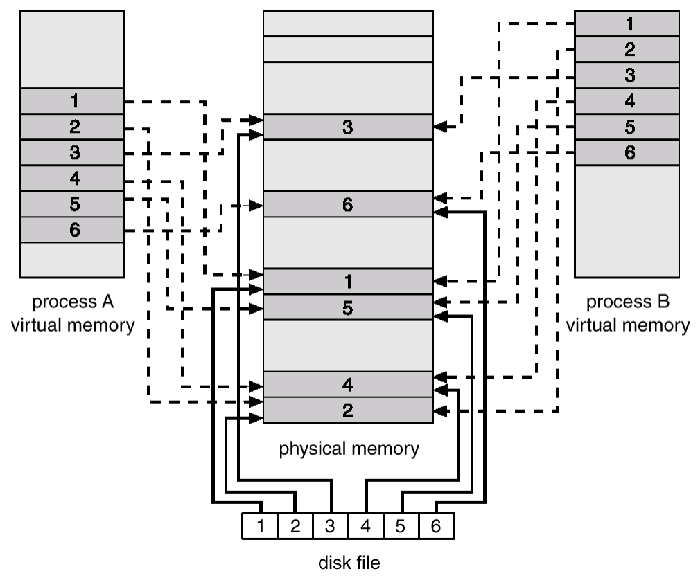

#### (8) 存储保护
- 界限保护：地址在上下界之间
- 用户态/内核态
- 存取控制检查
- 环保护（Ring 0~3）：处理器状态分为多个环(ring)，分别具有不同的存储访问特权级别(privilege)
  - 通常是级别高的在内环，编号小（如0环）级别最高
  - 可访问同环或更低级别环的数据，可调用同环或更高级别环的服务
  - 如图：

  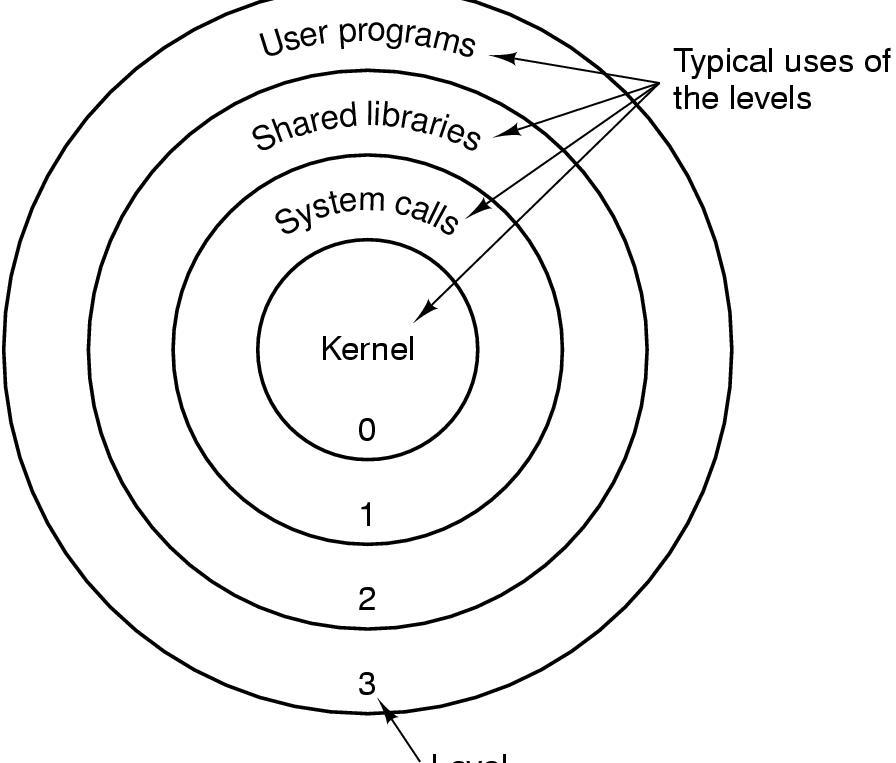

#### (9) 性能分析
- 缺页率 \( p \)
- 有效访问时间：
  \[
  EAT = (1-p) \times \text{内存访问时间} + p \times (\text{缺页处理开销} + \text{换入换出时间})
  \]

## 七、内存管理实例

### Solaris (UNIX)
- 交换系统 + 内核存储分配器（为内核提供内存分配服务）
- 数据结构：
  - 页表：每个进程有一个页表，进程逻辑空间的每页对应页表中的一个表项
  - 硬盘块描述表：该表表项与页表表项一一对应，描述该页在磁盘上的副本
  - 页面表：按物理页面号排序，描述每个物理页面
  - 交换表：每个磁盘交换区有一个交换表，该交换区上的每个页副本对应一个表项
- 双指针轮转置换算法：该算法利用页面表上的几个指针维护一个空闲页面表。当空闲页面数少于一定阈值时，该算法置换一些页面加入空闲页面表。
  图示：

  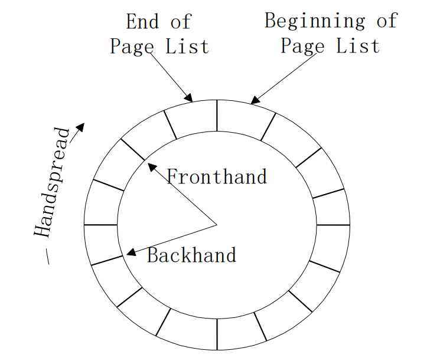

#### 内核存储分配器
内核需要分配和释放小内存块，用于内核的数据结构和缓冲区，这些内存块通常比物理页面要小许多，其分配和释放要求快速进行，其大小变化是缓慢的（意味着可以事先安排好）
内核的数据结构就是像进程控制块、文件描述符之类的，体量小，但没有他不行
内核存储分配器的可能运用的方法：惰性动态分区算法（Lazy Buddy System）
- 分配大小可变，但只能为 \( 2^k \)
- 合并条件：当空闲分区超过一定数目时，才合并
- 该算法维护的参数：
  - Ni表示大小为2^i的分区数目
  - Ai表示大小为2^i的已分配分区数目
  - Gi表示大小为2^i的适合合并空闲（globally free）分区数目
  - Li表示大小为2^i的不适合合并空闲（locally free）分区数目
  - 我们有如下关系：
    Ni = Ai + Gi + Li
- 合并的判断条件：
  - 要求Li <= Ai；依据它们的差来决定是否合并：差为0或1时进行合并，大于1时不合并

### Windows NT
- 页面调度：
  - 取页策略：`NT`采用**按进程需要进行的请求取页**和**按集群方法进行的提前取页**。集群方法是指在发生缺页时，不仅装入所需的页，而且装入该页附近的一些页。
  - 置页策略：在线性存储结构中，简单地把装入的页放在未分配的物理页面即可。
  - 淘汰策略：采用局部FIFO置换算法。在本进程范围内进行局部置换，利用FIFO算法把驻留时间最长的页面淘汰出去。
- 工作集自动调整：`NT`根据内存负荷和进程缺页情况自动调整工作集。
  - 进程创建时，指定一个最小工作集（可用SetProcessWorkingSetSize函数指定）。
  - 当内存负荷不太大时，允许进程拥有尽可能多的页面。
  - 系统通过自动调整保证内存中有一定的空闲页面存在。

