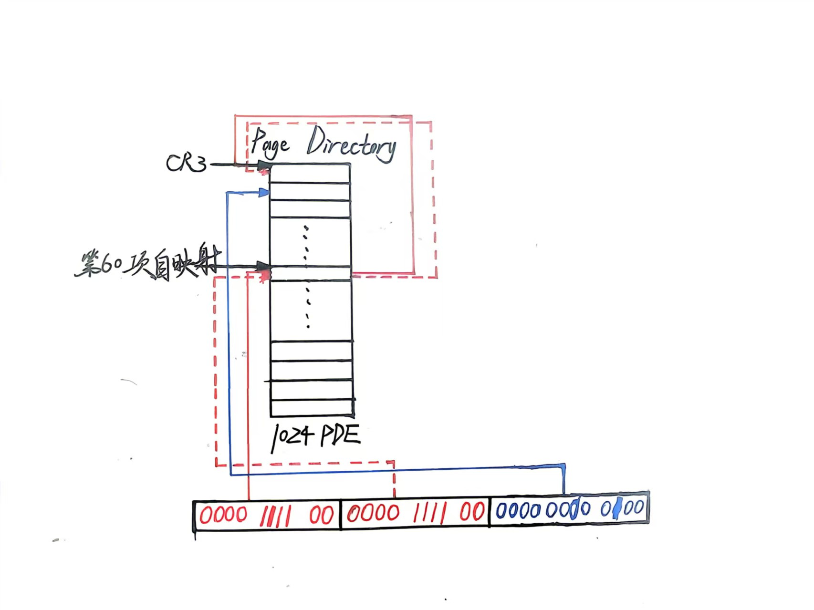
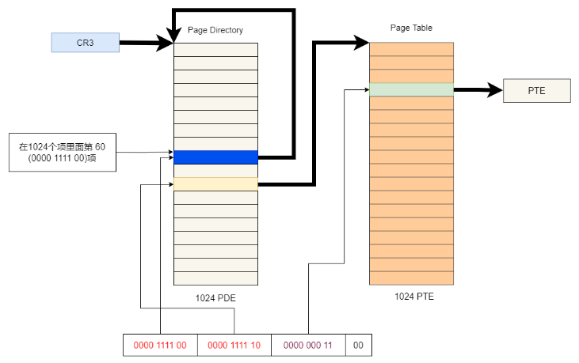
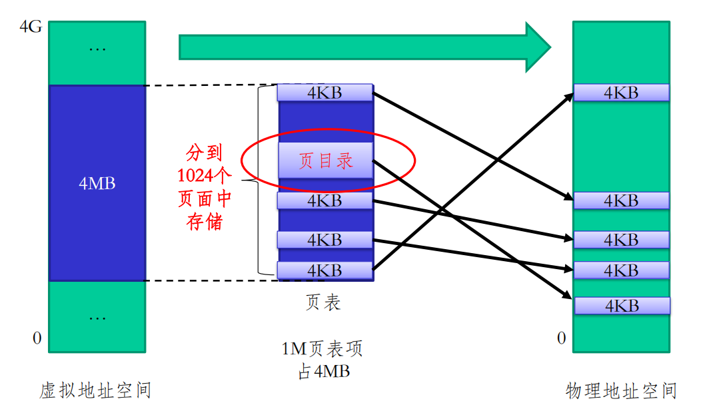
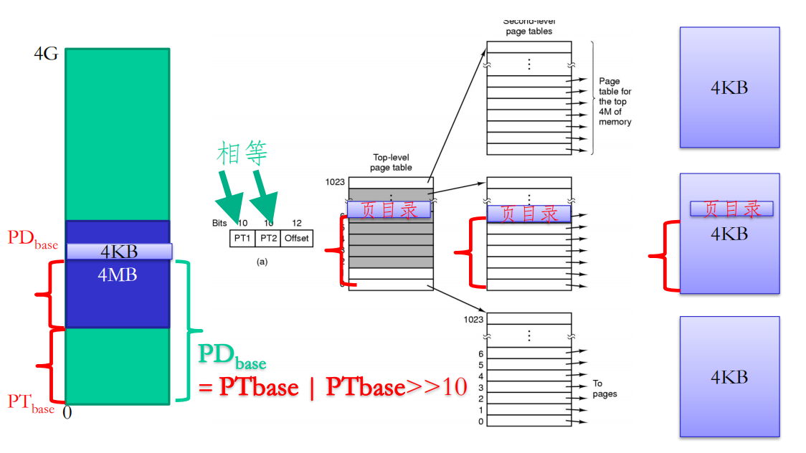
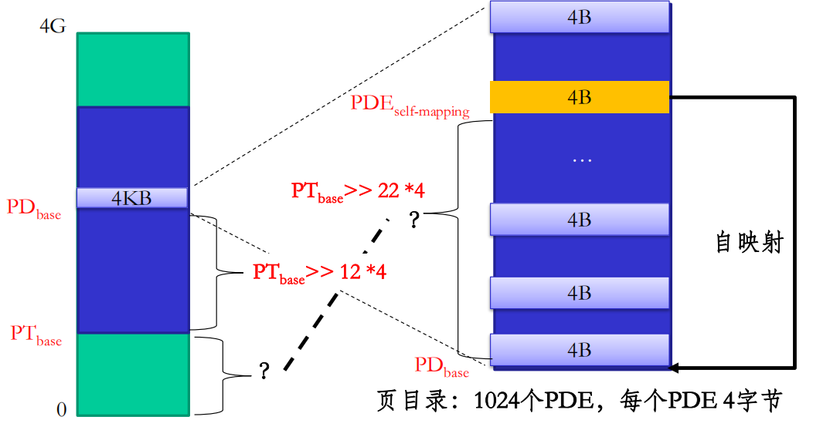
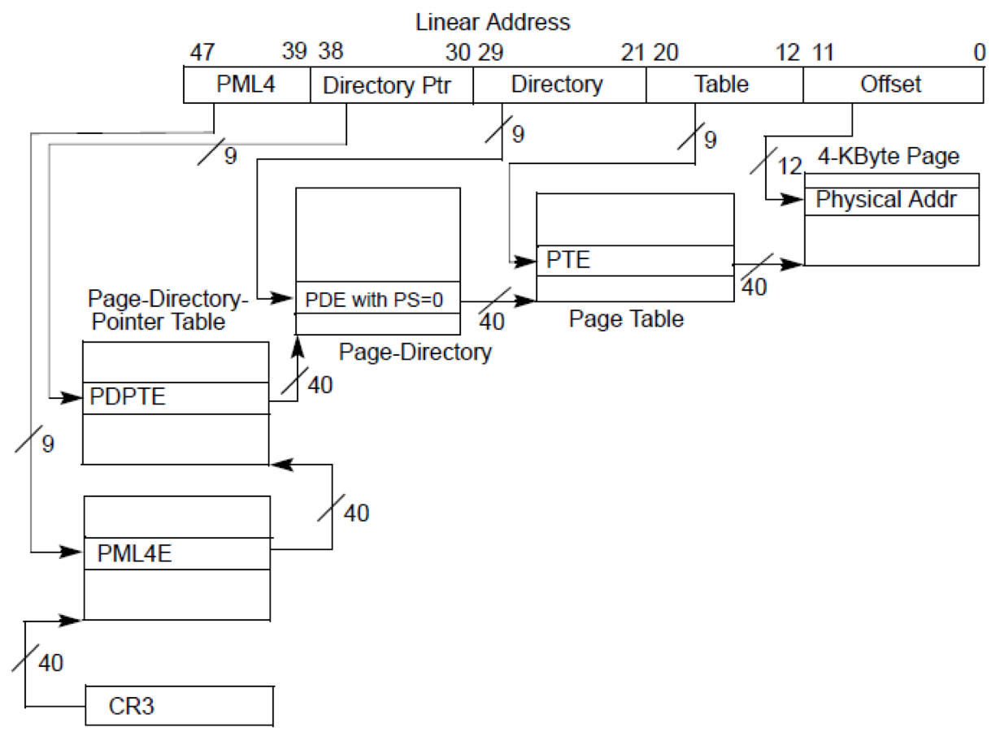
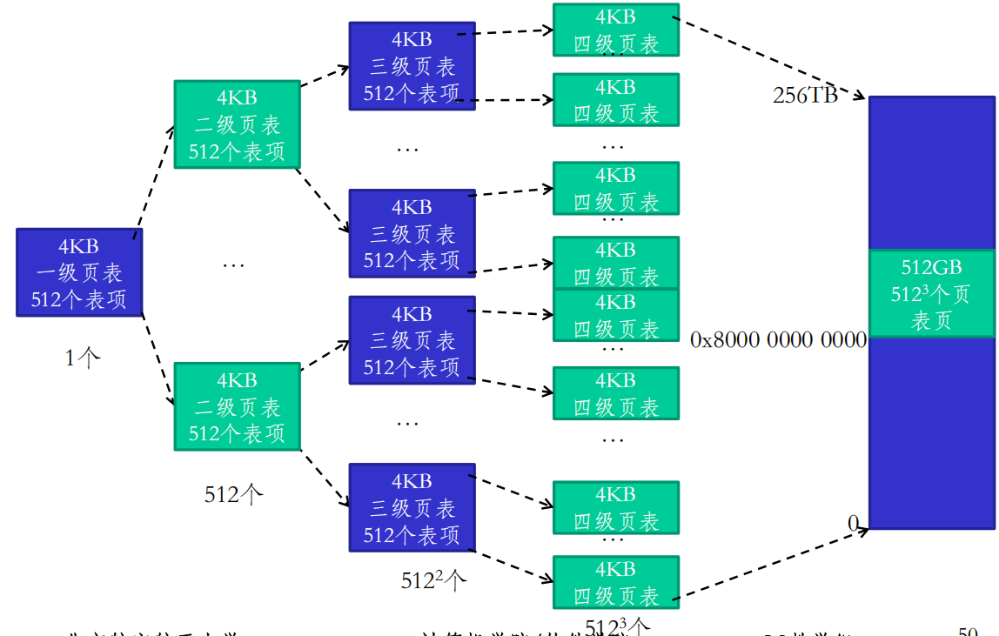
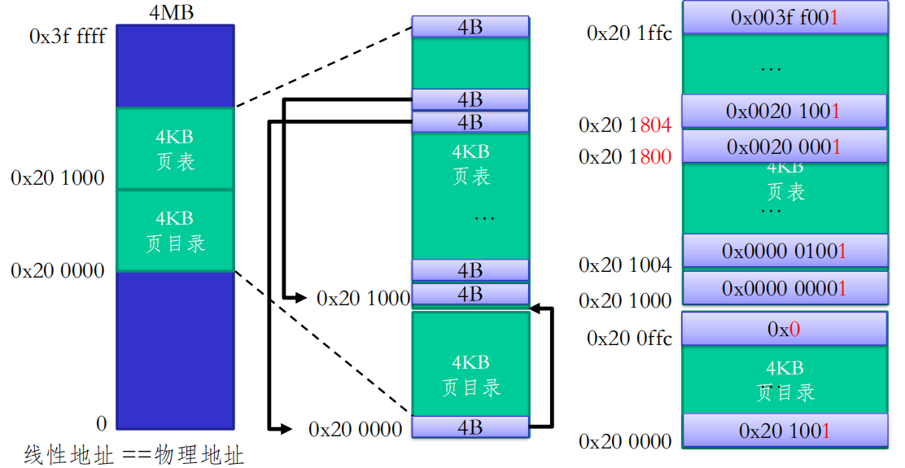

# 页目录自映射课程总结

## 1、自映射部分

先来回顾`3-3段式内存管理`中提到的把**线性地址**映射为**物理地址**的概念，
接下来分两个部分来讲讲页目录自映射：

### 1.1 页目录对自身的自映射

对于一个32位系统，我们不妨假设其页目录表的始地址是 `0x00100000`；假设该页目录表的索引60项设置为 `0x00100000`，也就是把页目录表的第一项指向页目录表自己。
当 CPU 访问线性地址 `0x0F03C004`时：
- 先取前10位：`0000111100`，得到页表的索引60项，也就是指向代表页目录表的那个页表页（也就是指向自己）
- 再取中间10位：`0000111100`，得到页目录表内的索引60项，发现它指向了 `0x00100000`，即第1项页表，还是指向自己
- 最后的12位：`000000000100`，得到页内偏移为1，即指向页目录第二项
显然如果想要访问页目录表的其他项，可以通过改变线性地址的后12位来实现。
当然，在实际的`OS`中，页目录表的最后一项通常是用来映射内核空间的，这样用户空间就无法访问到内核空间了。
以上均为物理地址
补个图：



### 1.2 页目录对其他页表的映射

显然就是改一下，假设该页目录表的索引4项指向地址 `0x00101000`。 
当CPU 访问线性地址 `0x00004000`时：
- 先取前10位：`0000000000`，同上
- 再取中间10位：`0000000100`，得到页目录表的索引4项，发现它指向了 `0x00101000`，也就是指向某一个页表
- 最后的12位：`000000000000`，得到页内偏移为0，即指向这个首地址为 `0x00101000` 的页表的第一项
同样的，如果想要访问这个页表内的其他项（地址偏移），可以通过改变线性地址的后12位来实现；想访问别的地址的页表，可以修改线性地址的中间10位。
以上均为物理地址
补个图：



总结：设置某个页目录项指向某个页表页的物理地址，就可以通过访问对应的线性地址来访问这个页表页了；设置某个页目录项指向页目录表自己的物理地址，就可以通过访问对应的线性地址来访问页目录表了。

## 2、PTbase和PDbase

### 2.1 为什么要定义 PTbase 和 PDbase？

因为自映射只告诉操作系统"可以访问页表本身"，但没有告诉操作系统"怎么访问他们“，即”页目录表和二级页表在虚拟地址空间中的位置"，所以需要定义 PTbase 和 PDbase 来明确它们的虚拟地址位置。

### 2.2 PTbase 的定义

**PTbase** 是页表区域（即所有页表页）的起始虚拟地址，该地址必须 **4MB 对齐**，即低 22 位全为 0，这样，对齐后能保证整个区域不跨越 4MB 边界，简化地址计算和映射关系。**OS设计者可规定其所在位置**。
例如：`0x7fc00000` 就是一个 4MB 对齐的地址（因为 `0x7fc00000 & 0x3FFFFF = 0`）。

补图：页目录和页表关系：



### 2.3 PDbase 的定义

**PDbase** 是页目录表起始的虚拟地址。
页目录本身是页表区域中的一个页（4KB），所以 PDbase 位于 `[PTbase, PTbase + 4MB)` 范围内。

### 3. 如何从 PTbase 推导出 PDbase 和自映射项？

首先，我们要认为，页目录的虚拟地址和对应页目录项的物理地址一定连续（即页目录本身是连续的）。当然，各个页表区域的物理地址未必连续。
当 CPU 访问虚拟地址 VA 时（分页已开启），如果希望自映射的实现，我们希望`PDbase`中的**某一个虚拟地址**能够被转换到页目录自身（物理页`PD_phys`）。
也就是说，当 CPU 处理`PDbase`的那个地址时，最终得到的物理页框应该是页目录的起始物理地址`PD_phys`。
显然由于**在虚拟地址中，我们一开始只知道起始点PTbase**，所以**我们只能利用这个有效信息设计一个合适的PDbase**。
理解这一点，显然就有如下方法：把虚拟地址的前10位作为偏移量，即：
$ PDbase = PTbase + (PTbase >> 10) $

如图：



同样的，我们在这个页面（页目录中）中设置一个自映射项（即那个指向页目录物理地址的项），让它指向页目录的物理地址`PD_phys`，即：
$ PDE_self_-_map = PTbase + (PTbase >> 10) + (PTbase >> 20) $

如图：



是的，这样就确保了`PDE_self_map`这个虚拟地址存储了`PD_phys`，会映射到页目录所在的物理页框。并且该地址仅由`PTbase`决定。
当然完全可以基于`PTbase`，设计别的方式指定`PDbase`和`PDE_self_map`，上述只是一种处理方式。搞明白这点就不会觉得这个操作多么高深莫测


### 4. 举个例子：
先看图
```
虚拟地址空间 (4GB)                        物理内存
─────────────────────────────────────────────────────────────────

  高地址
    ↑
    │
    │    ... 其他区域 ...
    │
    │  ┌─────────────────────────────────────┐
    │  │  页表区域 (4MB 连续虚拟地址)         │
    │  │  PTbase = 0x7fc00000                │
    │  │  ┌───────────────────────────────┐  │
    │  │  │ 页表页 0 (4KB)                │  │  ──────→  ┌───────────────┐
    │  │  │ 虚拟地址: PTbase + 0x0000     │  │           │ 页表页0物理页 │
    │  │  └───────────────────────────────┘  │           │ (由 PDE[0] 指向)
    │  │  ┌───────────────────────────────┐  │           └───────────────┘
    │  │  │ 页表页 1 (4KB)                │  │  ──────→  ┌───────────────┐
    │  │  │ 虚拟地址: PTbase + 0x1000     │  │            │ 页表页1物理页 │
    │  │  └───────────────────────────────┘  │           └───────────────┘
    │  │            ...                      │                  ...
    │  │  ┌───────────────────────────────┐  │
    │  │  │ 页表页 s = 511 (4KB)          │  │
    │  │  │ 虚拟地址: PDbase = PTbase + s*4K │
    │  │  │   = 0x7fdff000                │  │  ──────→  ┌───────────────┐
    │  │  │                               │  │           │ 页目录物理页  │
    │  │  │  这个页就是【页目录表】           │  │           │ (由 PDE[s] 指向)
    │  │  │                               │  │           │ CR3 = 0x12345000
    │  │  │  它的内部:                     │  │           │ ┌─────────────┐
    │  │  │   ┌─────────────────────┐     │  │           │ │ PDE[0]      │─→ 页表页0物理页
    │  │  │   │ PDE[0] (4字节)      │      │  │           │ │ PDE[1]      │─→ 页表页1物理页
    │  │  │   ├─────────────────────┤     │  │           │ │   ...       │
    │  │  │   │ PDE[1]              │     │  │           │ │ PDE[s] (自映│─┐
    │  │  │   ├─────────────────────┤     │  │           │ │  射项)      │ │
    │  │  │   │        ...          │     │  │           │ └─────────────┘ │
    │  │  │   ├─────────────────────┤     │  │           │                 │
    │  │  │   │ PDE[s] (自映射项)    │     │  │           │                 │
    │  │  │   │  内容: 0x12345003    │─────┼──────────────┘                 │
    │  │  │   └─────────────────────┘     │  │                              │
    │  │  └───────────────────────────────┘  │                              │
    │  │            ...                      │                              │
    │  └─────────────────────────────────────┘                              │
    │                                                                       │
    └───────────────────────────────────────────────────────────────────────┘
  低地址
```
看见了吗，在这个`4MB`的页表区域中，目录表并不是存在第一个页表页里面，而是混在全体页表中间的
结合这个图，假设操作系统在初始化时决定：
页表区域起始虚拟地址：PTbase = 0x7fc00000（4MB 对齐）
页目录的物理基址（将写入 CR3）：CR3_phys = 0x12345000
根据自映射公式，可以算出：
- 页目录的虚拟地址：PDbase = PTbase | (PTbase >> 10) = 0x7fc00000 | 0x1ff000 = 0x7fdff000
- 自映射项在页目录中的索引：PDX_self = PTbase >> 22 = 0x7fc00000 >> 22 = 0x1ff（十进制 511）
- 自映射项的虚拟地址：PDE_self_va = PDbase + PDX_self * 4 = 0x7fdff000 + 0x7fc = 0x7fdff7fc
- 自映射项的物理地址：PDE_self_pa = CR3_phys + PDX_self * 4 = 0x12345000 + 0x7fc = 0x123457fc
- 自映射项的内容：必须指向页目录自身，因此 PDE_self = CR3_phys | 标志位 = 0x12345000 | 0x3（假设标志为 0x3）
- 假设操作系统需要修改 第 5 个页表页（这里暂且视作索引 5）中的 第 100 个页表项（暂且视作索引 100）。该页表项的对应虚拟地址应为`0x7fc05190`：
  - 页目录索引：PDX = (0x7fc05190 >> 22) & 0x3FF = 0x1FF，显然取第 511 个页目录项（自映射项），内容为`0x12345003`
  - 页表索引：PTX = (0x7fc05190 >> 12) & 0x3FF = 0x5，取第 5 个页表项（中间10位）
  - 页表项物理地址：PTE_pa = 页表页物理地址 + PTX * 4 = 0x12345000 + 0x14 = 0x12345014，于是应当指向第 5 个页表页的物理地址
  - 最后加上页内漂移，得到最终物理地址，正好对应第 5 个页表页中的第 100 个页表项。
  - 搞定！

### 5. 反过来：已知 PDbase 求 PTbase

**示例**：若 PDbase = `0xC0300000`，  
`PDbase >> 12 = 0xC0300`，  
`0xC0300 / 1025 ≈ 0xC0`，不是整数，说明 PDbase 可能不是严格由自映射公式得出的，需谨慎。
事实上，常见设计是取 PTbase 为 0x80000000，则 PDbase = 0x80200000。
其实知道那个公式就行了，可以逆推1025倍数关系，这里没必要赘述

### 6. 多级目录的扩展

一个48位页式存储系统，采用4级页表：



也是一样的逻辑，在物理内存意义上，一级页表在二级页表里面，二级在三级里面，三级在四级里面；从一级页表开始，逐级映射到二级、三级、四级页表，最终映射到物理内存。自映射的概念同样适用，可以在一级页表中设置一个自映射项指向一级页表自身，从而实现对整个页表结构的访问和管理。此时构建图示如下：



假如这里的（PTbase）起始地址是`0x8000 0000 0000`，此时显然可以观察出每级页表为512个（2的9次方），那么根据自映射公式：
$ PDbase = PTbase + (PTbase >> 9) + (PTbase >> 18) + (PTbase >> 27) = 0x8040 2010 0000 $

通过 PTbase 与 PDbase 的关系，OS 可以轻松地在虚拟地址空间中定位页目录和页表，并利用自映射项直接修改页目录本身，从而高效管理页表。这是现代操作系统内存管理中的一个精巧设计。

### 7. X86初始系统页的建立

在开启分页之前，操作系统需要预先在内存中构造一个简单的页表，使得开启分页后，CPU 能继续执行当前代码。最常用的方法是 恒等映射：让虚拟地址的低 4MB 直接映射到相同的物理地址。

#### 7.1 布局与参数

假设：
- 物理地址 `0x200000`（2MB）处存放 **页目录**（4KB）
- 物理地址 `0x201000`（2MB+4KB）处存放 **第一个页表**（4KB）
- 我们要映射的虚拟地址范围：`0x00000000` ~ `0x003FFFFF`（4MB）

#### 7.2 页目录（PDE）内容和第一个页表（PTE）内容

页目录只有一项有效（索引 0），其余 1023 项暂时无效。(虚拟地址=物理地址)

| 页目录索引 | 物理地址（PDE位置） | 内容（物理地址+标志） | 说明 |
|------------|---------------------|-----------------------|------|
| 0          | `0x200000`          | `0x201003`            | 指向第一个页表（物理基址 `0x201000`），存在、可读写 |
| 1~1023     | `0x200004` ~ `0x200FFC` | `0x00000000`          | 无效（或暂未设置） |

1024 个页表项，每个指向一个 4KB 物理页框，实现恒等映射。

| 页表索引 | 物理地址（PTE位置） | 内容（物理页框+标志） | 映射到的物理页框 |
|----------|---------------------|-----------------------|------------------|
| 0        | `0x201000`          | `0x00000003`          | 物理页框 `0x00000000`（0~4KB） |
| 1        | `0x201004`          | `0x00001003`          | 物理页框 `0x00001000`（4KB~8KB） |
| 2        | `0x201008`          | `0x00002003`          | 物理页框 `0x00002000`（8KB~12KB） |
| ...      | ...                 | ...                   | ... |
| 1023     | `0x201FFC`          | `0x003FF003`          | 物理页框 `0x003FF000`（4MB-4KB ~ 4MB） |

每个 PTE 的低 12 位设置为 `0x003`（存在位 + 可读写位）。

#### 7.3 页目录和页表的物理布局
如图:



经过页表转换：
  1. 高10位 PDX=0 → 页目录第0项 → 指向页表物理地址 0x201000
  2. 中间10位 PTX → 页表内偏移 → 得到PTE → 指向物理页框
  3. 低12位偏移 → 页内偏移

#### 7.4 开启分页的步骤

1. 将页目录物理地址 `0x200000` 加载到 CR3 寄存器。
2. 设置 CR0 的 PG 位（同时可能已开启保护模式）。
3. 此时 CPU 开始将取指地址视为虚拟地址。  
   由于 PC（EIP）仍在低 4MB 范围内，通过页表转换后，实际访问的物理地址与虚拟地址相同，所以代码继续正确执行。

#### 7.5 之后过渡到自映射

当内核完成更高级的初始化后，会建立完整的页表结构，包括：
- 分配新的页目录和页表页，物理位置可以任意（不必连续）
- 建立自映射项，使页目录的虚拟地址可访问
- 将页表区域（例如从 `0x7fc00000` 开始）映射到所有页表页
- 切换 CR3 到新页目录，并更新内核的虚拟地址映射，废弃初始的恒等映射

