# 进程管理-进程与线程课程总结

## 1. 程序并发执行的 Bernstein 条件

### 1.1 基本概念辨析
- **顺序执行**：程序严格按照指定的次序执行，具有**顺序性**、**封闭性（独占全部资源）**和**可再现性（初始条件相同则结果相同）**。
- **并发**：多个活动在同一时间段内同时运行（时间重叠），无论是否在同一处理机上。
- **并行**：多个程序在同一时刻运行在不同的处理机上。
- **前趋图**：有向无循环图，用于描述语句或程序段之间的执行先后次序（如 A → B）。如图：

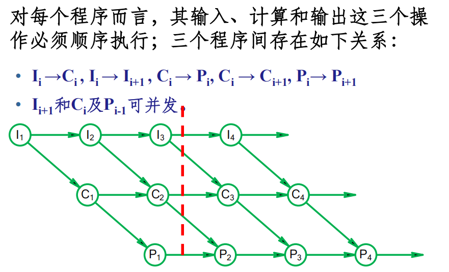

### 补充并发和并行的区别（虽然确实特别简单）

| 场景 | 并发 | 并行 |
| :--- | :--- | :--- |
| **单核电脑运行浏览器和音乐** | 操作系统把 CPU 时间切成**时间片**，一会儿给浏览器运行几毫秒，一会儿给音乐播放器运行几毫秒。切换极快，用户感觉两个软件**同时**在运行。<br>**（实际是快速交替）** | **不存在并行**。因为只有一个物理计算核心，同一时刻只能执行**一条指令**。 |
| **四核电脑进行视频渲染** | 依然存在并发，因为系统后台还有几百个线程在切换。 | 渲染软件把画面切成 4 块，分别交给 **4 个核心同时计算**。此时 4 个核心都在满负荷运算，**真正同时进行**。 |

- **并发是逻辑上的“同时”，通过时间片轮转实现**（**交错执行**）。  
- **并行是物理上的“同时”，依赖多硬件资源实现**（**同时执行**）。  

> **注意**：所有并行都是并发，但并发不一定是并行（单核也能并发）。

### 1.2 程序并发执行的特征
- **间断性**：呈现“执行—暂停—执行”的规律。
- **非封闭性**：多个程序共享资源，相互影响。
- **不可再现性**：执行结果依赖于执行速度与次序（可能产生与时间有关的错误）。如图：

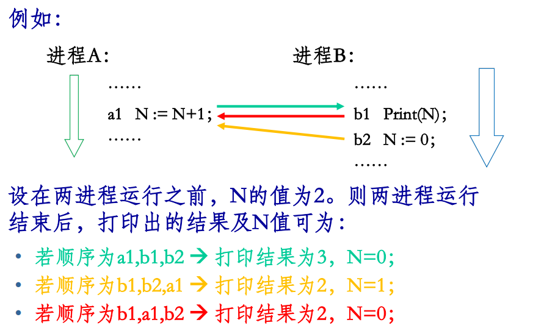

### 1.3 竞争与竞态
- **竞争**：多个进程读写共享数据，结果依赖于执行的相对时间。
- **竞态**：并发访问同一数据且结果与访问顺序有关的情况。

### 1.4 Bernstein 条件（正确并发执行的无关性条件）
定义：
- **R(Si)**：进程 Si 的**读子集**（被引用的变量集合）。
- **W(Si)**：进程 Si 的**写子集**（被改变的变量集合）。

**条件公式**：两个进程 S1 和 S2 可并发执行且结果可再现，当且仅当：
1. R(S1) ∩ W(S2) = Φ (空集)
2. W(S1) ∩ R(S2) = Φ
3. W(S1) ∩ W(S2) = Φ

**示例分析**：
- S1: `c := a + b;` → R={a,b}, W={c}
- S2: `d := a - b;` → R={a,b}, W={d}
- 交集均为空，**满足 Bernstein 条件**。

## 2. 进程的概念与表示

### 2.1 引入进程的原因
- 程序与“计算”并非一一对应。
- 多道程序环境下资源受限，存在**直接制约**（逻辑依赖）和**间接制约**（等待资源）。
- “程序”作为静态概念无法描述动态并发特性，因此引入**进程**。

### 2.2 进程的定义与特征
- **定义**：程序在一个数据集合上运行的过程，是系统进行资源分配和调度的独立单位。
- **特征**：
    - **动态性**：有生命周期（创建、执行、暂停、消亡，表示程序的一次执行）。
    - **并发性**：多个进程可在内存中同时运行。
    - **独立性**：传统OS中独立运行的基本单位。
    - **异步性**：进程按不可预知的速度推进。
    - **结构特征**：由**程序段**、**数据段**、**进程控制块(PCB)** 组成。

### 2.3 进程控制块 (PCB)
- **作用**：进程存在的唯一标志，记录管理和控制信息。在创建进程时，建立PCB，伴随进程运行的全过程，直到进程撤消而撤消。限制系统进程数目。
- **主要内容**：
    - **进程标识符**：唯一PID（Linux中是一个整型数）。
    - **程序和数据地址**：把PCB与其程序和数据联系起来。
    - **状态**：运行、就绪、阻塞队列等。等待进程则要根据等待的事件组成多个等待队列，如等待打印机队列、等待磁盘I/O完成队列等等。
    - **现场保护区**：当进程因某种原因不能继续占用CPU时，释放CPU，这时要将CPU的各种状态信息保护起来。
    - **同步与通信机制**：用于实现进程间互斥、同步和通信所需的信号量等。
    - **资源清单**：列出所拥有的除CPU外的资源记录，如打开的文件、I/O设备。
    - **链接字**：用于组成队列（就绪/阻塞队列，像链表一样）。
    - **优先级**：反映紧迫程度，通常由用户指定和系统设置。
- 在Linux 中每一个进程都由task_struct 数据结构来定义，task_struct就是我们通常所说的PCB

### 2.4 PCB 的组织方式
- **线性表**：连续存放，适用于进程数较少的情况。如图：

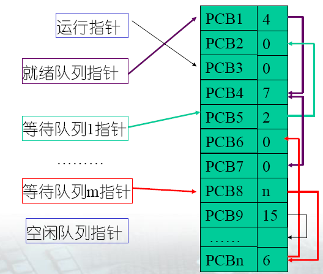

- **索引方式**：按状态建立索引表（就绪索引表、阻塞索引表）。如图：

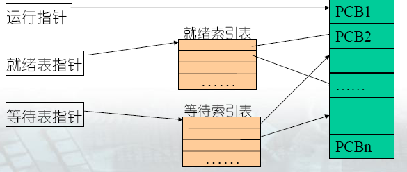

- **链接方式**：将PCB组成不同状态的队列（就绪队列、阻塞队列）。如图：

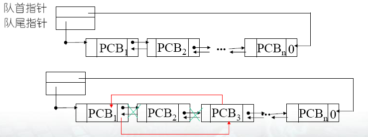

### 2.5 进程的组成
- 程序代码
- 数据集
- 程序计数器 (PC) 值
- 寄存器值、堆栈
- 系统资源集合

## 3. 程序、进程与作业的对比

| 对比项 | 程序 | 进程 | 作业 |
| :--- | :--- | :--- | :--- |
| **性质** | 静态、永久 | 动态（有生命周期）、短暂 | 用户提交的任务实体 |
| **存在形式** | 磁盘可执行文件，可以复制 | 内存中的执行过程，不可跨计算机迁移 | 外存等待队列 |
| **对应关系** | 1个程序可对应多个进程（多次执行） | 1个进程可调用多个程序（调用关系） | 1个作业可包含多个进程，且至少要有1个进程 |
| **并发性** | 无 | **能真实描述并发** | 用于批处理系统描述 |
| **关系** | 程序是进程的一部分（静态部分） | 对已提交完毕的程序所执行过程的描述 | 无 |
| **组成** | 代码段、数据段 | 程序段、数据段、PCB等 | 程序、数据和操作说明书 |

一个作业的完成要经过作业提交、作业收容、作业执行和作业完成4个阶段。

## 4. 进程状态与控制

### 4.1 三种基本状态
1. **就绪态**：获得除CPU外所有资源，等待调度。
2. **执行态**：占用CPU运行，处于此状态的进程的数目小于等于CPU的数目。
3. **阻塞态**：因等待某事件（I/O、信号）而暂停执行。

### 4.2 状态转换

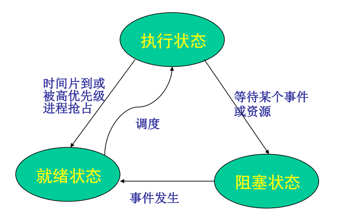

或者更加完整的

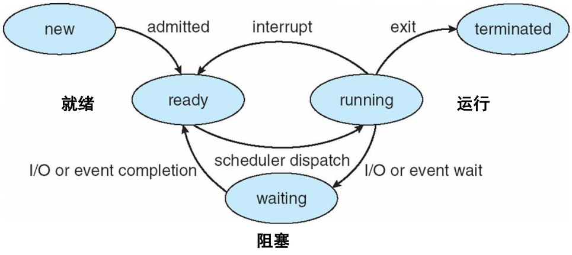

### 4.3 进程控制原语
- **定义**：在内核态下执行、连续不可分割的指令序列。
- **功能**：进程创建与撤销、状态转换管理，实现某个特定的操作功能。
- **创建场景**：提交批作业、用户登录、服务请求、父进程创建子进程（如 `fork`）。
- **进程树**：父子进程构成的有向树结构。

### 4.4 举例
以这个代码为例：
```c
#include <sys/types.h>
int glob = 6; /* external variable in initialized data */
int main(void) {
	int var; /* automatic variable on the stack */
	pid_t fpid;
	var = 88;
	printf("before fork\n"); /* we don't flush stdout */
	if ( (fpid = fork()) < 0)
		err_sys("fork error");
	else if (fpid == 0) { /* child */
		glob++; /* modify variables */
		var++;
	} else
		sleep(2); /* parent */
	printf("pid = %d, glob = %d, var = %d\n", getpid(), glob, var);
	exit(0);
}
```
- 在语句`fpid=fork()`之前，只有一个进程在执行。这段代码，但在这条语句之后，就变成两个进程在执行了（创建了子进程）

- 在fork函数执行完毕后，如果创建新进程成功，则出现两个进程，一个是子进程，一个是父进程。在子进程中，fork函数返回0，在父进程中，fork返回新创建子进程的进程ID。我们可以通过fork返回的值来判断当前进程是子进程还是父进程

- `fpid`的值为什么在父子进程中不同？其实就相当于链表，进程形成了链表，父进程的fpid指向子进程的进程id, 因为子进程没有子进程，所以其fpid为0。

- 父子进程的`glob`和`var`值为什么不同？因为父子进程虽然共享代码段，但**不共享数据段**，所以它们各自拥有独立的数据副本。父子进程在执行到`glob++`和`var++`时，修改的是各自的数据副本，因此它们的`glob`和`var`值不同。

- 补全必要头文件后最终输出：
```
before fork
pid = 888, glob = 7, var = 89
pid = 887, glob = 6, var = 88
```
相关代码在`jc01.c`中，还有，请在Linux状态下执行。

### 4.5 关键辨析：上下文切换 vs 陷入内核
- **进程上下文切换**：调度器执行；需保存进程执行断点、切换内存映射（页表基址、flush TLB），**开销大**。
- **模态切换（陷入内核）**：由中断/系统调用引起的CPU状态改变（用户态↔内核态）；主要是切换寄存器上下文，**开销相对较小**。

## 5. 线程的概念与表示

### 5.1 引入线程的目的
- **进程的不足**：
    - 单进程内部无法同时处理多任务（如一边播放MP3一边解压）
    - 若阻塞则整个进程挂起，即使进程中有些工作不依赖于输入的数据，也将无法执行
- **线程目标**：
    - 实体间可并发执行。
    - 实体间共享相同地址空间。
    - **将资源拥有（进程）与执行单元（线程）分离**。
- 对比图：

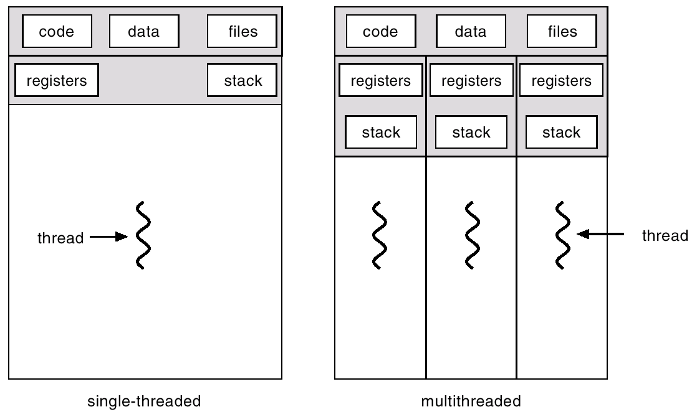

- 优势：
    - 减小进程切换的开销
    - 提高进程内的并发程度
    - 与其他同进程的线程共享进程拥有的所有资源，自身基本上不拥有资源

### 5.2 线程与进程的核心区别
| 对比项 | 进程 | 线程 |
| :--- | :--- | :--- |
| **组成** | 一个进程可以拥有多个线程 | 一个线程只能被一个进程所拥有 |
| **资源拥有** | 资源分配基本单位 | 不拥有资源，共享进程资源 |
| **调度单位** | 系统进行资源分配和调度的独立单位 | **CPU调度和分配的基本单位** |
| **独立性** | 独立地址空间 | 共享进程地址空间 |
| **开销** | 创建/切换开销大 | **创建快10-100倍**，切换轻量 |
| **栈结构** | 拥有独立栈 | **每个线程拥有自己的私有栈** |
| **优势** | 可以并发执行，改善资源使用率，提高系统效率 | 减少并发程序执行时付出的时空开销，使并发粒度更细，适用于多核/多CPU并行计算。对于存在大量计算和大量I/O处理的应用，大幅度提高性能 |
| **能否单独执行** | 可以 | 不能，必须依赖于所属进程 |

### 5.3 每个线程都有自己的栈

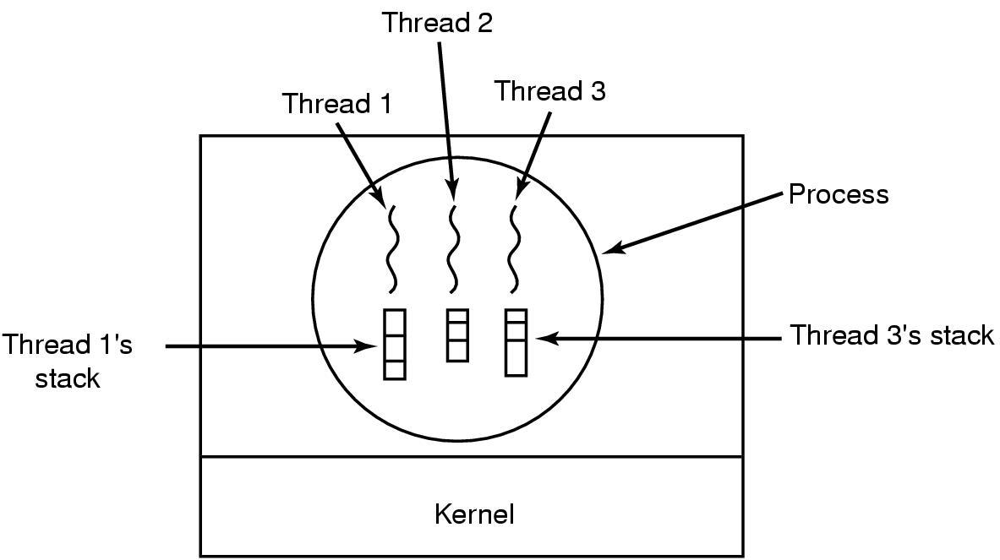

当同时进行字符输入、拼写检查（分词检查）、按排版格式显示、定时存盘、打印等事情时：

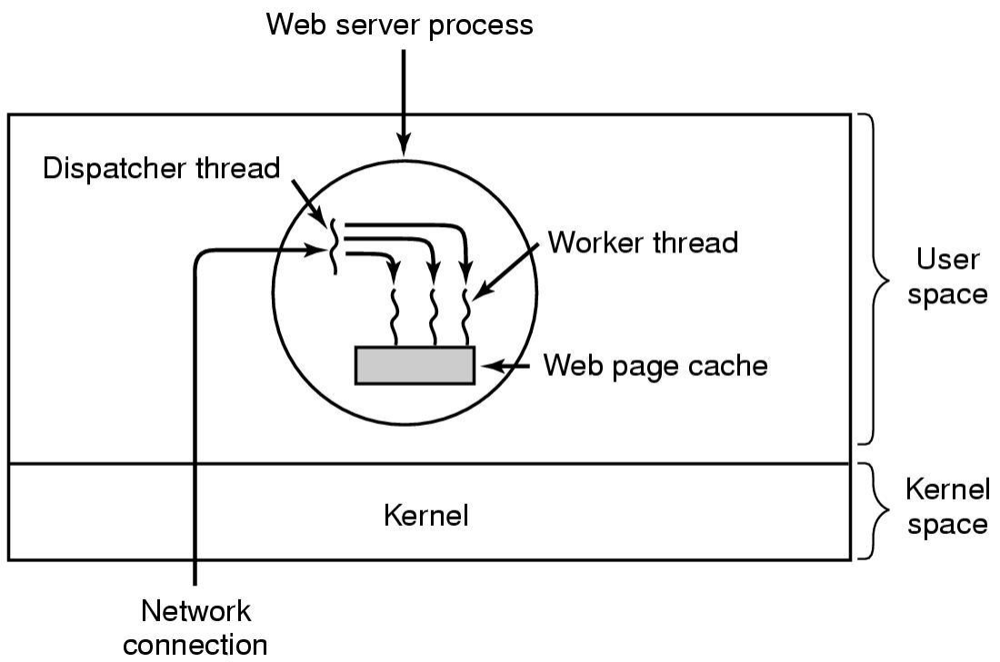

## 6. 线程模型及其实现

### 6.1 三类实现方式对比

1. 用户级线程（ULT）：

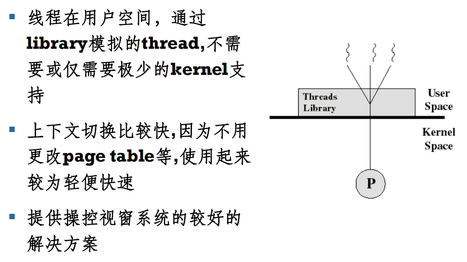

2. 内核级线程（KLT）：

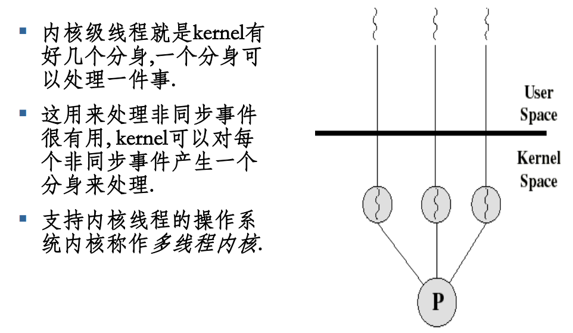

3. 混合实现：

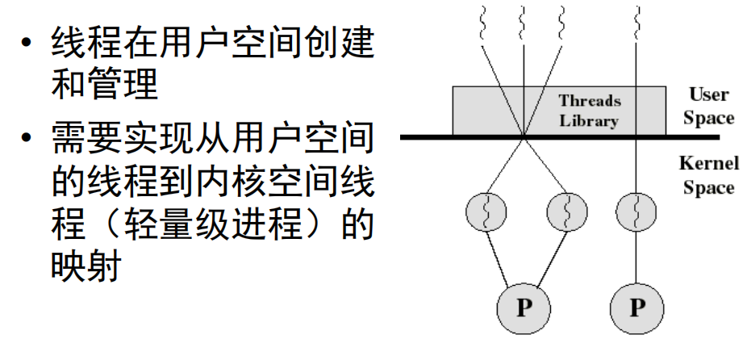

| 特性 | 用户级线程 (ULT) | 内核级线程 (KLT) | 混合实现 |
| :--- | :--- | :--- | :--- |
| **感知性** | 内核不可感知 | 内核可感知 | 两级映射 |
| **线程操作实现位置** | 用户态线程库 (Pthreads) | 操作系统内核 | 用户库 + 内核支持 |
| **切换开销** | **极低**（不涉及内核模式切换） | 较高（需陷入内核） | 折中 |
| **阻塞问题** | 一个线程阻塞导致**整个进程阻塞** | 仅阻塞该线程，其他线程可运行 | 解决阻塞问题 |
| **CPU调度** | CPU调度以进程为单位，线程调度由用户库管理，无法利用多核并行 | CPU调度则以线程为单位，线程调度由内核管理，支持多核并行 | 可利用多核并行 |


### 6.2 多线程模型（连接方式）
- **多对一 (Many-to-One)**：多个用户线程映射到1个内核线程。线程管理在用户空间完成。此模式中，操作系统无法看见，无法指挥用户级线程。
    - *优点*：线程管理是在用户空间进行的，管理效率高。
    - *缺点*：一个线程阻塞全进程阻塞，无法多核并行。
- **一对一 (One-to-One)**：1个用户线程映射到1个内核线程（如 Windows, Linux）。
    - *优点*：当一个线程被阻塞后，允许另一个线程继续执行，所以并发能力强，支持多核。
    - *缺点*：创建线程的开销大，限制系统线程总数。
- **多对多 (Many-to-Many)**：n个用户线程映射到m个内核线程（n ≥ m）。
    - *特点*：折中方案，兼顾并发度与系统开销。

#### 举例说明

本身确实不难，但我一直觉得写一些通俗的例子就是会理解的更好一点，何况这个概念本身就比较重要且稍显抽象
场景设定：
- 整个科室 = 进程（资源拥有单位）
- 病人 = 线程（需要执行的任务）
- 医生 = CPU 核心 / 内核调度实体
- 护士台（分诊台） = 操作系统内核调度器
- 科室内热心大妈 = 用户态线程库
- 病历本 = 线程上下文（寄存器、栈指针）

1. **多对一**：老式 **GNU Pth** 库，Java 早期的 Green Threads
- **100 个病人，只有 1 个医生**。护士台只知道有1个医生，不知道有多少病人。
- **一个病人治疗结束了（或者到时间了），下一个病人进入，不需要通知护士台换科室门牌**，大妈喊人来，直接换人坐凳子就行。
- **一个病人抽血晕倒了，医生停下来抢救，剩下 99 个病人干等着**。因为医生只能处理一个病人，所以当一个病人需要长时间处理时，其他病人都无法得到服务。

2. **一对一**：**Linux NPTL**，Windows 线程
- **100 个病人，配100个医生和100个病床等资源**。医疗资源消耗大（系统开销大），但互不耽误。
- 护士台（内核）的排班表上写着密密麻麻的 100 条记录，要实时管理/更换相关的记录
- **一个病人抽血晕倒了，医生停下来抢救，其他病人仍然可以得到服务**。因为每个病人都有自己的医生

3. **多对多**：**Solaris LWP**，IRIX 系统
- **100 个病人，配 8 个医生（按病床数配）**。哪个医生手上的病人去做检查了，医生立刻喊下一个病人过来看。 
- 护士台（内核）只需要管理 8 个医生的排班表，病人数量不受限制。
- **一个病人治疗结束了（或者到时间了），下一个病人进入，护士台不需要通知医生换科室门牌**，大妈喊人到那个空闲的医生那里来就行，护士台（内核）并不知情。只有当这 8 个医生全部累趴下（阻塞）或者大妈觉得需要再招一个医生时，才需要惊动护士台。
- **一个病人抽血晕倒了，医生停下来抢救，其他医生手上的病人仍然可以得到服务**。

各位应该也能看出来对应关系了：

| 连接模型 | 线程实现分类 | 调度单位 | 内核可见性 |
| :--- | :--- | :--- | :--- |
| **多对一** | **用户级线程** | 进程 | 不可见（透明） |
| **一对一** | **内核级线程** | 线程 | 可见 |
| **多对多** | **混合线程** | 轻量级进程/线程 | 部分可见 |

### 6.3 特定系统实现参考
- **Linux**：不严格区分进程与线程。使用 `fork`（创建进程）与 `clone`（创建线程，通过 `CLONE_VM` 等标志共享内存/文件等资源）。线程的调度，仍然可以使用进程的调度程序。
  - fork并不指定克隆标志，而clone可由用户指定克隆标志。克隆标志有 CLONE_VM 、 CLONE_FS 、CLONE_FILES 、 CLONE_SIGHAND 与CLONE_PID等，而fork创建普通进程则使用SIGCHLD标志
  - 具体如图：

  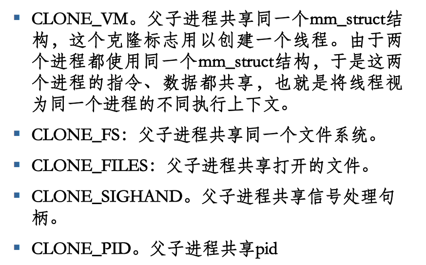

- **Windows**：一对一模型，数据结构包含 ETHREAD, KTHREAD, TEB。

### 6.4 编程注意事项
- **全局变量**：位于数据段（`.data`段），多线程共享全局变量需注意同步，避免竞态条件。
- **函数内局部变量**：位于栈上，每个线程有独立的栈空间，天然线程私有。
- **线程局部变量**：各线程拥有独立拷贝，互不干扰。如图：

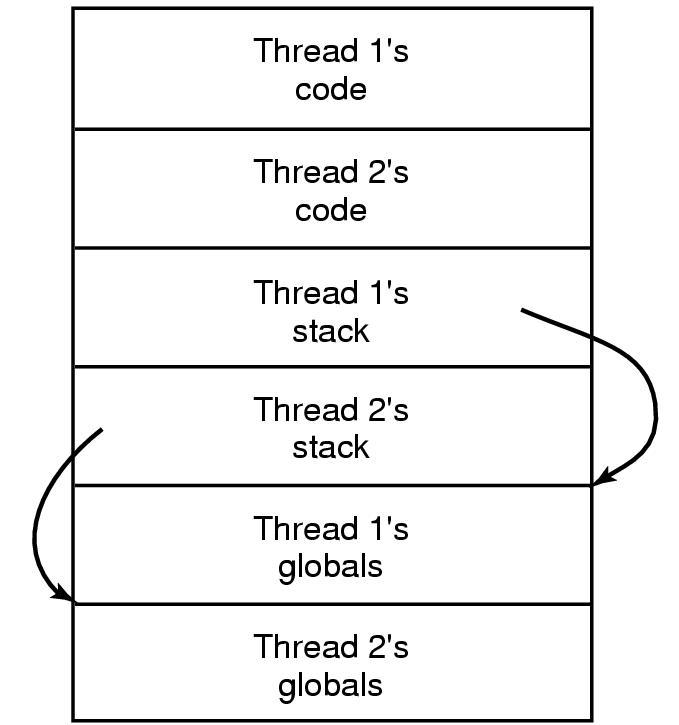

函数局部变量 ➜ 存储在 Stack（栈） 中。
线程局部变量（TLS） ➜ 存储在 Globals 区域（即线程局部存储（TLS））。

那么线程局部变量怎么定义？

```c
__thread int tls_var;  // 定义线程局部变量
```

最后我们提供了代码`jc02.c`，演示了线程局部变量的使用方式，欢迎在Linux状态下执行（这个好像Windows能跑）。