# 进程管理-进程同步-锁与信号量课程总结

## 0. 程序的并发执行

- **并发**：体现在进程的执行是间断性的；进程的相对执行速度是不可测的。（间断性）
- **共享**：体现在进程/线程之间的制约性（如共享打印机）（非封闭性）。
- **不确定性**：进程执行的结果与其执行的相对速度有关，是不确定的（不可再现性）。

## 1. 核心概念

- **并发与竞争**：多个进程并发访问同一共享资源，导致资源争夺，而最后的结果是不可预测的，它取决于各个进程
对共享数据访问的相对次序。
- **竞争条件 (Race Condition)**：多个进程并发访问和操作同一数据，其最终执行结果取决于访问的相对次序。
- **临界资源 (Critical Resource)**：==**一次仅允许一个进程访问的公共资源**==（如打印机）。
- **临界区 (Critical Section)**：每个进程中访问临界资源的那段代码。
    - **结构**：进入区 (Entry Section) -> 临界区 -> 退出区 (Exit Section) -> 剩余区 (Remainder Section)。
    - 如图：
    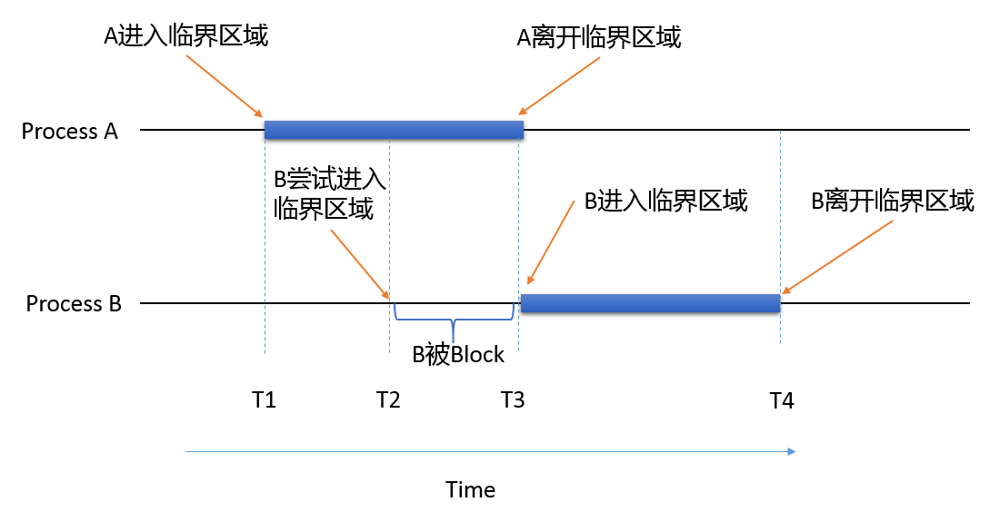
- **进程互斥 (Mutual Exclusion)**：两个或以上的进程<u>不能同时进入</u>关于同一组共享变量的临界区。这是进程间的一种间接制约关系。
- **进程同步 (Synchronization)**：为完成同一任务，各进程间因需要协调工作而相互等待、交换信息。这是进程间的一种直接制约关系。
- **互斥**：某一资源同时只允许一个访问者对其进行访问，具有唯一性和排它性。无法限制访问者对资源的访问顺序，即<u>访问是无序访问</u>。
- **同步**：在互斥的基础上，事先安排顺序，实现访问者对资源的**有序访问**。无法限制访问者对资源的访问数量，即<u>访问是无界访问</u>。

## 2. 临界区管理的准则

- **设计目标**：
    1.  **空闲让进**：无进程在临界区时，任何想进入的进程应立即进入。
    2.  **忙则等待 (Mutual Exclusion)**：任何两个进程不能同时处于临界区。
    3.  **有限等待 (Bounded Waiting)**：进程进入临界区的要求应在有限时间内得到满足。
    4.  **让权等待**：当进程不能进入临界区时，应立即释放CPU，避免忙等。不得妨碍别的进程进入。

## 3. 基于忙等待的互斥实现方法

这类方法在无法进入临界区时，进程会持续循环检测条件，空耗CPU。

### 3.1 软件方法

- **尝试1：轮换法**
    - **机制**：使用共享变量 `turn` 强制两个进程严格交替进入临界区。
    - **代码**：
    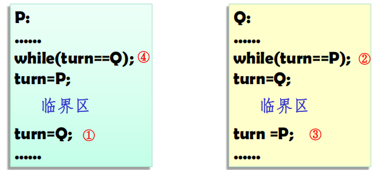
    - **优点**：实现简单，满足互斥和有限等待。
    - **缺点**：违反了 **Progress（空闲让进）** 原则，一个进程若不在临界区，会阻止另一个想进入的进程。
    - **详解**：`P`运行完之后必须由`Q`运行，反之同理，假如`P`运行之后**紧接着**要第二次进入临界区，则被卡住。

- **尝试2：标志法**
    - **机制**：使用 `Occupied` 布尔变量标记临界区状态（检查后设置）。
    - **代码**：
    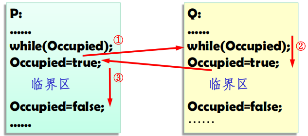
    - **优点**：大体满足互斥和空闲让进原则。
    - **缺点**：检查和设置之间存在时间空档，**无法完全实现互斥**。
    - **详解**：假设`P`检查到`Occupied == false`，准备进入临界区，此时**刚好发生中断被调度出去**，`Q`运行并设置`Occupied = true`，然后进入临界区。之后`P`被调度回来，继续执行，发现之前检查的结果是`false`，也进入了临界区，导致互斥失败。==虽然这有点扯，但是这个概率是确实存在的，OS不能赌概率==。

- **尝试3：先置标志法**
    - **机制**：两进程分别设置自己的标志 `pturn` 和 `qturn`，进入前先声明意图再检查对方。
    - **代码**：
    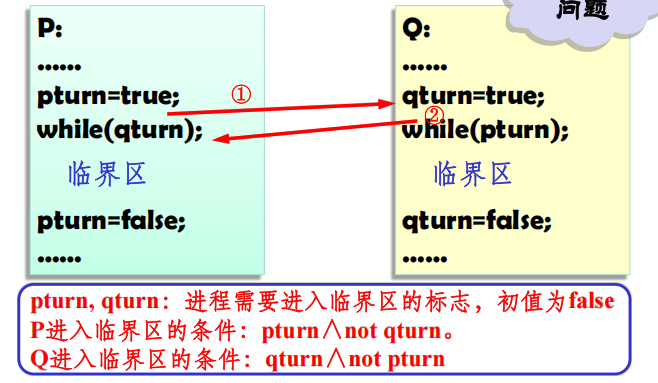
    - **缺点**：可能发生互相谦让导致死锁，违反了 **Progress** 原则。
    - **详解**：假设`P`和`Q`同时执行到设置标志的步骤，`P`设置`pturn = true`，`Q`设置`qturn = true`，然后两者都检查对方的标志，发现对方也有进入意图，**于是都进入等待状态，导致死锁。**
    - **改进代码**：
    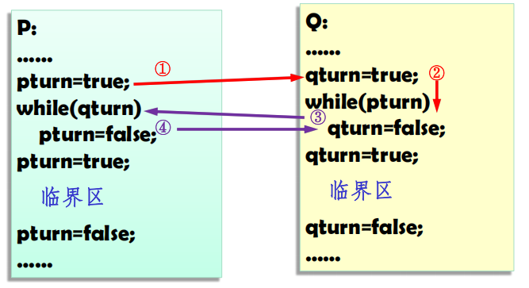
    检测到对方有进入意图，先自己放弃进入意图（`pturn = false`），然后等待一段时间后设置为真再次尝试进入。直到对方退出。
    - **缺点**：虽然解决了死锁问题，但仍存在忙等，且不满足有限等待原则。
    - **详解**：假设`P`和`Q`同时执行到设置标志的步骤，`P`设置`pturn = true`，`Q`设置`qturn = true`，然后两者都检查对方的标志，发现对方也有进入意图，于是都进入等待状态。此时如果`P`先被调度回来，它会看到`qturn == false`，于是**开心退出循环等待进入临界区！**==**但在刚退出循环，还没有进入的时候（没有来得及执行`pturn = true`）又被中止了**==；然后`Q`被调度回来，它会看到`pturn == false`，==**也退出循环进入临界区！**==。这样使得互斥失败！还是那句话，==**OS不能赌概率**==。

- **Dekker算法 (1965)**
    - **机制**：在先置标志法的前提下，结合 `turn`（轮转权）变量。进程进入前表明兴趣并谦让 `turn`（**`0`表示`P`优先，`1`表示`Q`优先**），==**且确保即使双方同时谦让，也只会有一方真正后退。**==
    - **代码**：
    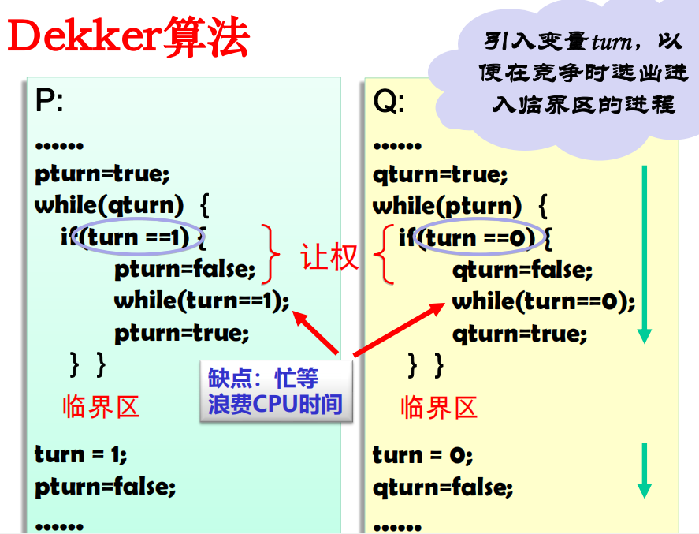
    - **优点**：完美解决了互斥、空闲让进和有限等待问题。
    - **详解**：假如同时冲突（双方同时想进入），  
      + P 执行`pturn = true`；几乎同时，Q 执行 `qturn = true`。
      + 此时`pturn == true`且`qturn == true`，双方都进入各自的`while`协商循环。假设当前 `turn == 0`（表示轮到 P 优先）。
      + 对于 P：检查`if (turn == 1)`，条件为假。==**P 不执行`if`体内的谦让代码**==，继续留在外层`while (qturn == true)`处忙等。P 保持`pturn == true`不放手。
      + 对于 Q：检查`if (turn == 0)`，条件为真。Q 执行`if`体：
      + `qturn = false：`暂时放弃意图。
      + `while (turn == 0);`：忙等，等待`turn` 变为1。
      + `qturn = true：`重新声明意图。
      + 此时发生了什么？
        - P 一直在循环检测`qturn`。当 Q 执行 `qturn = false`的那一瞬间，P 的`while (qturn == true)`条件立刻为假，P 跳出协商循环，进入临界区。
        - Q 则卡在`while (turn == 0);`处，等待 P 出来。
        - P 退出临界区后，执行`turn = 1`（把优先权交给 Q）。
        - P 执行`pturn = false`（清除意图）。
      + Q 在`while (turn == 0);`处检测到 `turn == 1`，退出内层循环。然后执行 `qturn = true`，重新声明意图。
      + Q 回到外层`while (pturn == true)`，此时`pturn == false`（P 已退出），条件为假，Q 进入临界区。
    - 互斥保证了，但凡有一个进程进入临界区，他的`pturn`或`qturn`就一直为真并结合`turn`不让权，另一个进程就无法进入临界区。
    - 死锁避免了，只有一方真正后退了；
    - 有限等待保证了：P 最多等待 Q 使用一次临界区即可进入，不会永远饥饿。

- **Peterson算法 (1981)**
    - **机制**：结合 `turn`（轮转权）和 `interested`（兴趣数组）两个变量。进程进入前表明兴趣并谦让 `turn`，==**只有当 “我把优先权让给了对方（`turn == i`）” 且 “对方也确实想进入（`interested[other] == TRUE`）” 时，我才需要等待。**==
    - **代码**：
    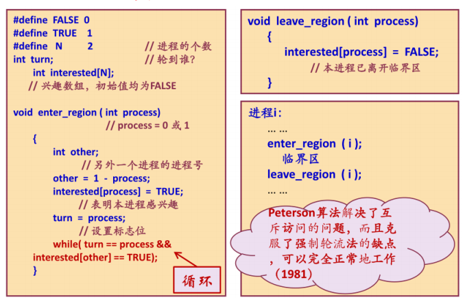
    - **优点**：完美解决了互斥、空闲让进和有限等待问题（==同样是因为`turn`作为全局变量，在任何时刻都只能取1个值，所以能保证互斥==）。

- **Lamport 面包店算法 (Bakery Algorithm, 1974)**

    - **思想**：模仿面包店排队取号。进程进入前抓取一个号码 (`number[i]`)，按号码从小到大进入，号码相同则按进程ID从小到大排序。
    >当进程`Pi`计算完`max(…)+1`但尚未将值赋给`number[i]`时，进程`Pj`中途插入，计算`max(…)+1`，得到相同的值；在这种情况下，`i`和`j`可保证编号较小的进程先进入临界区，并不会出现两个进程同时进入临界区的情况。
    - **数据结构**：`choosing[n]` (是否正在抓号，若进程`i`正在抓号，则`choosing[i]=1`) 和 `number[n]` (持有的号码，若`number[i]=0`为初始值，则进程`i`没有抓号)。
    - **代码**：
    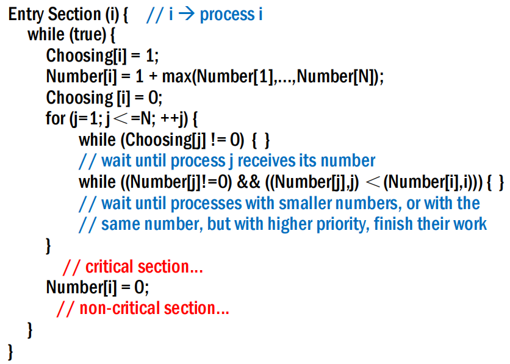
    - **缺点**：存在忙式等待，低效。（当`while`循环条件成立时，进程`Pi`不能向前推进，而在原地踏步，这种原地踏步被称为忙式等待。空耗`CPU`资源，因而是低效的）

### 3.2 硬件方法

- **中断屏蔽**
    - **机制**：进入临界区前执行“关中断”指令（==禁止 CPU 响应中断==），退出临界区前执行“开中断”指令。
    - **缺点**：仅适用于单核`CPU`，且滥用会影响系统时钟和效率，仅限内核少量使用。

- **Test-and-Set (TSL) 指令**
    - **机制**：==原子操作（不可中断）==，测试并设置内存字。返回旧值，同时写入新的值为 `true`（==硬件层面将“读取内存值”和“写入新值”两个动作绑定为一个原子操作==）。
    - **应用：自旋锁 (Spinlock)**
        ```c
        test_and_set(boolean_ref lock) { 
            boolean initial = lock; 
            lock = true; 
            return initial; 
        }// 原子操作

        acquire(lock) {
            while(test_and_set(lock) == 1); // 忙等
        }
        //临界区代码
        release(lock) {
            lock = 0;
        }
        ```
    - **实现**：x86使用 `TSL` 指令，MIPS使用 `LL` (Load Linked) 和 `SC` (Store Conditional) 指令对实现RMW原子操作。

- **Swap (XCHG) 指令**
    - **机制**：==原子指令==，交换两个字的内容。
    - **应用**：类似TSL，通过循环交换，获得全局变量`use`的`false`值，实现互斥。
    - **代码**：
        ```c
        Swap(boolean *a, Boolean *b) {
            Boolean temp;
            Temp = *a;
            *a = *b;
            *b = temp;
        }// 原子操作

        Boolean k = true; // 初始化为1，表达意愿
        Boolean use = false; // 初始资源空闲
        while(k != 0)
            Swap(&use, &k); //进入区
        Critial_region(); //临界区
        Use = 0; //退出区
        Other_region(); //剩余区
        ```
        当另外一个进程也执行到`Swap(&use, &k)`时，`use`已经被第一个进程设置为`true`，第二个进程的`k`会被设置为`true`，导致其循环等待，直到第一个进程退出临界区并将`use`设置为`false`。

- **忙等方法共性问题**：
共同特点：当一个进程想进入临界区时，先检查是否允许进入，若不允许，则该进程将原地等待，直到允许为止。
    1.  **忙等待**：浪费CPU时间。
    2.  **优先级反转**：低优先级进程占用临界区，导致高优先级进程长时间忙等无法运行。

## 4. 基于信号量的同步方法

- **基本思想**：将忙等变为阻塞。引入 `Sleep` (阻塞) 和 `Wakeup` (唤醒) 原语。

### 4.1 信号量 (Semaphore) 定义

- **提出者**：Dijkstra (1965)。
- **核心思路**：
像银行排队一样，看到队很长，先回家歇会儿（`sleep`），有空柜台了，大堂经理电话通知再过来（`wakeup`）。显然，`wakeup`原语的调用需要一个参数——被唤醒的进程ID。
- **定义**：
  - 两种**原子操作**
    - `P(S)`=`Wait(p)`：阻塞进程`p`，将其从就绪队列移除。
    - `V(s)`=`Signal(p)`：唤醒进程`p`，将其放入就绪队列。
  - 二元组 `(s, q)`。
    - `s`：具有非负初值的整型变量（正数表示可用资源数；负数绝对值表示等待进程数）。
    - `q`：等待该信号量的进程阻塞队列（初始为空）。
- **数据结构**：
    ```c
    typedef struct {
        int count; // 资源计数
        queue_t queue; // 阻塞队列
    } semaphore;
    ```
    - 一个初始值为正的整数: `s.count`，这是一个整数。正数代表还剩多少个资源（比如还剩3个空座位）；负数的绝对值代表有多少个进程正等着（比如 -2 代表有2个人在排队）。
    - 一个初始为空的队列: `s.queue`，当资源不够用时，进程主动登记到这个队列里，然后去睡觉（阻塞）。
- **代码**:
    ```c
    // P操作 (申请资源)
    void semWait(semaphore s) {
        s.count--;
        if (s.count < 0) {
            // 这两步必须原子性，阻塞当前进程，放入 s.queue
        }
    }

    // V操作 (释放资源)
    void semSignal(semaphore s) {
        s.count++;
        if (s.count <= 0) {
            // 这两步必须原子性，从 s.queue 唤醒一个进程，放入就绪队列
        }
    }
    ```
- **过程详解**：
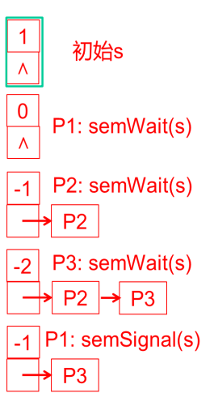
来看这个图：
  - `count` 表示总共多少个资源可用。初始值为正数，表示资源充足。
  - 若为 `semWait(s)` 时，首先将 `s.count` 减1。如果 `s.count` 仍然非负，说明资源足够，进程可以继续执行；如果 `s.count` 变为负数，说明资源不足，当前进程需要阻塞自己，并将自己加入到 `s.queue` 中等待。
  - 若为 `semSignal(s)` 时，首先将 `s.count` 加1。如果 `s.count` 变为零或负数，说明有进程在等待资源，此时从 `s.queue` 中唤醒一个进程让他就绪。反之，意味着没有进程要资源，不管他就行。
- **实现机制**：为保证原子性，内部常使用**关中断**或**TS指令**实现。
具体如图：
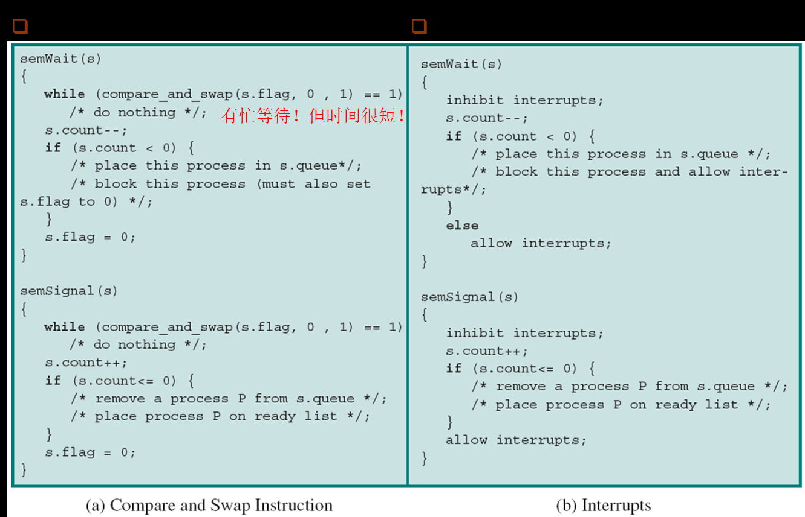
- **分类**：
    - **二元信号量**：值仅0或1，主要用于**互斥**。
    - **一般信号量**：初值为资源总数，用于**同步**。
    - **强/弱信号量**：取决于阻塞队列是否按FIFO出队（强信号量保证不饥饿）。

### 4.2 信号量的典型应用

1.  **互斥 (Mutual Exclusion)**：
    - 信号量初值 `mutex = 1`。
    - 代码：
    ```c
    semaphore mutex = 1; // 二元信号量
    // 进程 i
    P(mutex);
    /* 访问临界资源，如打印机 */
    V(mutex);
    ```

2.  **有限并发 (Bounded Concurrency)**：
    - 信号量初值 `sem_CS = c` (c为允许的最大并发数)。
    - 代码：
    ```c
    semaphore slots = 5; // 最多允许5个进程同时访问
    // 进程 i
    P(slots);
    /* 访问有限资源，如数据库连接池、餐厅座位 */
    V(slots);
    ```

3.  **进程同步 (Synchronization)**：
    - 信号量初值 `sync = 0`。
    - 等待方A先执行 `semWait(sync)`然后如果B没有执行完就等待，直到发出方B后执行 `semSignal(sync)`，A才继续。确保A一定等B执行完之后才执行
    - 代码：
    ```c
    semaphore sync = 0;
    // 进程 A，被阻塞
    P(sync);
    /* 等到 B 执行完，再执行 */
    V(sync);
    ```

4.  **会合 (Rendezvous)**：
    - 需求：`a1` 在 `b2` 前，`b1` 在 `a2` 前。
    - 代码：
    ```c
    semaphore aArrived = 0;
    semaphore bArrived = 0;

      // 线程 A
    a1_statement();
    V(aArrived);      // 告诉 B：我到了，自己停下
    P(bArrived);      // 唤醒 B，等 B 也到
    a2_statement();   // 两人都到了，继续往下走

    // 线程 B
    b1_statement();
    V(bArrived);      // 告诉 A：我到了
    P(aArrived);      // 等 A 也到
    b2_statement();   // 两人都到了，继续
    ```
    - 类似A和B在约定地点会面，必须等双方都到达后才能继续。然后A到了，自己先睡了`V(aArrived), aArrived=1`，然后唤醒B给B申请资源`P(bArrived) bArrived=-1`；等待B到了，再`V(bArrived), bArrived=0`进行声明，唤醒A`P(aArrived) aArrived=-1`，A被唤醒继续执行。

5.  **屏障 (Barriers)**：
    - 需求：进程组所有成员（N个进程）都到达某点后才能继续。如图：
    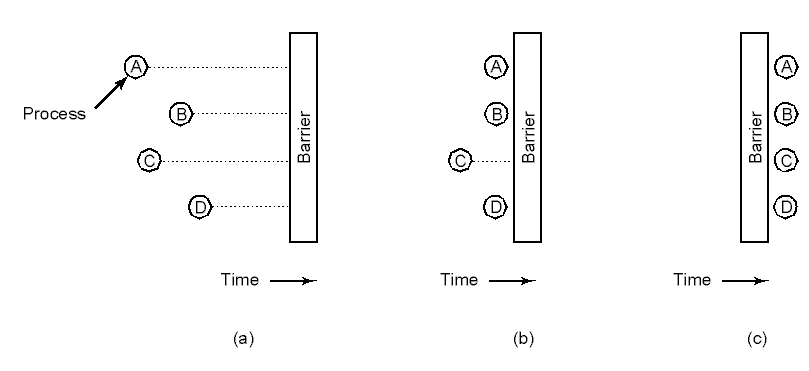
    - 实现：使用 `mutex` 保护计数器 `count`，使用 `barrier` 信号量阻塞。最后一个到达的进程负责唤醒下一个，形成链式唤醒。
    - 代码：
    ```c
    int n = 5;               // 进程总数
    int count = 0;           // 已到达的进程数
    semaphore mutex = 1;     // 保护 count
    semaphore barrier = 0;   // 用于阻塞进程

    // 每个进程执行以下代码：
    P(mutex);
        count = count + 1;
        if (count == n) {
            V(barrier);      // 最后一个人到达，打开栅栏，放行一个人
        }
    V(mutex);

    P(barrier);              // 所有人（除最后一个外）在这里排队等待
    V(barrier);              // 被唤醒的人负责唤醒下一个，形成连锁反应
    /* 屏障之后：所有进程继续执行下一阶段 */
    ```
    - 一个进程进入，首先获取`mutex`锁，增加`count`计数器，检查是否是最后一个到达的进程。
      - 如果不是最后一个到达的进程会被阻塞在这里；先解开`mutex`锁，允许别的进程拿到这个锁。然后`P(barrier)`等待。
      - 如果发现自己是第`n`个到达的进程，就执行`V(barrier)`打开栅栏；然后释放`mutex`锁。接着被释放的进程又能执行`V(barrier)`唤醒下一个等待的进程，如此形成链式唤醒，直到所有进程都被唤醒。
      
## 5. 进程同步/互斥问题的求解步骤

1.  **分析并发操作**：确定并发执行的进程/线程。
2.  **识别关系**：
    - 互斥：多个进程操作同一临界资源。
    - 同步：多个进程需按特定顺序执行。
3.  **设置信号量**：为每个同步/互斥约束设置信号量，明确含义及初值。
4.  **编写代码**：使用P/V操作准确描述进入/退出区逻辑。