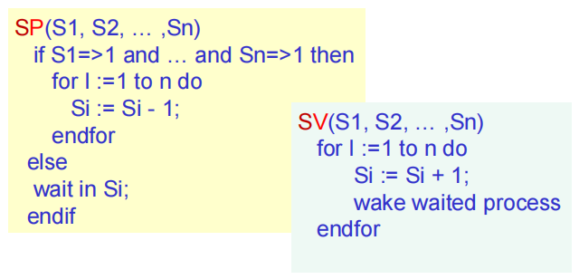
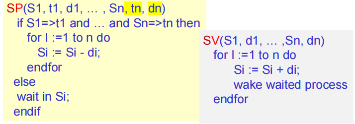
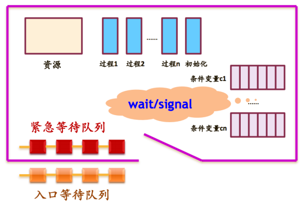
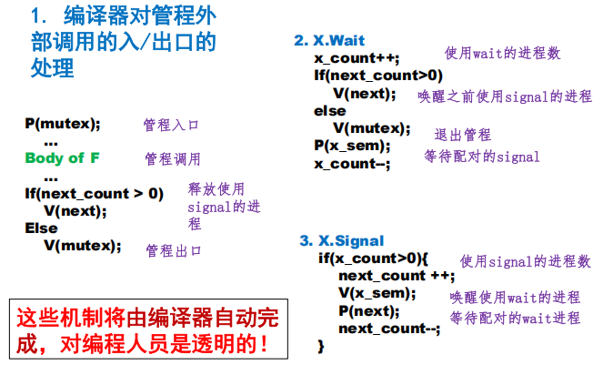
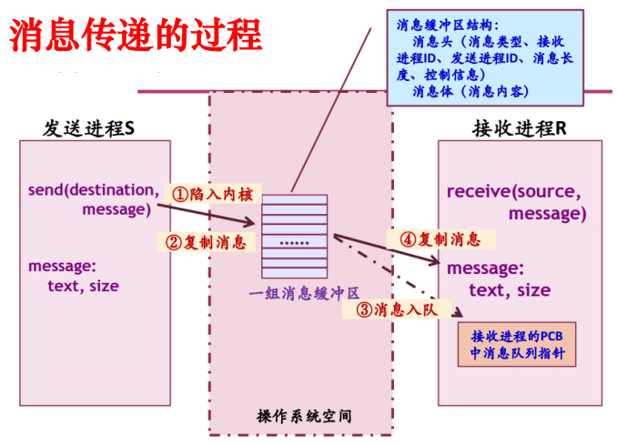
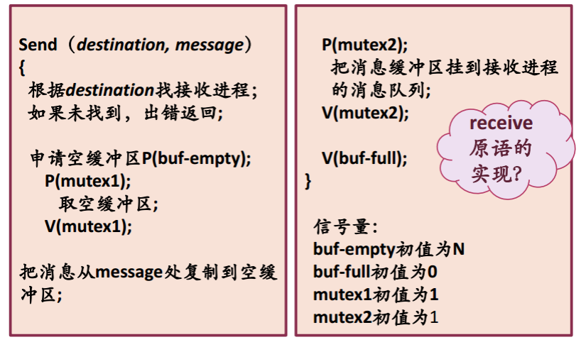
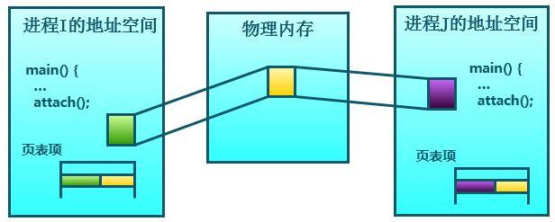
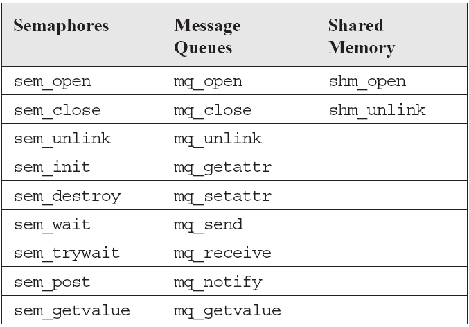

<font size=2>

# 进程管理-进程同步-管程IPC与经典同步问题课程总结

## 1 进程同步概述

### 1.1 内容结构
- 实现同步与互斥的关键概念
- 基于忙等待的方法
- 基于信号量的方法（包括信号量集）
- 基于管程的同步与互斥
- 进程间通信（IPC）的主要方法
- 经典的进程同步与互斥问题

## 2 多进程同步原语：Barriers（屏障）

### 2.1 定义与用途
- 用于**进程组的同步**，是 rendezvous 的泛化。
- 应用场景：
  - 科学计算中的迭代
  - 深度学习的卷积神经网络迭代
  - GPU 渲染算法迭代

### 2.2 实现机制（基于信号量）
```c
n = number of threads  //需要同步的线程数
count = 0              //记录已到达屏障(会合点)的线程数
mutex = Semaphore(1)   //保护 count 变量的互斥信号量
barrier = Semaphore(0) //屏障信号量，初始值为0，表示线程需要等待
```

**逻辑流程：**
```c
mutex.wait()
count = count + 1
mutex.signal()

if count == n:
    barrier.signal()   //如果全部到达，唤醒一个进程
barrier.wait()
barrier.signal()   //一旦有一个进程被唤醒，继续唤醒下一个进程，直到全部唤醒
```

## 3 信号量集机制

### 3.1 引入背景
- 当进程需要**同时申请多个资源**时，传统信号量可能导致死锁。
- 信号量集机制用于处理多资源的原子申请与释放。

### 3.2 AND型信号量集
基本思想：将进程需要的所有共享资源一次全部分配给它；待该进程使用完后再一起释放。

**伪代码逻辑**：


### 3.3 一般信号量集
- 增加了**测试值 ti** 和**占用值 di**：
  - **SP(S1, t1, d1, ..., Sn, tn, dn)**：只有当所有 `Si ≥ ti` 时才分配 `Si = Si - di`。
  - **SV(S1, d1, ..., Sn, dn)**：释放资源 `Si = Si + di`。
  - **伪代码逻辑**
  
  - 特殊用法
    - `SP(S, d, d)`：每次申请 d 个资源。
    - `SP(S, 1, 1)`：互斥信号量。
    - `SP(S, 1, 0)`：可控开关，S>=1 时允许任意多个进程进入，S=0 时禁止进入。

### 3.4 PV操作优缺点
优点：灵活简单
缺点：不够安全，可能导致死锁

## 4 管程（Monitor）

### 4.1 引入原因
- 信号量机制编程复杂，易出错。
- 管程是**语言级别的同步机制**，更安全、更易用。
- 因此1973年由C.A.R. Hoare等提出。

### 4.2 组成结构
1. 管程名称
2. 局部于管程内部的共享数据结构
3. 对该数据结构进行操作的一组互斥操作过程
4. 对局部于管程内部的共享数据的初始化语句

### 4.3 关键机制
- **互斥进入**：由编译器保证。
- **同步**：通过条件变量实现。
- **条件变量（Condition Variable）**：
  - 用于进程等待与唤醒。
  - 操作：`wait(x)`、`signal(x)`。

### 4.4 条件变量 vs 信号量
| 条件变量 | 信号量 |
|----------|--------|
| 不可增减值 | 可增减 |
| `wait` 一定阻塞 | `P` 仅在值 < 0 时阻塞 |
| `signal` 可能丢失（如果没有等待的进程） | `V` 操作不丢失 |
| 必须在管程内使用 | 可在任意上下文使用 |

### 4.5 管程中的进程调度策略
问题：当一个进入管程的进程Q执行等待操作时，它应当释放管程的互斥权（自己`wait`）。否则其他进程永远进不来，也就无法改变条件唤醒Q。**然而，当后面进入管程的进程执行唤醒操作时（例如P执行`signal`唤醒Q），管程中便存在两个同时处于活动状态的进程。这特么违背了互斥原则啊！**
- **Hoare 管程：==P在唤醒Q之后立即`wait`等待，Q开始执行==**。
- **MESA 管程**：Q进入等待/就绪队列；P继续执行，Q需要重新竞争锁。
- **Hansen 管程**：唤醒操作为最后一个可执行操作。

### 4.6 Hoare 管程结构
首先牢记**==P唤醒Q时，P等待，Q执行==**的大原则。
先来看图：


- **入口等待队列**：等待进入管程。
- **紧急等待队列-底层信号量为next**：因互斥进入而等待的进程，优先级高于入口等待队列（如果进程Ｐ唤醒进程Ｑ，则Ｐ等待Ｑ继续，如果进程Ｑ在执行又唤醒进程Ｒ，则Ｑ等待Ｒ继续，那么等到R执行完毕，Q理应得到最高的优先级以确保整个过程的正确性）。
- **条件等待队列-底层信号量为x_sem**：因资源被占用而等待的进程。每个条件变量表示一种等待原因，并不取具体数值－－相当于每个原因对应一个队列。
- **针对条件变量x的同步原语的实现**：
  - x.wait()：无论如何，执行此操作的进程都要排入x队列尾部等待
    - 如果紧急等待队列非空，则唤醒第一个等待者；
    - 否则释放管程的互斥权
  - x.signal()：
    - 如果x队列为空，则相当于空操作，执行此操作的进程继续；
    - 否则唤醒第一个等待者，执行x.signal()操作的进程排入紧急等待队列的尾部

### 4.7 管程内部同步原语实现
- **mutex**：每个管程必须提供一个用于互斥的信号量mutex，初始值为1。
  - 进程调用管程中的任何过程时，应执行P(mutex)；进程退出管程时应执行V(mutex)开放管程，以便让其他调用者进入。
  - 为了使进程在等待资源期间，其他进程能进入管程，故在wait操作中也必须执行V(mutex)，否则会妨碍其他进程进入管程，导致无法释放资源。
- **next**：对每个管程，引入信号量next（初值为0）。
  - 进程Q执行`signal`唤醒进程P后，`P(next)`用于挂起进程Q自己，此时Q进入紧急等待队列（next信号量的队列）。
  - 在退出管程前，检查是否有别的进程在信号量next上等待（即是否有`next_count > 0`），并用`V(next)`唤醒它。
- **x_sem**：对每个管程，引入信号量x-sem（初值为0）。
  - 进程P执行`wait`时，`P(x-sem)`用于挂起进程P自己。
  - 执行`signal`时，若`x_count > 0`，则`V(x_sem)`唤醒一个等待进程。
- 代码如下：

结合前面的解释加强理解吧

## 5 进程间通信（IPC）

### 5.1 低级通信 vs 高级通信
- **低级通信**：只能传递状态和整数值（控制信息），包含**信号量、管程，传递控制信息**。
  - 传送信息量小，效率低；且编程复杂
- **高级通信**：适合大数据量，可以解决进程的同步问题和通信问题。
  - 主要包含三类：**管道、共享内存、消息系统**

### 5.2 常见 IPC 机制
- 管道（Pipe）及命名管道（Named pipe或FIFO）
- 消息队列
- 共享内存
- 信号量
- 套接字（Socket）
- 信号（Signal）

### 5.3 （无名）管道（Pipe）
- 半双工通信，数据只能向一个方向流动；需要双方通信时，要建立起两个管道
- 仅限父子/兄弟进程间。
- 单独构成一种独立的文件系统，**数据只存储在内存中，独立于文件系统。**
- ==数据读取==：一个进程向管道中写的内容被管道另一端的进程读出。写入的内容添加在管道缓冲区的末尾，读出在头部。

### 5.4 命名管道（FIFO）
- 有路径名，可被任意进程访问。
- 以FIFO的文件形式存在于文件系统中。
- 遵循 FIFO 原则（读在开始处，写在末尾处）。

### 5.5 消息传递（Message Passing）
- 使用 `send` / `receive` 原语。
- 支持阻塞/非阻塞调用。
- 可基于邮箱（mailbox）编址。
- 主要用于解决消息丢失、延迟问题（TCP协议）
如图：



伪代码：


### 5.6 共享内存（Shared Memory）
- 是最有用的进程间通信方式，也是最快的IPC形式（因为它避免了其它形式的IPC必须执行的开销巨大的缓冲复制）。
- 多个进程映射同一块物理内存。
- 由于共享内存可以同时读但不能同时写，需要同步机制（如互斥锁）。
- 共享内存通信的效率高，但编程复杂，且需要注意同步问题。
如图：


### 5.7 IPC 的 POSIX 接口
| 信号量 | 消息队列 | 共享内存 |
|--------|----------|----------|

具体如图：


</font>