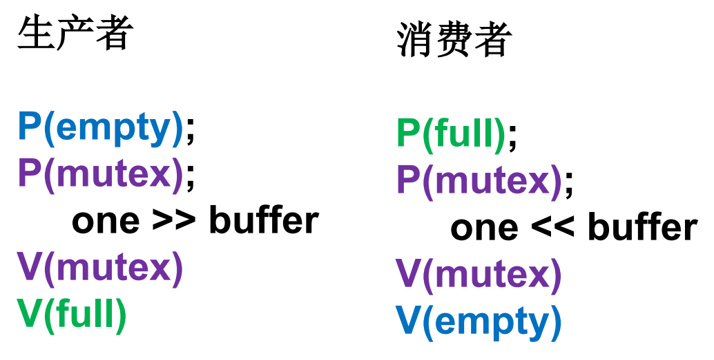
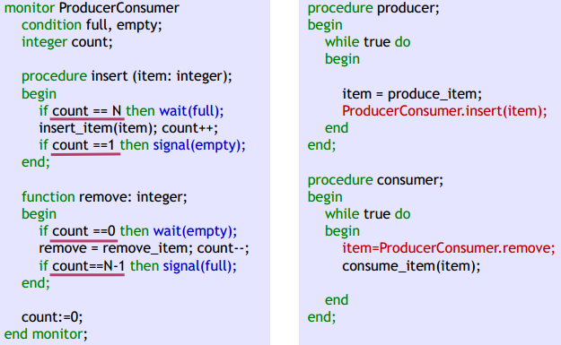
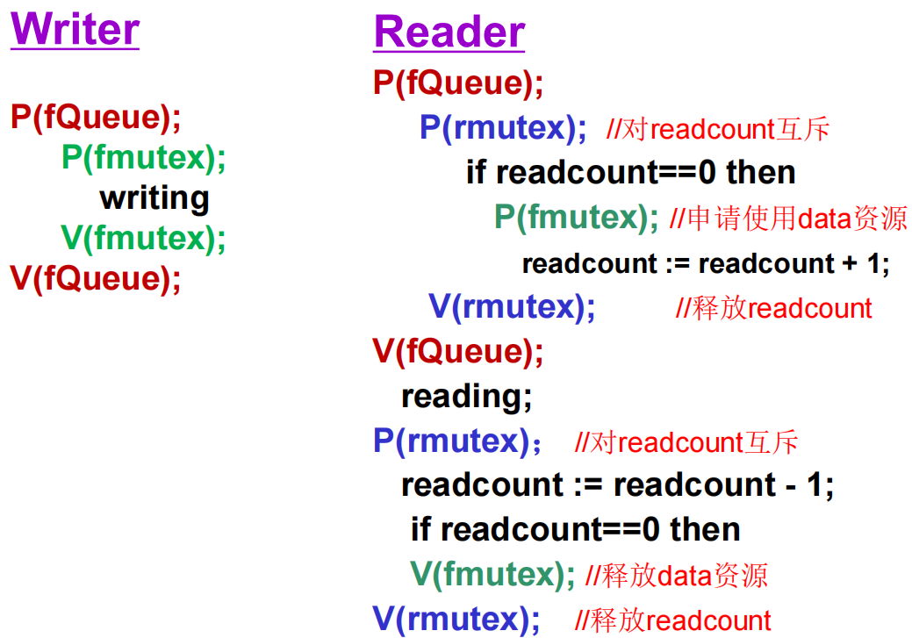
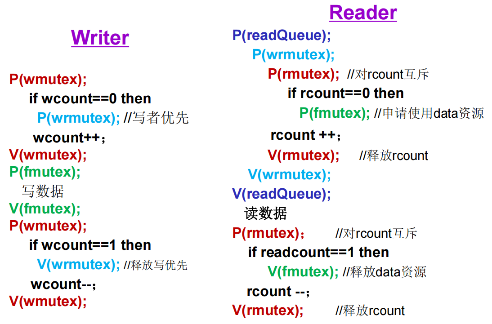
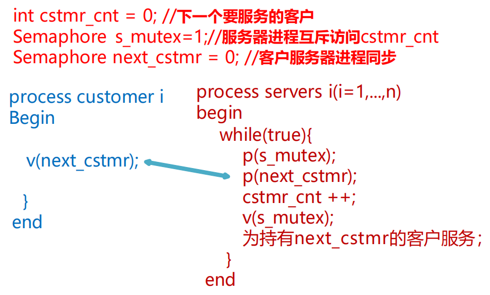
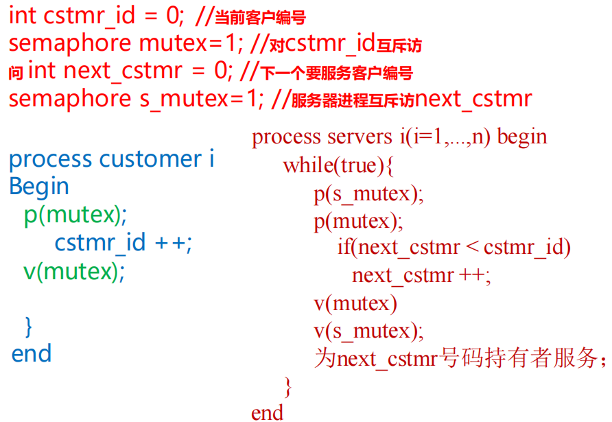
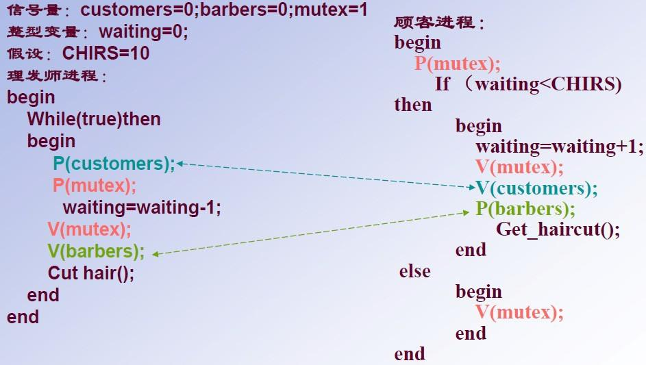
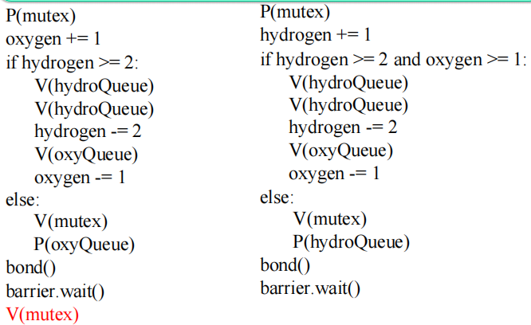

<font size=2>

# 进程管理-进程同步-同步问题进阶

## 1 内容概览

1.  **基础回顾**：生产者-消费者问题（信号量/管程/AND信号量）。
2.  **读者-写者问题深究**：
    -   读者优先（经典解法）。
    -   读写公平。
    -   写者优先。
3.  **生产者-消费者扩展**：多服务柜台叫号问题。
4.  **经典同步问题进阶**：
    -   理发师问题。
    -   构建水分子（H2O）问题。
5.  **哲学家进餐问题思考**：死锁与解决方案。
6.  **核心机制**：PV操作语义、管程、条件变量。

## 2 生产者-消费者问题（基础模型回顾）

### 2.1 问题描述
- **场景**：若干生产者与消费者通过容量为 N 的共享缓冲区交换数据。
- **约束**：缓冲区互斥访问；缓冲区空时消费者等待；缓冲区满时生产者等待。

**即同一时刻，只能有一个人访问缓冲区。**

### 2.2 信号量设计与伪代码

| 信号量 | 初值 | 含义 |
| :--- | :--- | :--- |
| `semaphore mutex` | 1 | 互斥访问缓冲区 |
| `semaphore empty` | N | 空闲缓冲区数量 |
| `semaphore full` | 0 | 已填充产品数量 |

> **隐含关系**：`full + empty == N`

**伪代码逻辑**：


#### 详细步骤解释

如果生产者来了，先 `P(empty)` 确保占一个空位，再 `P(mutex)` 进入临界区生产，最后 `V(mutex)` 释放互斥锁，`V(full)` 增加已填充数量。

消费者则相反，先 `P(full)` 确保有产品，再 `P(mutex)` 进入临界区消费，最后 `V(mutex)` 和 `V(empty)`。

> [!ATTENTION]
> `P` 操作顺序不可交换，若先 `P(mutex)` 再 `P(empty/full)` 可能导致死锁（如果首先就`P(mutex)`声明访问缓存区，但是`P(empty)`时发现没有空闲缓冲区，那么自己运行不了，别人也进不去，哦吼，锁死）。`V` 操作顺序通常不影响正确性，但建议先释放互斥锁再发信号以提高效率。

### 2.3 其他实现方式
- **管程实现**：使用 `condition full, empty` 和 `count` 计数器。
  - 如图
  
  - 生产者流程
    - 生产者调用 ProducerConsumer.insert(item)。管程入口自动加锁，保证互斥。
    - 检查 count == N：
      - 如果缓冲区满了，执行 wait(full)。该生产者立即阻塞，释放管程锁，让别的线程可以进入管程。否则继续。
    - 调用 insert_item 把数据放入缓冲区，count++。
    - 如果 count == 1（意味着放入前缓冲区是空的，可能有消费者在 empty 上等待），执行 signal(empty)，唤醒一个因等产品而阻塞的消费者。
    - 退出 insert 过程，管程锁自动释放（如果是因为 wait 阻塞，锁由 wait 释放；如果是正常结束，锁在退出时释放）。
  - 消费者调用 
    - ProducerConsumer.remove()，管程入口自动加锁。
    - 检查 count == 0：
      - 如果缓冲区空，执行 wait(empty)，阻塞消费者并释放锁。否则继续。
    - 取出产品，count--。
    - 如果 count == N - 1（意味着取出前缓冲区是满的，可能有生产者在 full 上等待），执行 signal(full)，唤醒一个生产者。
    - 返回产品，并自动释放锁

- **AND 信号量集**：`SP(empty, mutex)` 与 `SP(full, mutex)`。

## 3 读者-写者问题进阶

### 3.1 核心约束
- **读-读**：允许同时访问。
- **读-写**：互斥。
- **写-写**：互斥。

**即同一时刻，要么只有一个写者，要么只有多个读者。**

### 3.2 经典读者优先策略（可能导致写者饥饿）

**信号量设置**：
- `int readcount = 0` : 记录当前读者数量。
- `semaphore rmutex = 1`：保护 `readcount`的互斥。
- `semaphore fmutex = 1`：保护数据区 `Data`的互斥。

**伪代码逻辑**：



#### 详细步骤解释（关键！）

| 步骤 | 操作 | 深入解读 |
| :--- | :--- | :--- |
| **1. P(rmutex)** | 获取 `rmutex` | 因为 `readcount` 是共享变量，修改它必须互斥。这保证了多个读者同时到来时，计数操作是原子的。 |
| **2. 判断 `readcount == 0`** | 检查是否为首个读者 | 这是**读者优先策略的枢纽**。如果当前没有读者在读，意味着**写者有可能正占有数据**。 |
| **3. P(fmutex)** | 锁定数据区 | **只有第一个读者执行此操作（如果有写者在运行，则等待写者写完再拿到`fmutex`）**。一旦第一个读者拿到了 `fmutex`，所有后续的写者都会被挡在门外。后续的读者不再执行 `P(fmutex)`，直接放行。 |
| **4. readcount++** | 计数增加 | 此时已经有读者正在读了。 |
| **5. V(rmutex)** | 释放计数锁 | 关键点：**显然当第一个读者拿到权限的时候就能释放`rmutex`，**。这样后续的读者可以继续进入第一个阶段（修改计数），而无需等待当前读者读完数据。 |
| **6-7. 读取数据** | 并发读 | 多个读者可以同时处于这一行代码，安全地读取共享数据。 |
| **8. P(rmutex)** | 再次锁定计数 | 读者准备离开，需要修改 `readcount`，**必须重新申请锁以确保读者一个一个离开** |
| **9. readcount--** | 计数减少 | 一个读者离开了。 |
| **10. 判断 `readcount == 0`** | 检查是否为最后读者 | 如果是，**说明已经没有读者了，数据区不再被需要。** |
| **11. V(fmutex)** | 释放数据区 | **只有最后一个读者执行此操作，释放 `fmutex`，**。这将唤醒可能正在等待的写者（如果写者因 `P(fmutex)` 阻塞的话）。 |
| **12. V(rmutex)** | 释放计数锁 | 完成清理工作。 |

### 3.3 为什么被称为“读者优先”？

从上述流程可以清晰看到一种**偏向性**：

-  **读者不排队**：只要有一个读者拿到了 `fmutex`，后续到达的读者只需简单地在 `rmutex` 上短暂排队（修改计数），然后就能直接进入读数据阶段，**无需再次检查 `fmutex`**。
-  **写者被排挤**：写者申请的是 `fmutex`。只要系统里**始终有一个以上的读者在读**（即 `readcount >= 1`），`fmutex` 就永远不会被释放。新来的读者不断将 `readcount` 从 1 加到 2、加到 3... 而写者只能永远阻塞在 `P(fmutex)` 处。显然可能有以下情况。
  - 第一个读者进入，`P(fmutex)`，读数据。
  - 在第一个读者还没读完时，第二个、第三个读者到达，它们都通过了 `P(rmutex)`，增加了计数，然后直接去读数据。
  - 此时写者试图进入，执行 `P(fmutex)`，但因为 `fmutex` 被第一个读者持有，写者被挂起阻塞。
  - 此后，只要一直有新的读者到来（哪怕只是偶尔来一个），`readcount` 就始终无法归零。
  - **结果**：写者可能永远无法获得 CPU 时间写入数据，这就是**写者饥饿**。

### 3.4 读写公平策略（防止饥饿）

**新增信号量**：`fQueue = 1` 作为入口队列标志。

**核心思想**：**所有读者和写者在进入核心区前，都必须在 `fQueue` 上排队，保证先来先服务。**

**伪代码逻辑**：


#### 详细步骤解释

| 步骤 | 操作 | 深入解读 |
| :--- | :--- | :--- |
| **1. P(fQueue)** | 进入排队 | 不论读者还是写者，**都必须先在 `fQueue` 上排队**。这保证了**先来先服务**的公平性。 |
| **r2-5. 读者：P到V(rmutex)** | 保护计数和释放 | 和经典读者优先一样，但**前提是已经通过了 `fQueue` 的排队**。 |
| **r6. 读者：V(fQueue)** | 释放排队锁 | 读者已经进入核心区，**释放 `fQueue` 让下一个等待的线程进入排队**。接下来的读写者**拿到 `fQueue` 的资源**继续读写就行 |
| **w2-4. 写者：P(fmutex)到V(fmutex)** | 锁定和释放数据区 | **==写者申请 `fmutex`，如果有读者在读则阻塞，`P(fQueue)`的操作保证了不可能有新的读者进来，写者最终会得到机会==**。 |
| **w5. 写者：V(fQueue)** | 释放排队锁 | 写者已经完成核心区操作，**释放 `fQueue` 让下一个等待的线程进入排队**。 |

### 3.5 写者优先策略（复杂信号量集）

**步骤解释（这回不打表了打表太难写了，而且大家结合前面两个自己推推应该也能懂）**：
-   分离读者队列（`rQueue`）和写者优先队列（`wrmutex`）。
-   读者到来时先申请`rQueue`
    - 如果前面有其他读者，排队
    - 否则，如果没有写者，它进入到wrmutex “就绪区”，该区域仅允许一个读者存在；如果有写者，则一在wrmutex队列一直等到被写者唤醒
-   写者到来时先申请 `wrmutex`。
    - 若已有读者在工作但未结束，写者阻塞在 `wrmutex`，后续读者阻塞在 `rQueue`。
    - 若前面有其他写者，则增加写计数在数据操作队列上排队等待其他写者完成时被唤醒。
    - 最后一个读者结束时唤醒写者；最后一个写者结束时唤醒 `wrmutex` 上的唯一读者。

**关键数据结构**：
```text
int rcount = 0, wcount = 0;        // 读者和写者计数
semaphore rmutex = 1, wmutex = 1;  // 计数器互斥
semaphore fmutex = 1;              // 数据区互斥
semaphore wrmutex = 1;             // 写优先锁
semaphore rQueue = 1;              // 读者等待队列锁
```

**伪代码逻辑**：



## 4 生产者-消费者扩展：银行叫号问题

**场景**：N 个柜台（消费者），无限客户（生产者）。

**同步关系**：柜台等待客户（取号），客户到达唤醒柜台。

### 4.1 基于信号量的算法
- **伪代码逻辑**：



#### 4.1.1 完整流程推演

- 初始状态：`next_cstmr = 0`，`cstmr_cnt = 0`，假设服务进程有n个，那么n-1个都在`s_mutex`这里睡觉，剩下1个卡在`p(next_cstmr)`这一行。

- 客户到达：某个客户进程执行`v(next_cstmr)`。信号量变为1，唤醒这个睡眠在`p(next_cstmr)`的服务进程（假设是`Server-1`）。

- 服务进程苏醒：`Server-1`跨过`p(next_cstmr)`，此时`next_cstmr`变回 0。然后它加锁修改`cstmr_cnt`从 0 变 1，解锁（唤醒在`s_mutex`这里睡觉的某一个进程来到`p(next_cstmr)`待命，假如是`Server-2`），然后开始服务该客户。

- 并发情况：如果这时又来了第二个客户执行`v(next_cstmr)`，第二个服务进程`Server-2`被唤醒。它会将 cstmr_cnt 从 1 增加到 2，继续唤醒在`s_mutex`这里睡觉的服务进程（如果有的话）。这样就形成了一个循环。

### 4.2 其他实现方式
- **伪代码逻辑**：



#### 4.2.1 完整流程推演
一模一样流程不过还是解释一下

- 初始状态：`next_cstmr = 0`，`cstmr_id = 0`，n-1个服务进程都在`s_mutex`这里睡觉。剩下1个有幸等待着`if(next_cstmr< cstmr_id)`这里。

- 客户到达：先执行`P(s_mutex)`，加锁修改`cstmr_id`从 0 变 1，满足`if`条件，然后执行`V(mutex)`和`V(s_mutex)`唤醒在`next_cstmr`这里睡觉的服务进程（如果有的话）。这个进程服务这个客户，被唤醒的进程服务下一个客户，以此类推。

## 5 理发师问题

**资源描述**：1 个理发师，1 把理发椅，N 把等候椅。
**行为约束**：无顾客时理发师睡觉；有顾客时唤醒；满座则顾客离开。

**变量定义**：
```text
#define CHAIRS 5
semaphore customers = 0;   // 等待服务的顾客数
semaphore barbers = 0;     // 空闲理发师数（初始为0，表示无理发师可用，顾客唤醒）
semaphore mutex = 1;       // 互斥访问 waiting
int waiting = 0;           // 坐着等待的人数
```

**算法逻辑**：


这回自己手推也能退出来吧

> [!QUESTION] 补充一个自己的问题
>
> **问题**：在理发师问题中,要是一个顾客V(mutex)释放了锁,然后V(customers)激活了理发师,理发师还没来得及P(customers)做出响应,这个顾客的进程被中止,又有一个顾客V(mutex)释放了锁,然后V(customers)激活了理发师,理发师仍然没有来得及P,这个顾客又被中止,现在轮到理发师响应,会怎么样?
> **自答**：其实也不会怎么样，因为理发师是循环，两遍V(customers)都是有记录的，那么理发师肯定也要走两遍P(customers)理发两次，整个流程完全正确

## 6 构建水分子问题

**目标**：H 线程和 O 线程按 2：1 比例组合同步通过屏障 `barrier` 调用 `bond()`。

**信号量设计**：
- `mutex = 1`：保护计数器。
- `oxyQueue = 0`，`hydroQueue = 0`：各自排队等待的信号量。
- `oxygen = 0`，`hydrogen = 0`：计数器，记录当前等待的 O 和 H 数量。
- `barrier(3)`：3 个线程都到达后才放行。

**伪代码逻辑**：


前面很简单，我们主要解读最后的同步部分：
- `bond()`象征“这个原子参与了形成化学键”。**不负责同步**，每个线程到达后，独立地执行自己的`bond()`。
- `barrier.wait()`是**真正的同步点**，只有当 2 个 H 和 1 个 O 都到达后，才会放行它们继续执行。这样就保证了每次形成水分子时，都是严格按照 2：1 的比例。

> [!QUESTION] 为什么氧气进程最后要加一个V(mutex)？
>
> 释放自己的mutex信号量让别人进来，这里会问了，假如是H进程生成了水分子，它又没有V(mutex)释放，那其他的H进程和O进程就永远进不来了啊！其实就是因为，这里的mutex是信号量，不是互斥锁（虽然名字长得像），它的作用是保护进程之间的互斥，所以没有归属权，具体是谁执行V(mutex)并不重要，只要有一个进程执行V(mutex)来释放这个信号量，让其他线程能够进入mutex正常生成H和O执行后续流程就行
> 互斥锁就是有归属的，可以理解为在信号量的基础上加了一个owner属性，所以只有owner才能操作互斥锁，这仅仅作为拓展，各位感兴趣可以自行查阅资料

</font>