

# 操作系统 第四章 进程管理 - 4.3 调度

## 1 基本概念

### 1.1. 什么是CPU调度
CPU 调度的任务是**控制、协调多个进程对 CPU 的竞争**，即按照一定的策略（调度算法），从就绪队列中选择一个进程，并把 CPU 的控制权交给被选中的进程。

**场景**：N个进程就绪，M个CPU（M≥1），OS需要决策给哪个进程分配哪个CPU。

### 1.2. 要解决的三个问题
- **WHEN**：何时需要调度（进程调度的时机）
- **HOW**：如何分派到CPU上（进程的上下文切换）
- **WHAT**：按什么原则选择下一个要执行的进程（进程调度算法）

### 1.3. 何时调度（When）
- 当一个新的进程被创建时
- 当一个进程运行完毕时
- 当一个进程由于I/O、信号量或其他原因被阻塞时
- 当一个I/O中断发生时（等待该I/O的进程转入就绪状态）
- 当时钟中断发生时

### 1.4. 何时切换（When）
只要OS取得对CPU的控制，进程切换就可能发生：
- **用户调用**：来自程序的显式请求（如打开文件）
- **陷阱**：最末一条指令导致出错，会引起进程移至退出状态
- **中断**：外部因素影响当前指令的执行，控制被转移至中断处理程序

### 1.5. 进程上下文切换的步骤
1. 保存处理器的上下文，包括程序计数器和其它寄存器
2. 用新状态和其它相关信息更新正在运行进程的PCB
3. 把进程移至合适的队列（就绪、阻塞）
4. 选择另一个要执行的进程
5. 更新被选中进程的PCB
6. 从被选中进程中重装入CPU上下文

如图（虽然没啥鸟用）

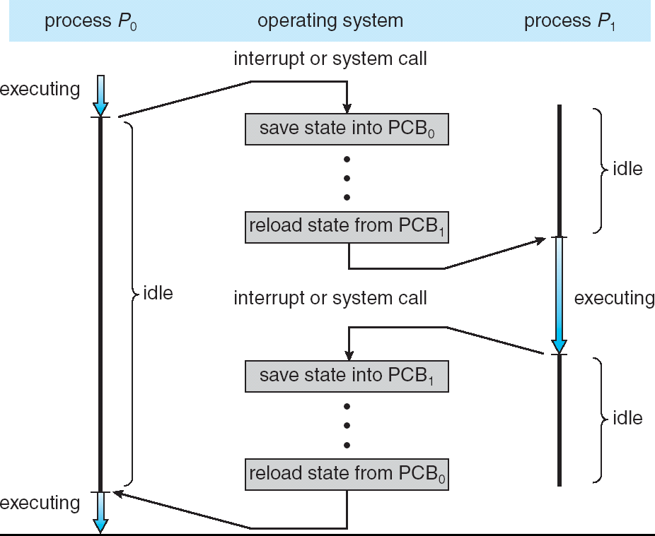>

## 2. 调度的分类

### 1. 高级调度（宏观调度/作业调度）
- 从用户工作流程的角度，对每个作业进行调度，时间上通常是分钟、小时或天
- 选中的作业进入内存，没选中继续呆在外存（后备区）
- 决定接纳多少个作业、接纳哪些作业

### 2. 中级调度（内外存交换）
- 从存储器资源的角度，将进程的部分或全部换出到外存（交换区），将当前所需部分换入到内存
- 指令和数据必须在内存里才能被CPU直接访问

### 3. 低级调度（微观调度/进程或线程调度）
- 从CPU资源的角度，执行的单位，时间上通常是毫秒
- 因为执行频繁，要求在实现时达到高效率
- 分为：
  - **非抢占式**
  - **抢占式**（时间片原则、优先权原则、短作业优先）

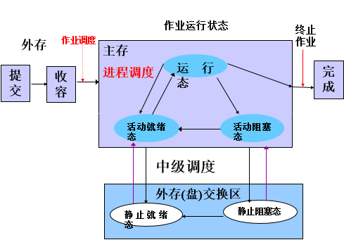

## 3 调度的性能准则

### 1. 面向用户的准则
- **周转时间**：作业从提交到完成所经历的时间（批处理系统）
  - 平均周转时间、带权平均周转时间 (T/Ts)
- **响应时间**：用户输入请求到系统给出首次响应的时间（分时系统）
- **截止时间**：
  - 开始截止时间和完成截止时间（实时系统）
- **优先级**：使关键任务达到更好的指标
- **公平性**：不因作业或进程本身的特性而使上述指标过分恶化

### 2. 面向系统的准则
- **吞吐量**：单位时间内所完成的作业数（批处理系统）
- **处理机利用率**（大中型主机）
- **各种资源的均衡利用**：如CPU繁忙和I/O繁忙的作业搭配

## 4 设计调度算法要考虑的问题

### 4.1. 进程的分类
**第一种分类**：
- **I/O密集型**：频繁进行I/O，花费很多时间等待I/O操作完成
- **CPU密集型**：计算量大，需要大量的CPU时间

**第二种分类**：
- **批处理进程**：无需与用户交互，通常在后台运行，不需很快响应
- **交互式进程**：与用户交互频繁，花很多时间等待用户输入，响应时间要快（平均低于50~150ms）
- **实时进程**：有实时要求，不能被低优先级进程阻塞，响应时间要短且稳定

### 4.2. 进程优先级
CPU调度优先级较高的进程
- **静态优先级**：进程创建时指定，运行过程中不再改变，如图：
  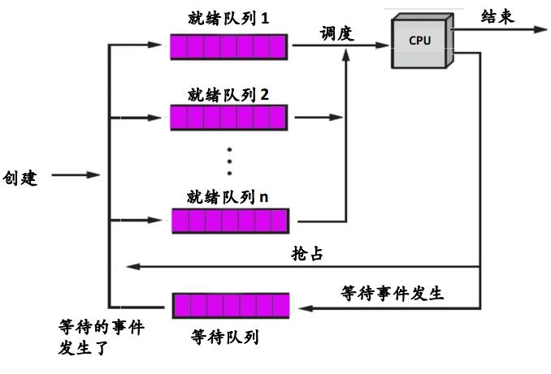>
- **动态优先级**：所有进程先进入第一级就绪队列，随着运行可能降低某些进程的优先级（时间片用完则降级，降到最后一级为止），如图：
  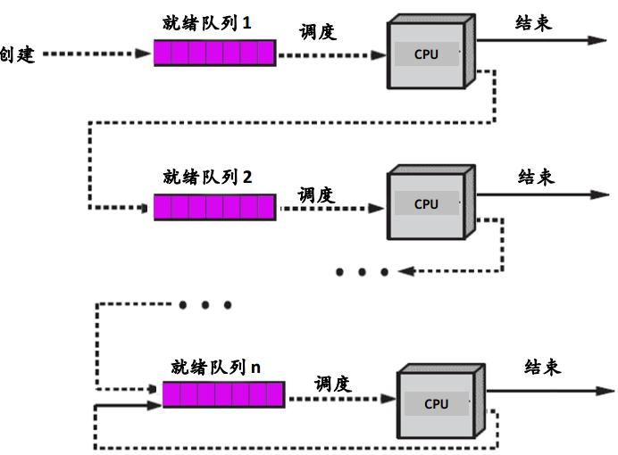>

### 4.3. 占用CPU的方式
- **不可抢占式**：进程一直占用处理器，直到自己阻塞或时间片用完
- **抢占式**：就绪队列中一旦有更高优先级的进程，便立即进行进程调度

### 4.4. 时间片
- 分配给进程运行的时间长度
- 选择时间片需考虑：进程切换开销、响应时间要求、就绪进程个数、CPU能力、进程行为

### 4.5 详解性能评价指标
- 吞吐量 = 作业数 / 总执行时间
- 周转时间 = 完成时刻 - 提交时刻
- 响应时间 = 响应时刻 - 提交时刻
- 带权周转时间 = 周转时间 / 服务时间（执行时间）
- 平均周转时间，平均带权周转时间，平均响应时间 = 各自的总和 / 作业数

## 5. 批处理系统的调度算法

### 5.1. 先来先服务（FCFS）
- 按作业/进程变为就绪态的先后顺序调度，非抢占方式（执行完/阻塞才让出CPU）
- 唤醒后并不立即恢复执行
- **特点**：比较有利于长作业，不利于短作业；有利于CPU繁忙的作业，不利于I/O繁忙的作业

### 5.2. 短作业优先（SJF/SPN）
- 对预计执行时间短的作业优先分派处理机，非抢占方式
- **优点**：改善平均周转时间和平均带权周转时间，提高系统吞吐量
- **缺点**：对长作业非常不利（可能饥饿）；难以准确估计作业执行时间

### 5.3. 最短剩余时间优先（FRTF）
- SJF的抢占式版本
- 新就绪进程比当前运行进程具有更短的完成时间时，系统抢占当前进程
- **缺点**：可能导致长任务饥饿

### 5.4. 最高响应比优先（HRRF）
- FCFS和SJF的折衷，既考虑等待时间又考虑运行时间
- 响应比：RP = (已等待时间 + 要求运行时间) / 要求运行时间 = 1 + 已等待时间 / 要求运行时间
- 选择RP值最大的运行
- **效果**：短作业容易得到较高响应比；长作业等待足够长时间后也能获得高响应比；饥饿不会发生
- **缺点**：每次计算响应比有时间开销，性能比SJF略差

如图：
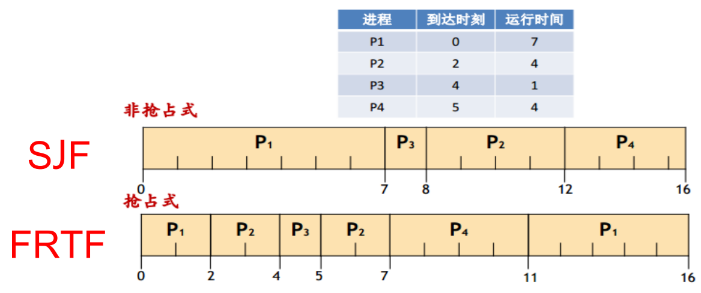

## 6 交互式系统的调度算法

### 6.1. 时间片轮转（RR）
- 系统中所有就绪进程按照FCFS原则排成一个队列
- 每次调度将CPU分派给队首进程，让其执行一个时间片
- 时间片结束时，暂停当前进程，将其送到就绪队列末尾
- **时间片长度**：过长退化FCFS，过短上下文切换开销增大
- 响应时间 ≈ 进程数目 × 时间片
- 应当使用户输入通常在一个时间片内能处理完，否则使响应时间，平均周转时间和平均带权周转时间延长

### 6.2. 优先级算法
- 平衡各进程对响应时间的要求，适用于作业调度和进程调度
- 可分抢先式和非抢先式
- **静态优先级**依据：
  - 进程类型（系统进程优先级较高）
  - 对资源的需求（对CPU/内存需求较少的进程，优先级较高）
  - 用户要求
- **动态优先级**：等待时间延长可提高优先级，每执行一个时间片可降低优先级

### 6.3. 多级队列算法（MQ）
- 引入多个就绪队列，每个作业固定归入一个队列
- 不同队列可有不同的优先级、时间片长度、调度策略
- 如：系统进程、用户交互进程、批处理进程等
如图：
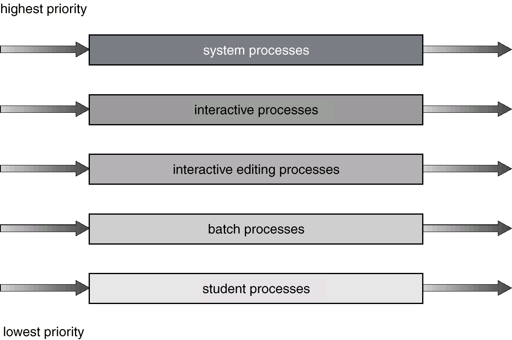>

### 6.4. 多级反馈队列算法（MFQ）
- 时间片轮转和优先级算法的综合与发展
- 设置多个不同优先级的就绪队列，优先级越低时间片越长
- 新进程先投入最高优先级队列，未执行完则降级到下一队列
- 仅当较高优先级队列为空时，才调度较低优先级队列
- 降低到最后的队列，则按“时间片轮转”算法调度直到完成
- 只有较高优先级队列为空才运行较低级，一有高优先级的新进程则抢先执行新进程
- **优点**：照顾短进程、照顾I/O型进程、不必估计进程执行时间，动态调节
- **I/O型进程**保持在最高优先级；**计算型进程**逐渐降到最低优先级
如图：
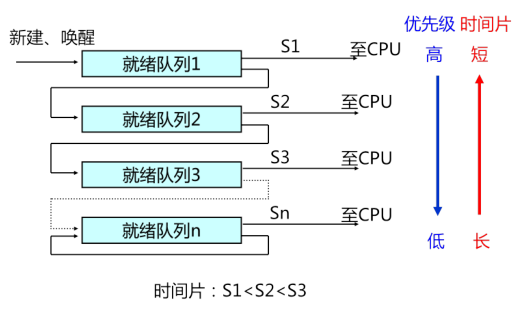

## 7 线程调度与优先级倒置

### 7.1 线程调度
如图：
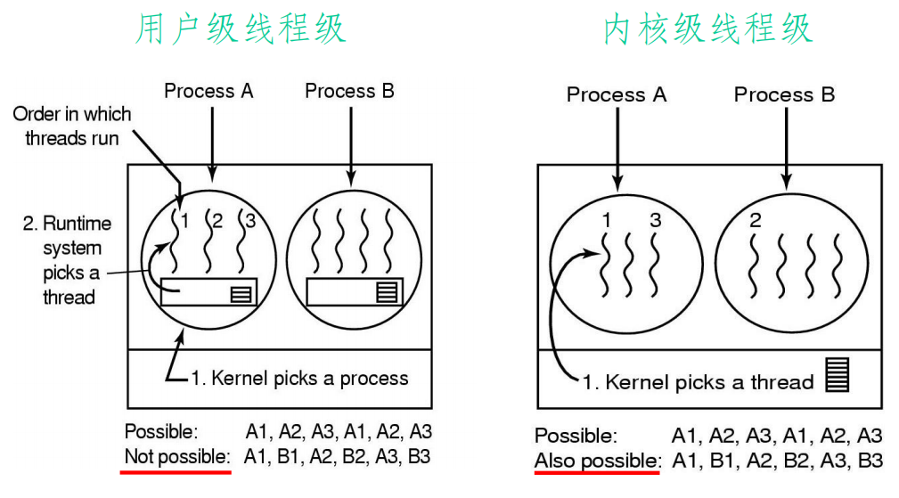>

显然，用户级线程中，OS只能操控进程，因此不能随便跨进程运行线程

### 7.2 优先级倒置
- **现象**：高优先级进程被低优先级进程延迟或阻塞
- **例子**：如图：
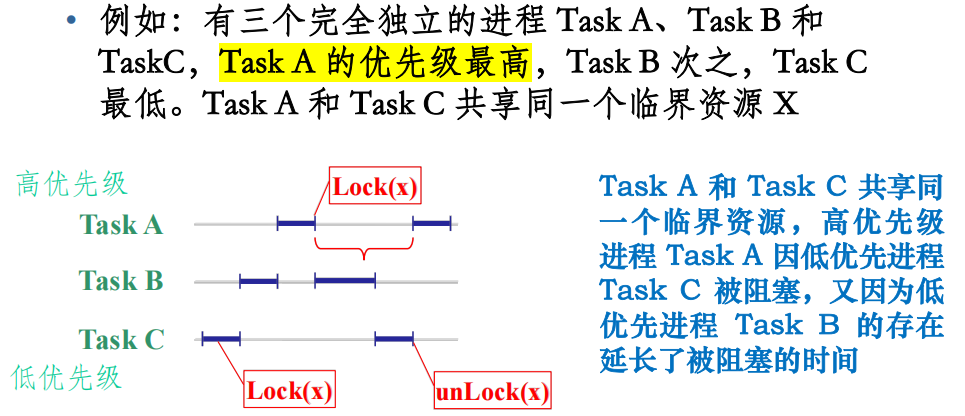>

### 7.3 解决方法
- **优先级置顶**：TaskC进入临界区后不允许被抢占，具有最高优先级
  如图：
  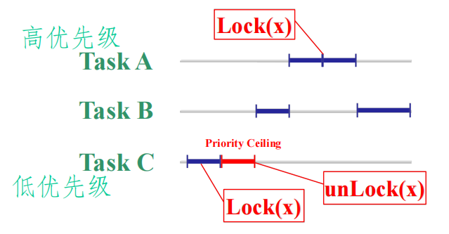>

- **优先级继承**：当高优先级进程要进入临界区时，正在使用该资源的低优先级进程继承高优先级，直到退出临界区
  如图：
  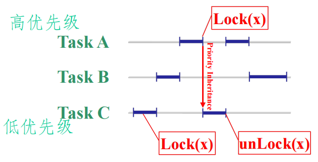>

## 8 实时系统的调度算法

### 8.1 实时系统特点
- 时间起着主导作用，必须在确定的时间范围内做出反应（正确但迟到<有小错误但及时）
- **硬实时**：绝对满足截止时间要求（汽车/飞机控制系统）
- **软实时**：偶尔可以不满足（视频/音频程序）
对不同刺激的响应指派给不同的进程（任务），并且每个进程的行为是可提前预测的

### 8.2 前提条件
- 任务集S已知，每个任务的周期T已知
- 所有任务都是周期性的，必须在限定时限D内完成
- 任务之间相互独立
- 每个任务的运行时间c不变
- 调度、任务切换时间忽略不计
- CPU利用率：用U = ∑(ci/Ti) 表示

### 8.3 静态表调度
- 通过对所有周期性任务的分析预测，事先确定固定调度方案
- **特点**：开销最小，无灵活性，只适用于完全固定的任务场景

### 8.4 单调速率调度（RMS）
- **单处理器下最优静态调度算法**，静态、抢占式
- 周期越小，优先级越高————越先被调度
  - 如果优先级一样就随机选一个调度
- 可调度条件：∑(Ci/Ti) ≤ n(²√2 - 1)，极限约为 ln2 ≈ 0.693

### 8.5 最早截止期优先（EDF）
- 绝对截止时间越早（即**剩下的时间片越少**），优先级越高
- 可调度条件：∑(Ci/Ti) ≤ 1
图示：
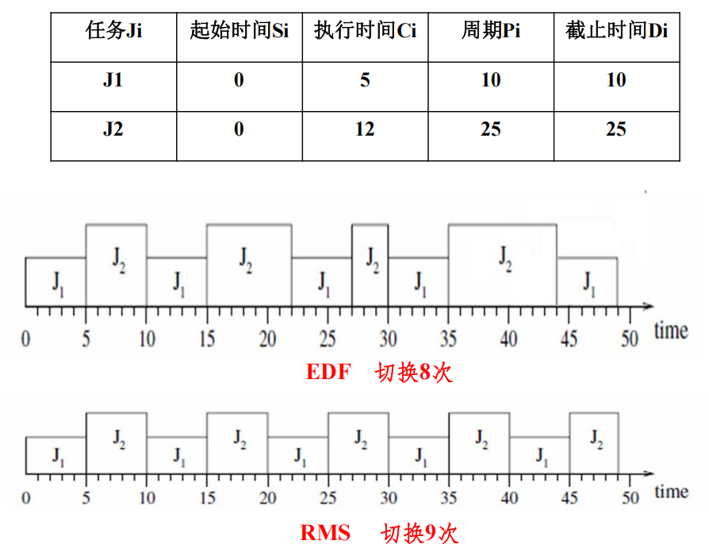>

## 9 多处理机调度

### 9.1 与单处理机调度的区别
- 注重整体运行效率
- 调度算法更加多样
- 多处理机访问OS数据结构时需要互斥
- 调度单位广泛采用线程

### 9.2 非对称式多处理系统（AMP）
- 各处理器地位不同
- 主处理机管理公共就绪队列，分派进程给从处理机
- 有潜在的不可靠性

### 9.3 对称式多处理系统（SMP）
- 各处理器地位相同

**集中控制**：
- **静态分配**：每个CPU一个就绪队列，进程始终在同一CPU上运行（开销小，但忙闲不均）
- **动态分配**：所有CPU共享一个公共就绪队列（防止忙闲不均）

**分散控制**：
- **自调度**：各处理机自行在就绪队列中取任务（最常用，需要互斥访问控制）
  - 优点：不需要专门处理机分派任务
  - 缺点：处理器较多时，就绪队列访问可能成为瓶颈

### 9.4 成组调度
- 将一个进程中的一组线程同时分派到一组处理机上执行
- 优点：提高线程执行并行度，减少阻塞，加快推进速度，减少调度次数
- 类型：面向所有程序平分处理机时间；面向所有线程平分处理机时间
图示：
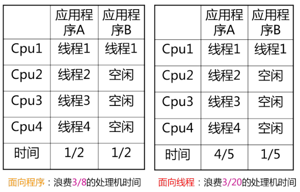>

### 9.5 专用处理机调度
- 为进程中的每个线程固定分配一个CPU，直到执行完成
- 缺点：线程阻塞时CPU闲置
- 优点：不需切换，推进速度快
- 适用：CPU数量众多的高度并行系统

## 10 Linux的调度

### 10.1 历史变迁
- **Linux 2.4**：O(n)调度器
- **Linux 2.6.0**：O(1)调度器
- **Linux 2.6.23**：CFS完全公平调度器

### 10.2 三种调度策略
- **SCHED_OTHER**：一般进程
- **SCHED_FIFO**：先进先出的实时进程
- **SCHED_RR**：轮转方式执行的实时进程

### 10.3 关键概念
- **priority**：进程优先级，反映进程相对可选择的程度，默认200ms
- **rt_priority**：实时进程相对优先级，1~99（一般进程为0）
- **counter**：反映进程剩余可运行时间，时钟中断时减1，直至为0。
  - 创建子进程时父进程counter减半，赋予子进程
  - 所有可运行进程counter都为0时，重新赋值
- **权重（goodness）**：实时进程 = 1000 + rt_priority；一般进程 = counter（当前进程+1以减少切换）

### 10.4 传统Linux调度器的问题
- 可扩展性不好（O(n)）
- 高负载下性能较低
- 交互式进程优化不完善
- 对实时进程支持不够（内核态不抢占）

### 10.5 O(1)调度器特点
- 140个优先级（40个用户任务 + 100个实时/内核）
- 两个独立优先级队列：active 和 expired
- 所有算法O(1)复杂度
- 时间片与优先级线性映射
- 实时任务：SCHED_FIFO（抢占其他任务，无时间片限制）、SCHED_RR
- **问题**：交互式进程识别算法存在失效情况，NUMA支持不完善，代码复杂

## 11 传统UNIX的进程调度(这里随便吧反正大概率不考)

### 调度特点
- 未设置作业调度
- 进程调度采用基于时间片的多级反馈队列算法
- 进程优先级分为**核心优先级**和**用户优先级**

### 调度时机
- 进程由核心态转入用户态时
- 进程主动放弃处理机时

### 调度标志
- **runrun**：要求进行调度
- **runin**：内存中没有适当进程可以换出
- **runout**：外存交换区中没有适当进程可以换入

### 用户优先级（0~127）
- 优先数公式：P_pri = P_CPU/2 + PUSER + P_nice + NZERO
- PUSER = 25，NZERO = 20
- P_CPU：最近一次CPU使用时间，时钟中断加1（最多80）
- P_nice：用户可设置的优先级偏移值（默认20）
- 优先数越大，优先级越低

### 核心优先级（0~49）
- **不可中断优先级**：对换、等待磁盘I/O、等待缓冲区、等待文件索引结点
- **可中断优先级**：等待tty I/O、等待子进程退出

### 调度实现三阶段
1. 检查是否作上下文切换，保存当前进程上下文
2. 恢复0号进程上下文，寻找最高优先级就绪进程
3. 恢复当前进程上下文，执行该进程

