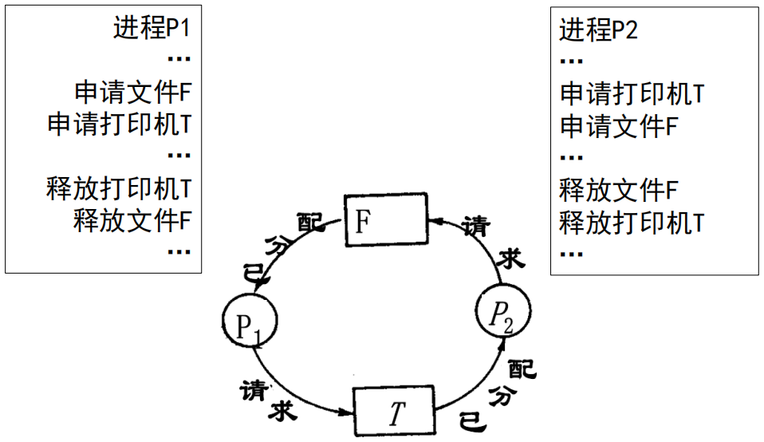
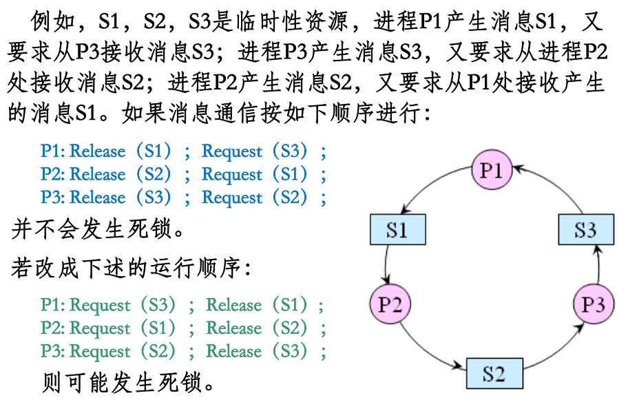
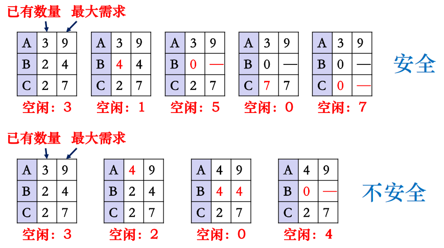
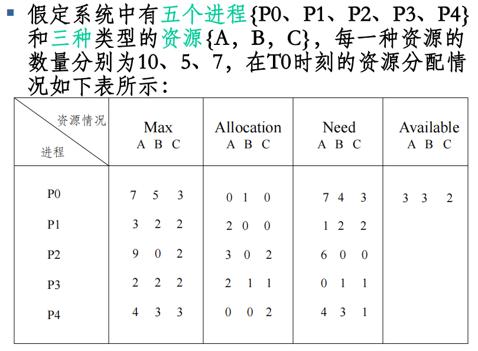
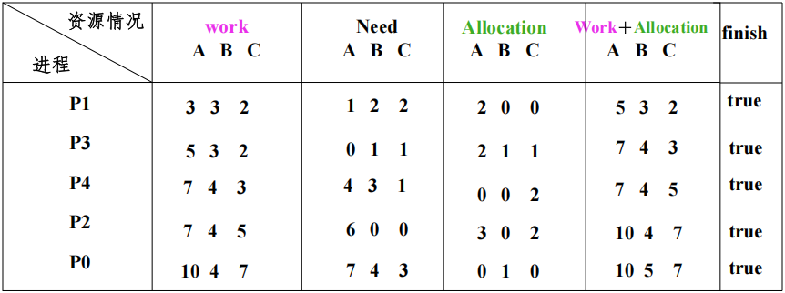
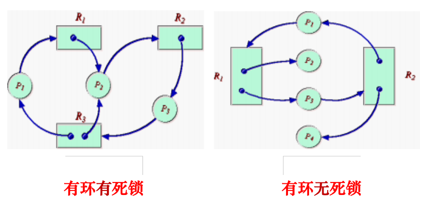
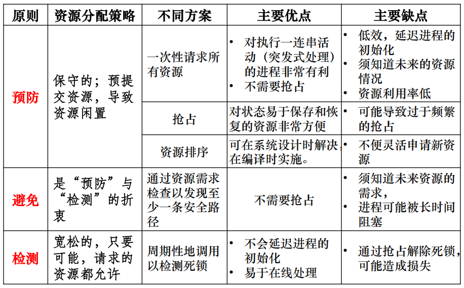

# 操作系统 第四章 进程管理 — 4.4 死锁 核心总结

## 1 死锁的基本概念

### 1.1. 死锁定义
由于资源占用的互斥性，当某个进程提出资源申请后，使得一些进程在无外力协助的情况下，永远分配不到必需的资源而无法运行。

### 1.2. 死锁发生原因
- **竞争资源**：多个进程争夺不可共享或临时性资源。
- **并发执行顺序不当**：进程推进顺序不合理，形成循环等待。
For example

### 1.3. 资源分类与死锁
- **可剥夺资源**：如CPU、内存，可被系统强行剥夺（一般不引起死锁）。
- **非可剥夺资源**：如磁带机、打印机，只能由占用进程主动释放（易导致死锁）。
- **临时性资源（消耗性资源）**：如消息、中断，由一进程产生，另一进程使用（若产生与接收顺序不当，可能导致死锁）。

> [!TIP] 进程推进不当导致死锁的案例
> 案例1，如图所示：
> 
> 案例2:
> 此外,再考虑一件事情,对于生产-消费者问题,如果没有全局锁,就可能
> - 缓冲区为空→ 消费者读取count发现为0→消费者被切换(没来得及阻塞自己)
> - 生产者生产一个产品→生产者检测到count=1→尝试唤醒消费者→但实际上消费者还没有睡眠,失败
> - 消费者阻塞,但再也没有生产者唤醒他了,死锁

## 1.4. 死锁产生的四个必要条件
1. **互斥条件**：资源只能由单个进程排他性地使用，即在一段时间内某资源只由一个进程占用。
2. **请求和保持条件**：进程已持有资源，又提出新的资源请求，且新资源被其他进程占用时，进程阻塞但不释放已持有资源。
3. **不剥夺条件**：已分配给进程的资源，在该进程使用完毕前不可被系统强制收回。
4. **环路等待条件**：存在一组进程 {P0, P1, ..., Pn}，其中 P0 等待 P1 占用的资源，P1 等待 P2 占用的资源，...，Pn 等待 P0 占用的资源，形成环形等待链。

### 1.5. 死锁、活锁与饥饿
- **活锁 (Livelock)**：任务未阻塞，但因条件不满足不断重复尝试-失败循环，状态在改变但无进展。
  - **可能自行解开。可采用先来先服务策略避免。**
- **饥饿 (Starvation)**：因资源分配策略不公平，某些进程长时间等待，当等待严重影响推进时称为饥饿；极端情况下任务失去意义则为“饿死”。

## 2 处理死锁的基本方法

### 2.1 不允许死锁发生————预防死锁（静态策略，破坏四个必要条件之一）
1. **打破互斥条件**：允许资源共享。但某些资源（如打印机）天生互斥，不适用。
2. **打破占有且申请条件**：资源预先一次性分配，**只有满足所有需求才分配（“全部分配”）**。  
   - 缺点：动态需求难预测；资源利用率低（全程占据）；降低进程并发度。
3. **打破不可剥夺条件**：允许系统强占资源。当新申请不能满足时，进程须释放已持有资源，稍后重新申请。  
   - 缺点：实现困难，降低系统性能。
4. **打破循环等待条件**：资源有序分配法——将所有资源编号，进程必须**按编号递增顺序申请资源**，占用了小号资源，才能申请大号资源，就不会产生环路，从而预防了死锁。
   - 优点：资源利用率和系统吞吐量较高。  
   - 缺点：限制资源请求灵活性；可能提前占用暂不需要的资源，增加占用时间。

### 2.2 不允许死锁发生————避免死锁（动态策略，不事先限制资源申请）
系统动态检查每个资源请求，仅当分配后系统仍处于安全状态时才分配。

#### 2.2.1. 安全序列与安全状态
- **安全序列**：存在一种进程执行顺序 {P1, P2, ..., Pn}，使得每个进程所需的最大资源可由当前可用资源与已分配给前面进程的资源满足，并且序列可全部完成。
- **安全状态**：系统存在至少一个安全序列；否则为不安全状态。

如图：

不安全状态不一定立刻发生死锁，但死锁发生后系统必处于不安全状态。

#### 2.2.2. 银行家算法（核心动态避免算法）

- **数据结构**：
  - `Available`：m维向量，定义了系统中m类资源当前可用的数量。
  - `Max`：n✖m矩阵，定义了系统中n个进程中的每一个进程对m类资源的最大需求。Max[i][j] 表示进程 Pi 对资源 Rj 的最大需求量。
  - `Allocation`：n✖m矩阵，定义了系统中n个进程中的每一个进程当前已分配的资源数量。Allocation[i][j] 表示进程 Pi 已分配的资源 Rj 的数量。
  - `Need`：n✖m矩阵，Need = Max - Allocation。
- **资源请求检查步骤**：
  1. 检查 `Request ≤ Need`，否则出错（请求超出最大需求）。
  2. 检查 `Request ≤ Available`，否则等待（资源不足）。
  3. 试探分配：`Available -= Request`，`Allocation += Request`，`Need -= Request`。
  4. 执行**安全性算法**：
     - 设两个向量 `Work = Available`，`Finish[i] = false`。
       - Work表示系统可提供给进程继续运行所需要的各类资源的数目，它含有m个元素，初始时Work=Available。
       - Finish表示系统是否有足够的资源分配给进程，使之运行完成。开始时先做Finish[i]=false；当有足够的资源分配给进程时，初始时Finish[i]=true.
     - 寻找满足 `Finish[i]=false` 且 `Need[i] ≤ Work` 的进程。
     - 找到后，`Work += Allocation[i]`，`Finish[i]=true`，i自增（跳到下一个进程）重复查找。
     - 若所有 `Finish[i]` 均为 true，则系统安全，正式分配；否则不安全，撤销试探分配，进程等待。
  图示：
  
  

- **特点**：
  - 允许互斥、部分分配和不可抢占，资源利用率高；
  - 但要求进程事先声明最大需求，在实际系统中较难实现。

### 2.3 允许死锁发生

#### 检测死锁
- 利用资源分配图 (RAG) 或检测算法判断是否存在循环等待（死锁）。
- **资源分配图化简法**：
  - 节点：进程结点 (P) 与资源结点 (R)。P = {p1, p2, … , pn}，R = {r1, r2, … , rm}，两者为互斥资源。
  - 边：eE，e = (pi, rj) 或e = (rj, pi)。请求边 (P→R) 与分配边 (R→P)。
  - 表示：圆圈表示进程，矩形表示一类资源，矩形中的小圈代表每个资源。
  - 图示：（可看出环和死锁并非绝对，有环路不一定都有死锁）
  
  - 补充:
    - 封锁进程：是指某个进程请求资源数超过系统中现有未分配资源数，被系统封锁
    - 非封锁进程：即没有被系统封锁的进程
  - 化简：若进程是非封锁进程（所需资源可满足），将其请求边变为分配边，完成后删除所有分配边，使进程成为孤立结点。重复以上操作，若能化简掉所有边，则无死锁；若图不可完全化简，则存在死锁。

#### 解除死锁（死锁已发生后的恢复）
- **目标**：以最小代价恢复系统运行。死锁解除后，进程应恢复它原来的状态
- **方法**：
  1. **剥夺资源法**：挂起某些进程，强行收回其资源分配给其他死锁进程，待条件满足后再激活。
  2. **撤销进程法**：终止部分（回退）或全部死锁进程，释放其资源。
- **注意事项**：
  - 避免总剥夺/撤销同一进程，防止饥饿。
  - 尽量选择代价最小（如回退开销小）的牺牲进程。

### 2.4 总结

### 3 经典实例：哲学家进餐问题
- **问题**：五位哲学家围绕圆桌，每两人间有一根筷子，进餐需同时拿起左右两根筷子。
- **潜在死锁**：所有人同时拿起左边筷子，等待右边筷子时陷入循环等待。
- **避免死锁的解题思路**：
  - **破除资源互斥**：限制同时进餐人数（至多四人），破坏互斥（至少有一个哲学家能够进餐）。
  - **破除循环等待**：对筷子编号，要求按编号顺序拿取；或奇数号先左后右，偶数号先右后左，破坏循环等待。
  - **破除请求与保持条件**：要求同时拿起两根筷子，否则一根不拿，破坏请求与保持条件。
