

# I/O管理总结笔记

## 1 I/O系统整体架构

I/O软件按层次从用户到硬件依次划分为：

1. **用户层I/O软件**（设备无关）
2. **操作系统I/O管理软件**（设备无关与设备相关的分界）
3. **设备驱动程序及中断处理程序**（设备相关）
4. **含寄存器的I/O设备控制器**（设备相关）
5. **I/O设备硬件**

> 核心思想：**分层设计**，低层屏蔽硬件细节，高层提供统一、友好的接口。

## 2 I/O硬件组成
如图：
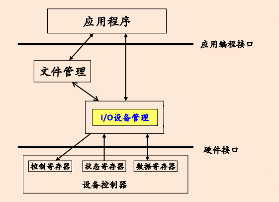

### 2.1. 总线
- 连接CPU、内存与I/O设备的主要通道。
- **总线带宽 = 频率 × 宽度（Bytes/sec）**
- 常见结构：北桥（高速）与南桥（低速外设）。

### 2.2. 设备控制器
如图：
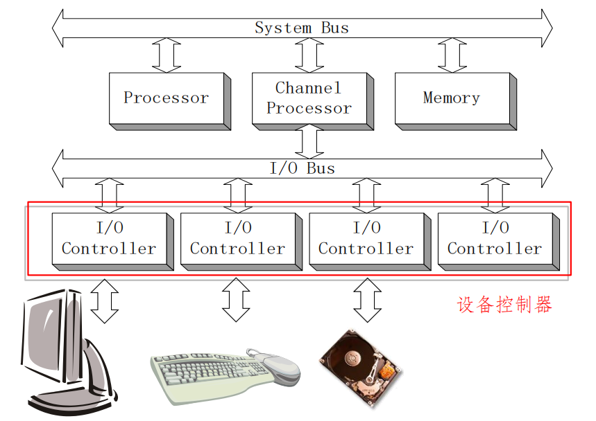

- 位于设备与总线之间，负责接收并执行CPU命令。
- **功能**：接收/识别CPU的命令、数据交换、状态报告、地址识别、缓冲、差错检测。
- **组成**：
  - 与CPU接口：**数据/控制/状态寄存器**。
  - 与设备接口：传输数据、控制、状态信号。
  - I/O逻辑：实现CPU对设备的控制。
- **结构**：
  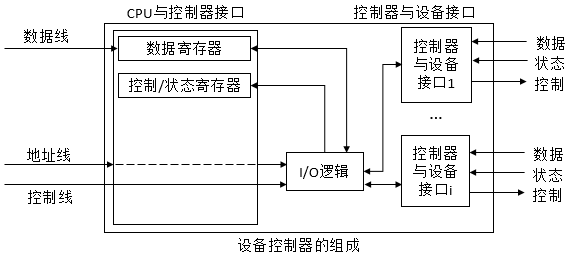

### 2.3. I/O端口编址方式

| 方式 | 特点 |
|------|------|
| **内存映射I/O** | 控制器寄存器映射到物理地址空间；优点：无需专用保护机制，指令丰富；缺点：不能缓存控制寄存器内容 |
| **独立编址** | 专用I/O地址空间（如Intel in/out指令）；优点：地址空间独立，易于区分对内存还是对I/O操作；缺点：操作指令少 |

> [!NOTE] 详解独立编址
> 完全一样的地址数值，但因为访问指令不同，CPU拉低了不同的控制信号线。

## 3 设备分类与管理目标

### 3.1. 按数据组织分类
- **块设备**：以数据块为单位，可寻址，传输效率高，如磁盘。
- **字符设备**：以字符流为单位，不可寻址，传输效率低，如键盘。

### 3.2. 按用途分类
- **存储设备**：如磁盘、光盘，提供数据存储。
- **传输设备**：如网络接口，提供数据通信。
- **人机交互设备**：如显示器、键盘、鼠标，提供用户接口。

### 3.3. 按资源分配角度分类
- **独占设备**：一段时间内只能由一个进程使用（如打印机）。
- **共享设备**：可被多个进程交叉使用（如磁盘）。
- **虚设备**：用一类设备模拟另一类设备（如SPOOLing技术将打印机虚拟为共享设备）。

### 3.4. I/O管理的特点
- I/O性能经常成为系统性能的瓶颈
- 操作系统庞大复杂的主要原因之一：外设资源种类多、繁杂，并发，均来自I/O
- 与其它功能联系紧密，特别是文件系统

### 3.5. 管理目标和功能
**目的**：
- **提高效率**：匹配速度差异，提高并行度。
- **方便使用**：统一接口，逻辑设备屏蔽物理差异。
- **方便控制**：动态增加/删除设备。
- **保护**：数据传输安全保密。

**功能**：
- **提供设备使用的用户接口**：命令接口和编程接口
- **设备分配和释放**：使用设备前，需要分配设备和相应的通道、控制器
- **设备的访问和控制**：包括并发访问和差错处理
- **I/O缓冲和调度**：目标是提高I/O访问效率

## 4 I/O控制方式（四种进化）

| 方式 | 原理 | CPU干预程度 | 适用场景 |
|------|------|---------------|----------|
| **程序控制I/O（轮询）** | CPU不断查询设备状态，向I/O模块发出指令 | 全程 | 简单低速 |
| **中断驱动I/O** | I/O设备完成操作后，由设备控制器主动地通知CPU | 每次数据传输 | 中低速 |
| **DMA** | 专用控制器控制块数据传送，结束中断CPU | 仅开始/结束 | 高速块传输 |
| **通道方式** | 专用处理器执行通道程序，控制多台设备 | 极低 | 大系统多设备并发 |

- **程序控制I/O**： 
  如图：
  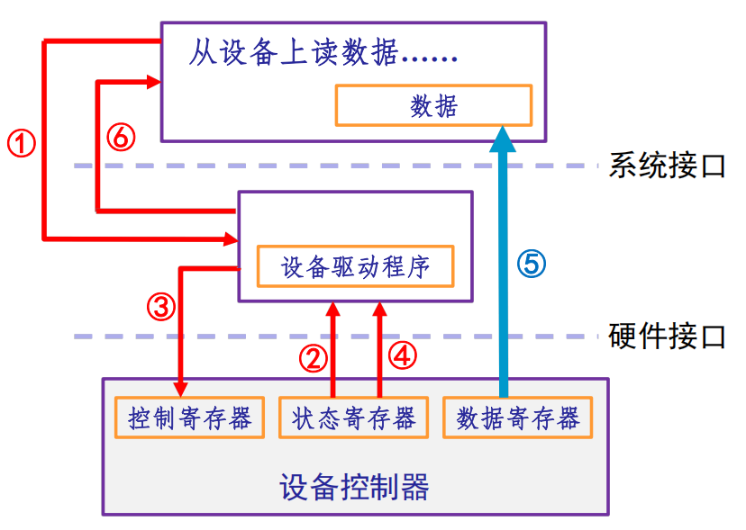

  - 应用程序提出了一个读数据的请求
  - 设备驱动程序检查设备的状态
  - 如果状态正常，就给设备发出相应的控制命令
  - 不断地去测试这个设备是否完成了这次执行过程，就是一个轮询
  - 设备控制器完成操作，把数据送给应用程序
  - 应用程序继续进行相应的处理
- **中断驱动方式**：  
  如图：
  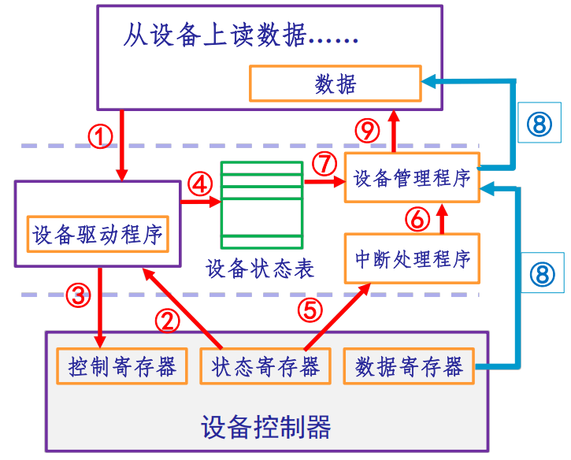

  - 用户程序提出I/O请求
  - 设备驱动程序检查设备的状态
  - 如果设备已经准备好，那么就向设备发出控制命令
  - 将状态记录在设备状态表中， CPU继续其它工作
  - 设备完成工作后向CPU发中断信号，转入中断处理程序
  - 中断处理程序发现这是一个正常地完成了控制命令的
  - 信号后，把结果提交给设备管理程序
  - 设备管理程序会从设备状态表里查询是哪一个请求的完成
  - 把相应的数据送到 应用程序
  - 通知应用程序可以继续执行
- **DMA（直接存储访问方式）**：
  如图：
  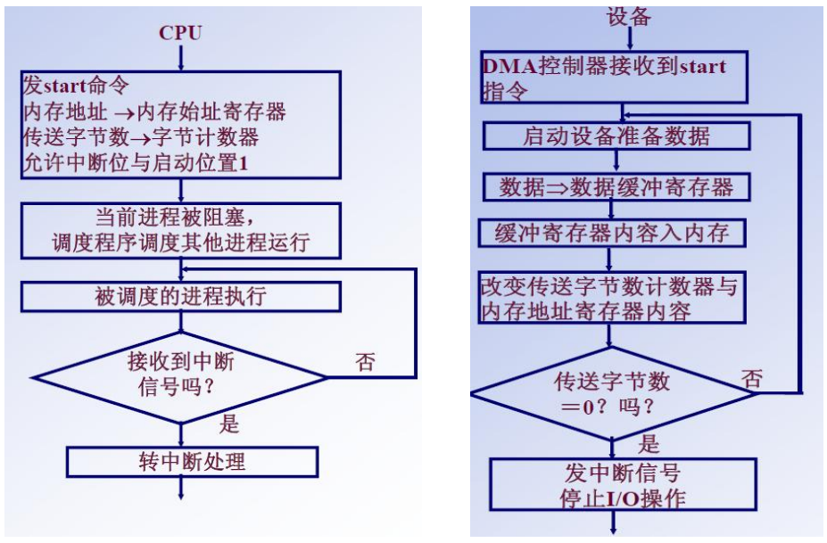

  - **命令/状态寄存器（CR）**：用于接收从CPU发送来的I/O命令，或有关控制信息，或设备的状态
  - **内存地址寄存器（MAR）**：在输入时，它存放把数据从设备传送到内存的起始目标地址，在输出时，它存放由内存到设备的内存源地址
  - **数据寄存器（DR）**：用于暂存从设备到内存，或从内存到设备的数据
  - **数据计数器（DC）**：用于存放要传送的数据字节数
  - **DMA控制器**：负责执行DMA传输，独立于CPU，完成数据传输后发中断通知CPU
  - **优点**：仅干预开始和结束，适合高速块传输
  - **缺点**：数据传送方向、地址和数据量由CPU控制；且每个设备需要独立DMA控制器
- **通道方式**：
  如图：
  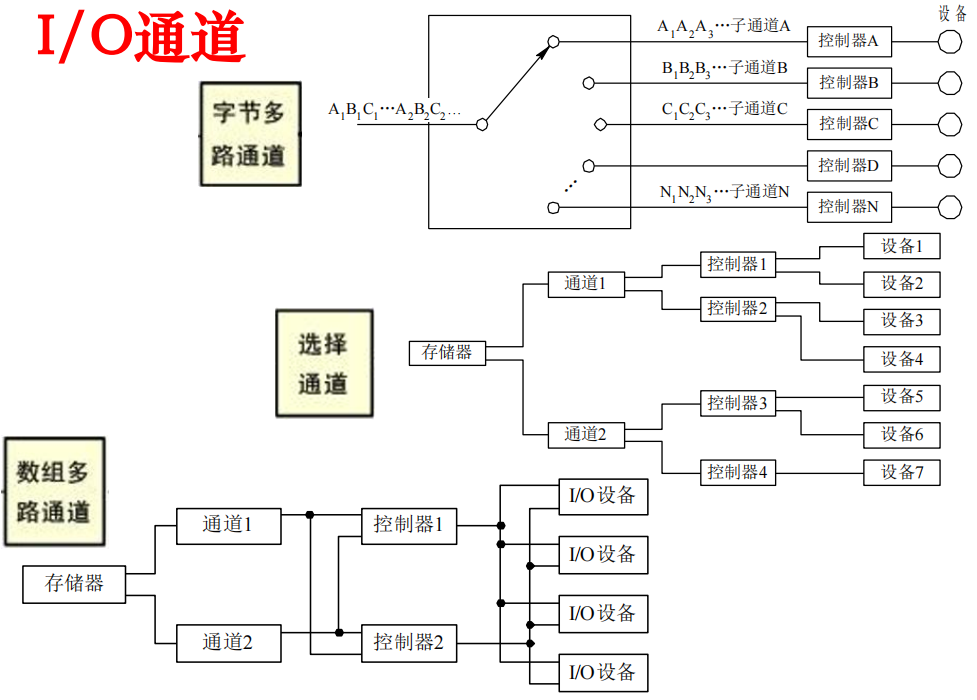

  - **字节多路通道**：以字节为单位交叉工作：当为一台设备传送一个字节后，立即转去为另一台设备传送一个字节，**适用于低中速I/O设备**（打印机，终端）
  - **数组选择通道**：每次传送一批数据，传送速率很高，一段时间只为一台设备服务；每当一个I/O请求处理完之后，就选择另一台设备为其服务
  - **数组多路通道**：每次传送一批数据，但在传送过程中可以为多台设备服务，**与通道连接的设备可并行工作**

> [!ATTENTION] DMA和中断的区别
> 中断：每次数据传送后中断CPU，需保护/恢复现场。
> DMA：整批完成后中断，CPU不参与数据传送的过程，DMA控制器直接在主存和I/O设备之间传送数据，只有开始和结束才需要CPU干预。
> 程序中断方式具有对异常事件的处理能力，而DMA控制方式适用于数据块的传输

> [!ATTENTION] DMA和通道的区别
> 通道是一个特殊的处理器，有自己的指令和程序，通过执行通道程序实现对数据传输的控制(比如方向\起始地址\长度)，所以通道具有更强的独立处理I/O的功能

## 5 I/O软件分层结构

### 5.1. 各层功能(分层设计思想)
如图:
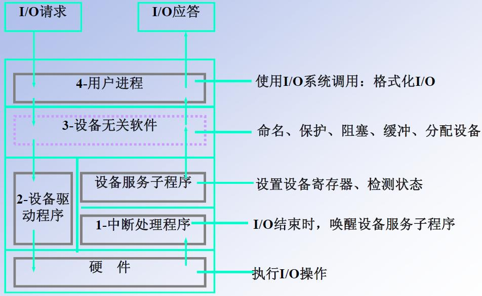

- 较低层更多的考虑硬件的特性，并向较高层软件提供接口
- 较高层不依赖于硬件，并向用户提供一个友好的、清晰的、简单的、功能更强的接口

### 5.2. 设备独立性（逻辑设备）
- **逻辑设备名**：用户程序使用，屏蔽物理设备。
- **物理设备名**：系统执行的实际设备标识。
- **LUT（逻辑设备表）**：实现逻辑名→物理名+驱动入口映射。
  - 将逻辑设备名称转换为某物理设备名称。
  - 可全系统一张（单用户）或每个用户一张（多用户）。
- **优点**：
  - **设备分配时的灵活性**：若进程能够以逻辑设备名称来请求某类设备时，系统可立即将该类设备中的任一台分配给进程，仅当所有此类设备全部分配完毕时，进程才会阻塞
  - **易于实现I/O重定向**：用于I/O操作的设备可以更换，而不必改变应用程序

### 5.3. 设备驱动程序
**功能**：
- 接收来自与设备无关的上层软件的抽象请求，并执行这个请求
- 负责释放设备寄存器的命令，并监督它们正确执行
- 是I/O进程与设备控制器之间的通信程序
**组成**：
- 自动配置和初始化子程序
  - 如果该设备正常，则对该设备及其相关的设备驱动程序需要的软件状态进行初始化。
- I/O操作子程序
  - 系统调用的结果，用户态变为内核态
- 中断服务子程序
**共性**：
核心代码/接口/机制与服务，动态加载（内核发出请求时加载）
**接口说明**：
- 驱动程序初始化函数
  - 在系统启动时安装入内核执行
- 驱动程序卸载函数，释放设备函数
- I/O操作函数
  - 包含启动I/O的命令（独占设备），或挂入请求队列（共享设备）
- 中断服务函数
  - 处理设备完成中断，通知设备管理程序，如果有I/O管理队列，启动下一个请求
**区别**：
- 是内核一部分，出错导致系统崩溃。
- 提供标准接口，可动态加载/卸载。
- **没有main函数**，完成初始化后不再运行，由初始化函数入口等待系统调用。
- 不能使用标准C库。
如图：
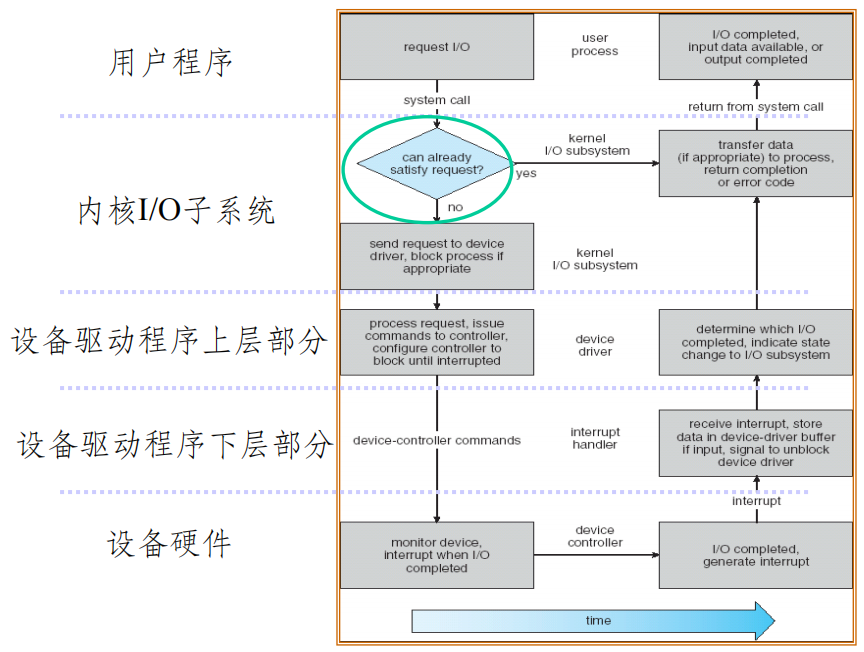

## 6 设备管理数据结构
I/O设备分配的共享问题的两种常见作法：
- 在进程间切换使用外设，如键盘和鼠标
- 通过一个虚拟设备把外设与应用进程隔开，只由虚拟设备来使用设备

### 6.1 数据结构一览
- **SDT**（系统设备表）：全系统设备资源状态，指向DCT。
  - 如图：
  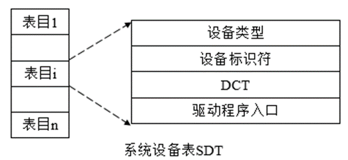

  - 反映系统中设备资源的状态，记录所有设备的状态及其设备控制表的入口
  - DCT指针：指向相应设备的DCT
  - 设备使用进程标识：正在使用该设备的进程标识
  - DCT信息：为引用方便而保存的DCT信息（设备标识，类型）
- **DCT**（设备控制表）：每设备一张，记录设备特性、状态、请求队列等。
  - 如图：
  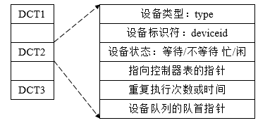

  - 设备请求队列队首指针：指向等待使用该设备的第一个进程的PCB（即设备请求队列的队首）
  - 设备状态：空闲/占用/故障（使用状态时忙/闲标志置为1）
  - 控制器表指针：该指针指向该设备所属控制器的控制表
  - 重复执行次数：对于某些设备，可能需要重复执行某个命令多次才能完成一个I/O操作，这个字段记录了需要重复执行的次数
- **COCT**（控制器控制表）：每控制器一张，记录控制器状态/通道连接。
  - 如图：
  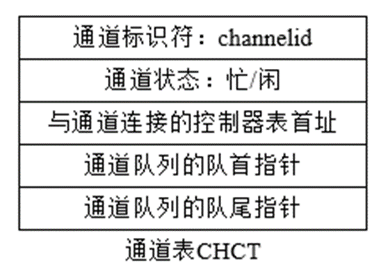

  - 每个设备控制器一张，描述I/O控制器的配置和状态
- **CHCT**（通道控制表）：每通道一张，记录通道状态。
  - 如图：
  

  - 每个通道一张，描述通道的配置和状态
  - 注意到一个通道可以连接多个控制器，所以COCT是通道表指针；CHCT是控制器表首址

### 6.2 分配算法与安全
设备固有属性：独享、共享、虚拟设备
设备分配算法：先来先服务、优先级高者优先
设备分配中的安全性(safety)：死锁问题
- **安全分配**：请求后阻塞，防死锁。
- **不安全分配**：请求后继续运行，可能死锁，需安全检查。

### 6.3 设备分配流程
1. 分配设备（物理设备名查SDT→DCT）
2. 分配控制器（DCT→查COCT）
3. 分配通道（COCT→查CHCT）

## 7 SPOOLing 系统（虚拟设备技术/假脱机技术）

- 用**共享设备（磁盘）模拟独占设备**。
- 流程：
  - SPOOLing程序预先从外设读取数据并加以缓冲，在以后需要的时候输入到应用程序
  - SPOOLing程序接受应用程序的输出数据并加以缓冲，在以后适当的时候输出到外设
  - 进行I/O操作时，只是和SPOOLing程序交换数据
  - 如图：
  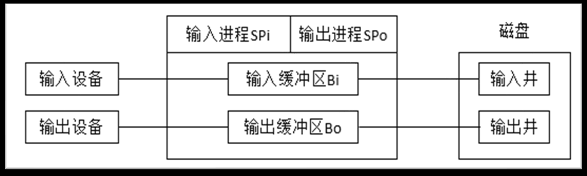

- 组成：
  - **输入/输出井**：磁盘上大存储空间。输入井用于暂存I/O设备输入的数据，输出井用于暂存用户程序和输出数据。
  - **输入/输出缓冲区**：内存缓冲。缓和CPU与磁盘之间速度不匹配。输入缓冲区用于暂存由输入设备送来的数据，以后再传送到输入井，输出缓冲区用于暂存从输出井送来的数据，以后再传送给输出设备
  - **SPi/Spo进程**：模拟脱机外围控制机。进程SPi负责从输入设备读取数据并送入输入缓冲区，进程Spo负责从输出缓冲区取出数据并送到输出设备
- 优点：提高I/O速度，实现设备共享（如打印机队列）。

## 8 I/O缓冲管理

### 8.1. 缓冲目的
可提高外设利用率，原因：
- 匹配速度差异。
- 减少中断次数。
- 提高CPU与设备并行性。

### 8.2. 缓冲方案对比

| 类型 | 处理时间 | 适用条件 |
|------|----------|----------|
| **单缓冲** | Max(C,T)+M | T>C则M+T，反则M+C |
| **双缓冲** | 近似Max(C+M, T) | C≈T效果好 |
| **环形缓冲** | 多缓冲循环使用 | 速度差大时 |
| **缓冲池** | 多个共享缓冲区，按空/输入/输出队列组织，四种工作方式 | 大型系统 |

深度补充：
- **单缓冲**：只有一个缓冲区。一旦 M 执行完毕，缓冲区内数据已移走，立即可启动下一块的 T。因此下一块的 T 可以与当前块的 C 重叠，但 M 和 C 是串行的。
如图：
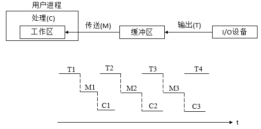

- **双缓冲**：两个缓冲区 A、B 交替使用。数据从设备进缓冲 (T) 可以与 CPU 操作 (M 及 C) 完全流水线并行。但 CPU 自身的 M 和 C 依然串行。
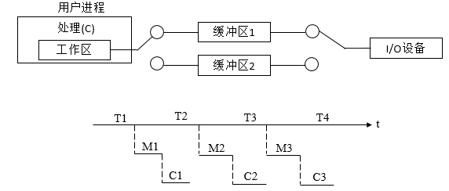

> [!ATTENTION] 双缓冲比单缓冲到底好在哪里
> 因为单缓冲中T和M是不能并行的(你T想在缓冲区中写东西，结果缓冲区还没清空，何意味)
> 双缓冲中T和M是完全并行的(你T在A缓冲区中写东西，结果A缓冲区还没清空了，那我去B缓冲区中写呗)
> 因此，双缓冲主要是节省了M的时间（单缓冲中C和T是并行的，双缓冲中M+C这个整体和T并行）

- **环形缓冲**：
  - 多个缓冲区循环使用，适合速度差大时。作为输入的多缓冲区可分为三种类型，用于装输入数据的空缓冲区R、已装满数据的缓冲区G以及计算进程正在使用的工作缓冲区C
  - 设置三个指针，用于指示计算进程下一个可用缓冲区G的指针Nextg、指示输入进程下次可用的空缓冲区R的指针Nexti、以及用于指示计算进程正在使用的缓冲区C的指针Current
  - 如图：
  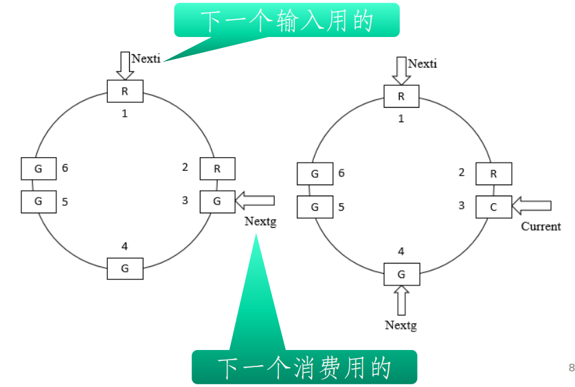

- **缓冲池**：
  - 大型系统中，多个共享缓冲区，按空/输入/输出队列组织。每个缓冲区可用于输入或输出，按需分配。
  - 维护三个队列：空缓冲区队列（emq）、输入缓冲区队列（inq）和输出缓冲区队列（outq）。
  - 如图：
  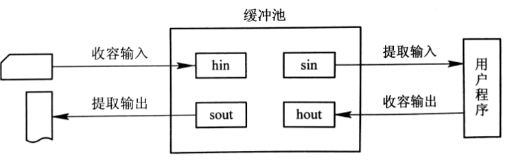
  
  - **收容输入**：emq取空缓冲hin→装数据→挂入inq
  - **提取输入**：inq取缓冲sin→提取数据→空缓冲区挂回emq
  - **收容输出**：emq取空缓冲hout→装数据→挂入outq
  - **提取输出**：outq取缓冲sout→提取数据→空缓冲区挂回emq

## 9 I/O性能优化路径

1. **减少CPU等待I/O**：缓冲、异步I/O。
2. **减少CPU参与I/O**：DMA、通道技术。

还有实例：UNIX与Windows NT设备管理，这里几乎不是考点了，老师都直接一笔带过，感兴趣自己看看ppt吧，跳过

