

# 磁盘管理总结笔记

## 1 磁盘的结构与特性

### 1.1. 硬盘发展历史
- **第一块硬盘**：1956年IBM 350 RAMAC，5MB容量，50片24英寸盘片，总重1吨。
- **温彻斯特硬盘**：IBM 3340，确立了密封结构、空气动力学悬浮、高平整度磁性材料三大特征。

### 1.2. 硬盘尺寸演进
- 14英寸 → 8英寸 → 5.25英寸 → 3.5英寸 → 2.5英寸 → 1.8英寸

### 1.3. 基本概念
- **扇区**：盘片上扇形区域，最小物理存储单位。
- **磁道**：同心圆轨迹。
- **柱面**：不同盘片相同半径的磁道集合。
- **磁头**：每个盘面一个，用于读写。
如图：

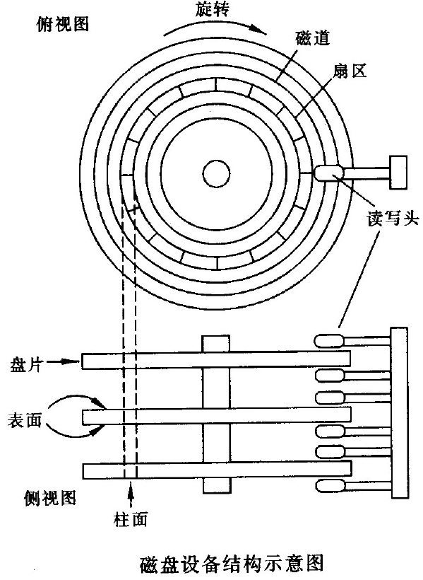

### 1.4. 扇区结构
- 实际扇区数 > 标定容量，包括：
  - 固件区（控制器使用）
  - 工作区（用户数据）
  - 保留区（备用扇区）
如图：
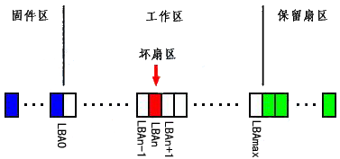

### 1.5. 缺陷表
- **P表**：永久缺陷列表，记录生产过程中的坏道，**直接跳过坏的扇区**。
- **G表**（未明确但常见）：增长缺陷列表，**把坏的扇区映射到后面的保留扇区**。

## 2 磁盘组织：从扇区到逻辑块

### 2.1. 磁盘的组织和地址类型
- **组织**：主引导扇区(MBR) → 分区表(DPT) → 分区引导扇区(DBR) → 逻辑块
如图:
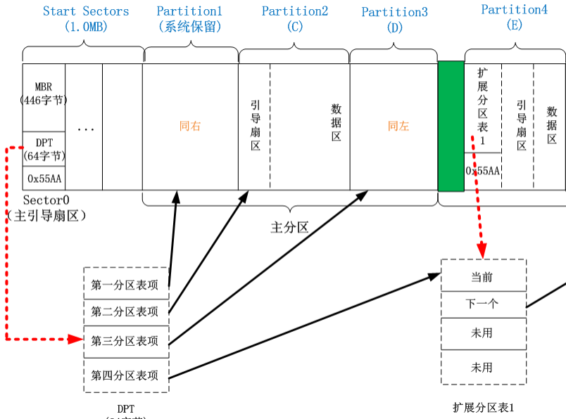
- **CHS地址**：柱面、磁头、扇区
- **LBA**：逻辑块地址，现代磁盘视为一维逻辑块数组

### 2.2. 主引导记录（MBR）
- 位于0柱面、0磁头、1扇区，512字节。
- 包含引导代码446字节和分区表（DPT,4*16字节）和幻数（2字节，0xAA55）。
- 不属于任何操作系统，具有公共引导特性。

### 2.3. 分区类型
- **主分区**：至少1个，最多4个（含扩展分区），**系统必
须装在主分区上面。**
- **扩展分区**：最多1个，可包含多个逻辑分区。
- **活动分区**：用于启动系统。

### 2.4. 分区表DPT表项结构（16字节）
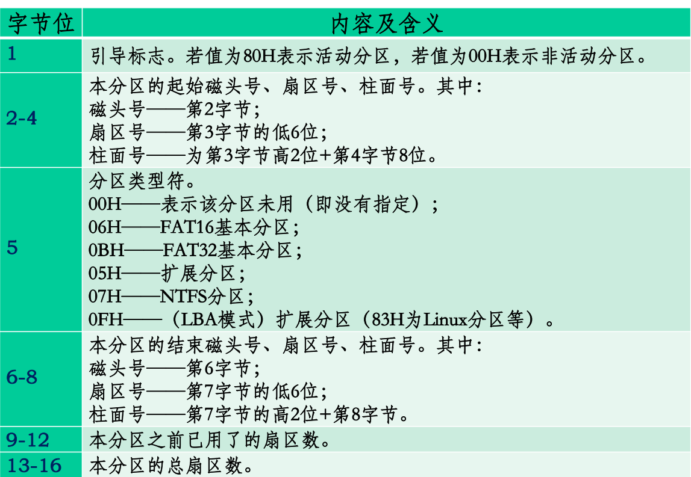

### 2.5. CHS与LBA寻址限制
- 最大CHS寻址：1024柱面 × 256磁头 × 63扇区 × 512字节 ≈ 8.46GB
- **INT 13扩展标准**：支持64位LBA，突破137GB限制。
- **ATA 133规范**：将28位提升至48位，支持更大硬盘。

> [!NOTE]  为什么扇区只有63个而非64个？
> 因为0号扇区不被使用（保留给MBR或引导扇区），因此编号从1开始。

### 2.6. 磁盘地址和块号地址
- 磁盘地址（CHS）：Cylinder，Head，Sector
- 块号：又称逻辑块号（ LBA ），Logic Block Address，现代磁盘驱动器可以看做一个一维的逻辑块的数组

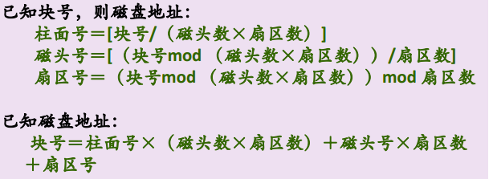

## 3. I/O请求调度算法

### 3.1. 访问时间组成
- **寻道时间**：磁头移动到目标磁道时间
  - Ts＝ m × n + s 
  - 其中m是一个常数，把磁臂（磁头）从当前位置移动到指定磁道上所经历的时间
  - 该时间是启动磁盘的时间s与磁头移动n条磁道所花费的时间之和。
- **旋转延迟**：硬盘典型的旋转速度为3600 r/min，每转需时16.7 ms，平均Tr为8.3 ms（转半圈）。
- **传输时间**：读写数据所需时间
  - Tt＝b/(rN)
  - 与每次所读/写的字节数b，旋转速度r（转几圈），以及磁道上的字节数N（一圈多少字节）有关

### 3.2. 调度算法对比

| 算法 | 思想 | 优点 | 缺点 |
|------|------|------|------|
| FCFS | 按请求到达顺序服务 | 简单公平 | 平均寻道距离大 |
| SSTF | 优先最近磁道 | 平均服务时间短 | 可能产生饥饿 |
| SCAN（电梯） | 单向扫描，到端折返 | 避免饥饿 | 两端磁道访问频率低 |
| C-SCAN | 单向扫描，快速返回 | 公平对待两端 | 行程较长 |
| LOOK / C-LOOK | 只到最远请求点返回 | 更高效 | 实现稍复杂 |
| N-Step-SCAN | 请求队列分成若干个长度为N的子队列 | 避免磁头粘黏 | 实现复杂 |
| FSCANS | 当前请求与新增请求分离 | 提高响应速度 | 实现复杂 |

<table>
  <tr>
    <td>
      <figure>
        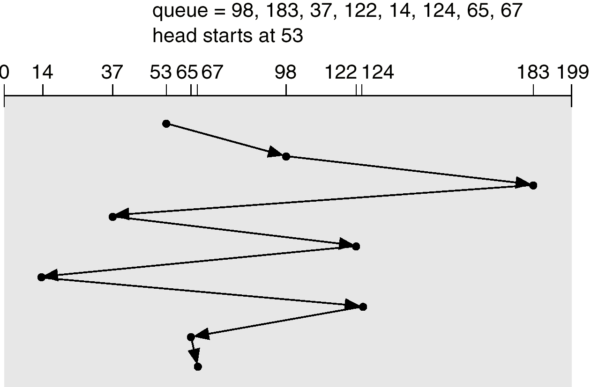
        <b>FCFS 示意图</b>
      </figure>
    </td>
    <td>
      <figure>
        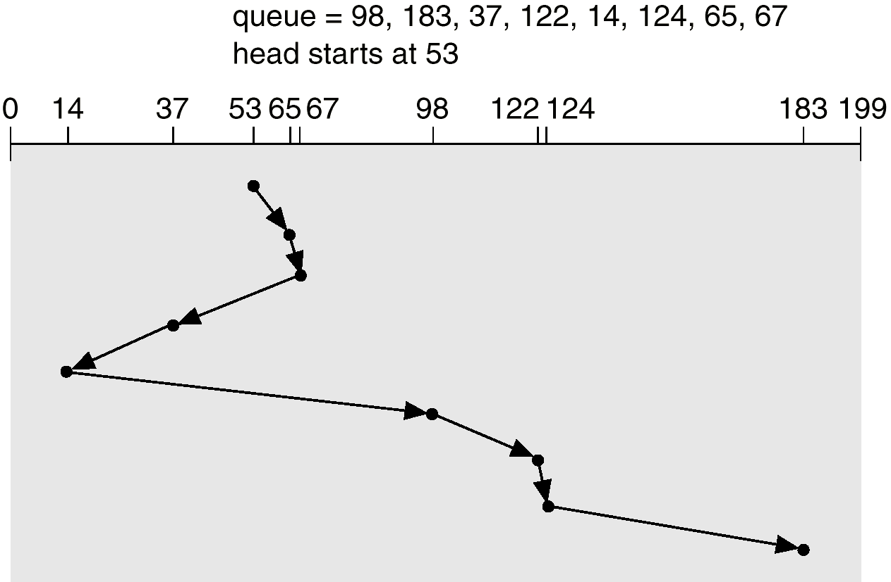
        <b>SSTF 示意图</b>
      </figure>
    </td>
  </tr>
  <tr>
    <td>
      <figure>
        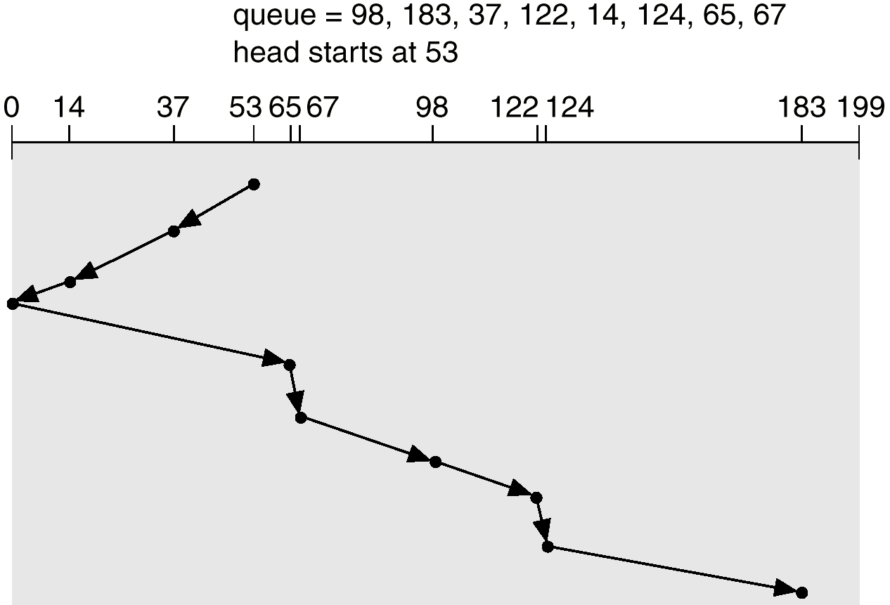
        <b>SCAN 示意图</b>
      </figure>
    </td>
    <td>
      <figure>
        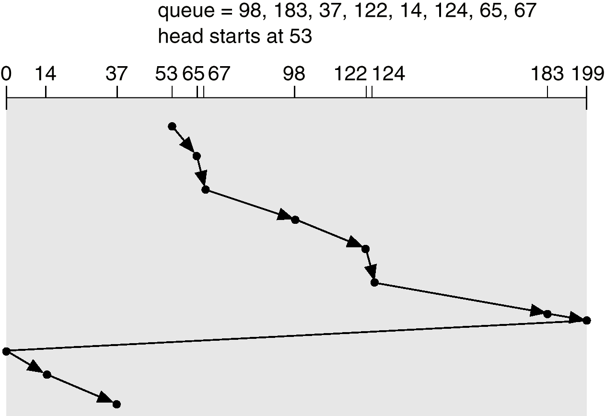
        <b>C-SCAN 示意图</b>
      </figure>
    </td>
  </tr>
</table>

## 4. 磁盘空闲空间管理

- **位图**：每位表示一个块是否空闲，分配的物理块为0，否则为1。
- **空闲表**：将所有空闲块记录在一个表中，记录空闲块起始块号和数量。
- **空闲链表**：链表连接所有空闲块。
- **成组链接法**：分组管理空闲块，在通过指针把组与组之间链接起来，节省空间，支持后进先出。
  图示：
  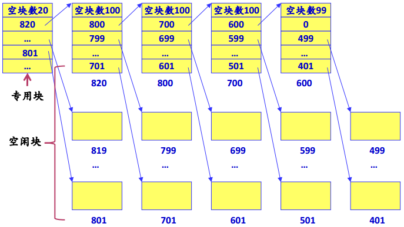

## 5. Flash Disk

### 5.1. 技术类型
- **NOR Flash**：Intel 1988，随机读取和连续读取都快，成本高（3-4倍）。
- **NAND Flash**：东芝 1989，读取慢，成本低。
- 在连续大数据传输速度上，二者差异较小。

### 5.2. 性能特点
- 无机械部件，耐震动，适应极端温度。
- 读写周期短（15-30μs），远快于硬盘（5ms）。
- 擦除寿命有限：写 > 读，擦除 > 写。

### 5.3. 主要问题与解决
- **擦除寿命下降**：近年来NAND寿命急剧下降。
- **解决方案**：磨损均衡化（Wear Leveling）

### 5.4. 调度算法适用性
- 传统磁盘调度算法（如SCAN）不适用于Flash Disk，因其无寻道延迟。

## 6. RAID（廉价冗余磁盘阵列）

### 6.1. 基本思想
- 将多个廉价硬盘组合成阵列，提升性能、容量、可靠性。

### 6.2. 核心技术
- **数据条带**：数据分块并行读写，提升速度。
- **镜像**：数据完全复制，提升可靠性。
- **数据校验**：使用奇偶校验或海明码恢复数据。

### 6.3. RAID级别对比

| 级别 | 特点 | 最少磁盘数 | 冗余 | 性能 | 应用 |
|------|------|-------------|------|------|------|
| RAID 0 | 条带化 | 2 | 无 | 读写快 | 非关键数据 |
| RAID 1 | 镜像 | 2 | 有 | 读快，写慢 | 高可靠性 |
| RAID 2 | 海明码校验 | 7+ | 有 | 未商业化 | — |
| RAID 3 | 位级条带+奇偶校验盘 | 3+ | 有 | 连续传输快 | 视频编辑 |
| RAID 4 | 块级条带+奇偶校验盘 | 3+ | 有 | 写瓶颈 | 少用 |
| RAID 5 | 块级条带+分布式校验 | 3+ | 有 | 读写均衡 | 通用 |
| RAID 6 | 双分布式校验 | 4+ | 强 | 写性能差 | 高安全 |
| RAID 10 | 镜像+条带 | 4 | 强 | 高 | 数据库 |

#### 6.3.1 RAID 0（条带化）
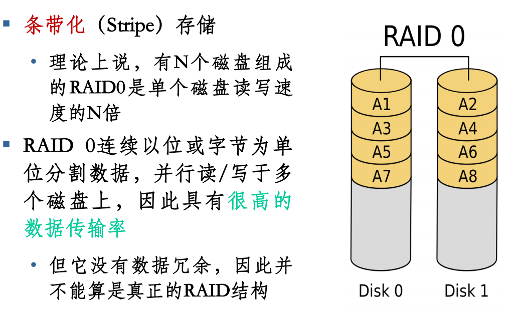

类比：两人合抄一本书，一人抄一半，效率翻倍，但如果其中一人丢了，全部丢了。

#### 6.3.2 RAID 1（镜像）
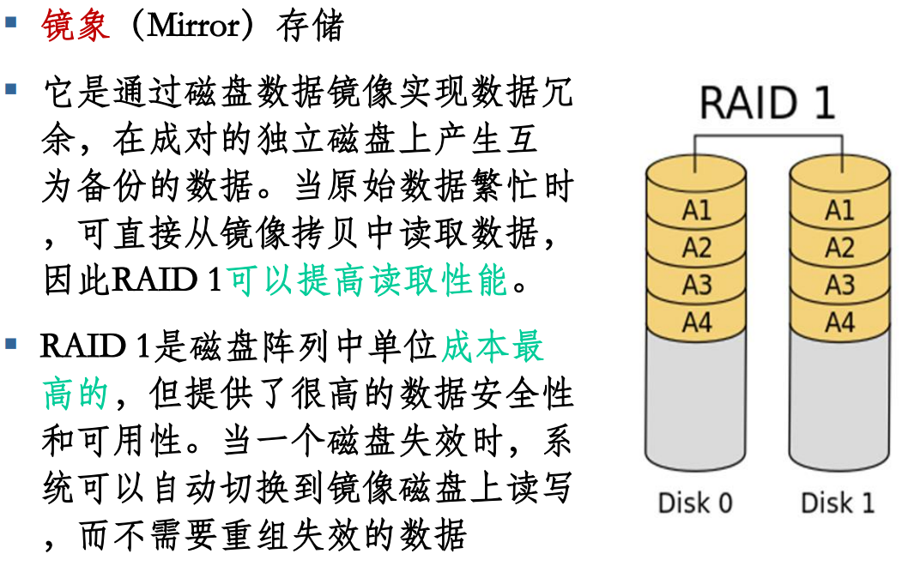

类比：一本书两人都抄一遍，效率不变，占用空间翻倍，但如果其中一人丢了，另一个还有。

#### 6.3.3 RAID 2（分布式校验）
- 将数据条块化地分布于不同的硬盘上，条块单位为位或字节，使用海明码来提供错误检查及恢复
- 需要多个磁盘来存放海明校验码信息，冗余磁盘数量与数据磁盘数量的对数成正比

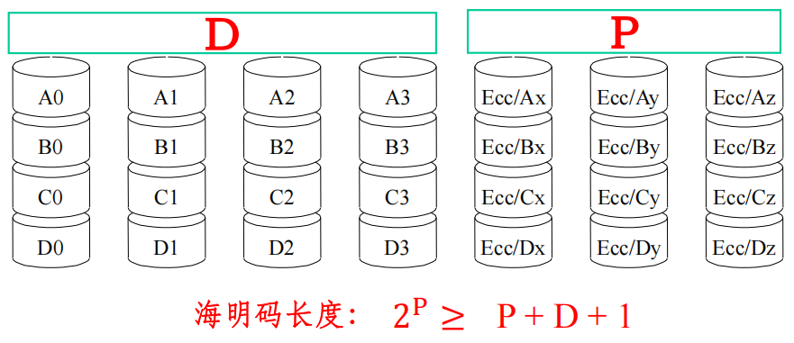
类比：一群抄写员 + 几个密码专家，每个抄写员只抄一个个单独的字母，密码专家根据抄写员的内容计算校验码，提供错误检测和纠正能力。人多且慢，但是若任何一个抄写员的内容丢失了，密码专家可以恢复。

#### 6.3.4 RAID 3（位级条带+奇偶校验盘）
- 将磁盘分组，读写要访问组中所有盘，每组中有一个盘作为校验盘，数据条带存储单位为字节。
- 奇偶校验
  - 先将分布在各个数据盘上的一组数据加起来，将和存放在冗余盘上。一旦某一个盘出错，只要将冗余盘上的和减去所有正确盘上的数据，得到的差就是出错的盘上的数据
- 连续数据传输效率高，但随机访问性能差，且写性能受校验盘瓶颈影响

类比：一群抄写员 + 一个校验员。抄写员每次抄1个字节，校验员按照这个字节实时计算校验码

#### 6.3.5 RAID 4（块级条带+奇偶校验盘）
- 把RAID 3的条块单位改为块
类比：一群抄写员 + 一个校验员。抄写员每次抄一个块（一个较大的章节），校验员按照这个块实时计算校验码

#### 6.3.6 RAID 5（块级条带+分布式校验）
- 将RAID 4的校验盘分布到所有盘上，即在所有磁盘上交叉地存取数据及奇偶校验信息
  如图：
  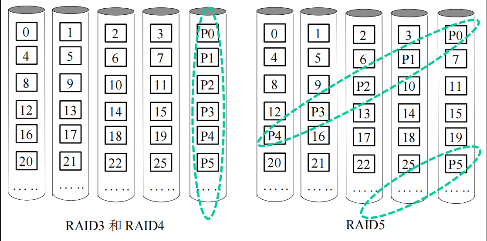
- 特点：
  - 更适合于小数据块和随机读写的数据
  - 即每一次写操作将产生四个实际的读/写操作（虽然RAID 4也是如此，但RAID 5的分布式校验可以更好地平衡负载）

类比：一群抄写员。每个抄写员还是每次抄一个块（一个较大的章节），但校验员大家轮班，不会有人要把校验的工作独自全部做完。

> [!NOTE] RAID 3/4/5 有什么共性?
> 本质都是奇偶校验，所以当有两块盘坏掉的时候，无论是RAID 3/4/5，整个RAID的数据都失效

#### 6.3.7 RAID 6（双分布式校验）
- 在RAID 5的基础上增加了第二个独立的校验信息块（两个校验块的算法不同），允许同时发生两块盘的故障而不丢失数据
  如图：
  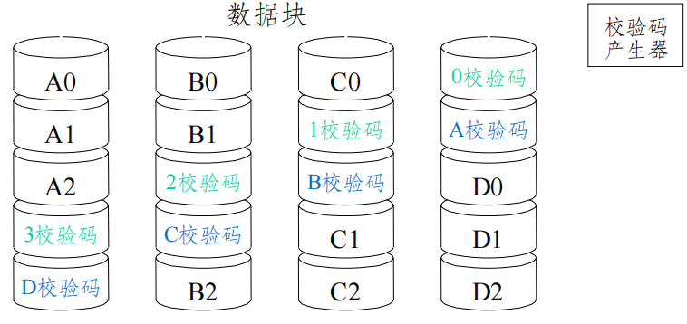
- 可容忍双盘出错，但需要分配给奇偶校验信息更大的磁盘空间
- 一次写操作将产生六个实际的读/写操作，性能较差

类比：一群抄写员。每个抄写员还是每次抄一个块（一个较大的章节），但每次搞两个人担任校验工作

### 6.4. 优缺点总结
- **条带化**：并行存取，性能好，负载均衡，但可靠性差。
- **镜像**：高可靠，但存储开销大。
- **校验**：可恢复，但有写损失。

## 7. 提升I/O性能的技术

### 7.1. 方法
- 选择高性能磁盘
- 并行化I/O
- 使用高效调度算法
- 设置磁盘高速缓存

### 7.2. 磁盘缓存————Cache
- 形式：独立缓存、虚拟内存缓存
- 数据交付：直接交付（copy）、指针交付（内存管理复杂）
- 置换算法：LRU
- 周期性写回：周期性地将disk cache中被修改过的内容写回磁盘

### 7.3. 优化数据布局
- 优化物理块的分布————连续摆放物理块
- 优化索引节点分布————减少与数据块的距离/与数据块结合

### 7.4. 其他技术
- **提前读**：顺序访问时预读下一块到缓存，提升效率（可靠性风险）
- **延迟写**：将本应立即写回磁盘的数据挂到空闲缓冲区的队列末尾。直到该数据块移到链头时才将其写回磁盘，再作为空闲区分配出去，提升效率（可靠性风险）
- **虚拟盘**：（用内存空间RAM去模拟磁盘）Virtual disk的存放的内容由用户完全控制，Disk cache中的内容完全是由操作系统控制

## 8. 磁盘管理实例（Windows 2000/Server 2003）

不考，所以摆了

