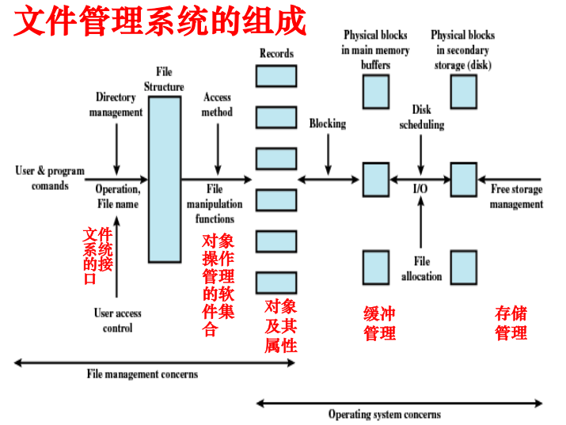
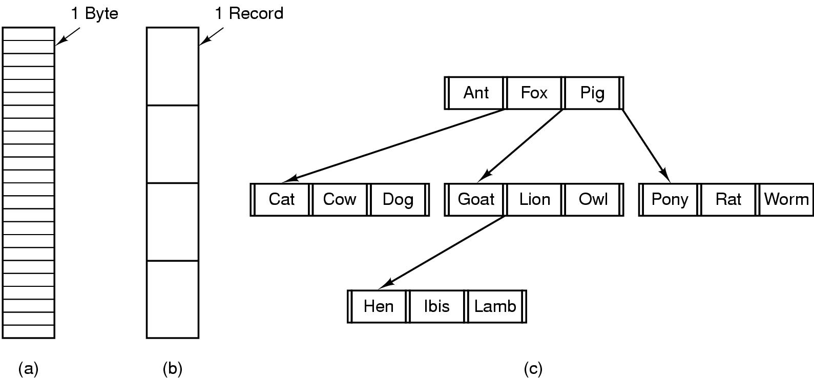
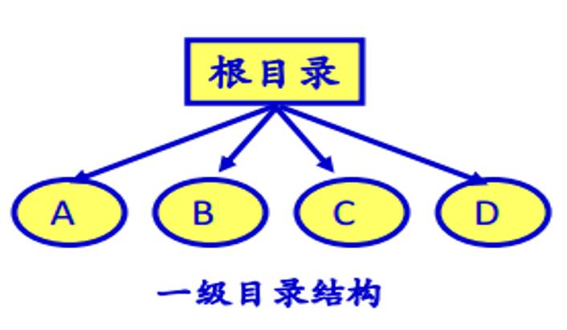
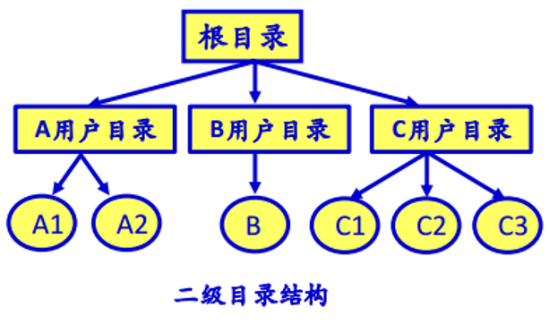
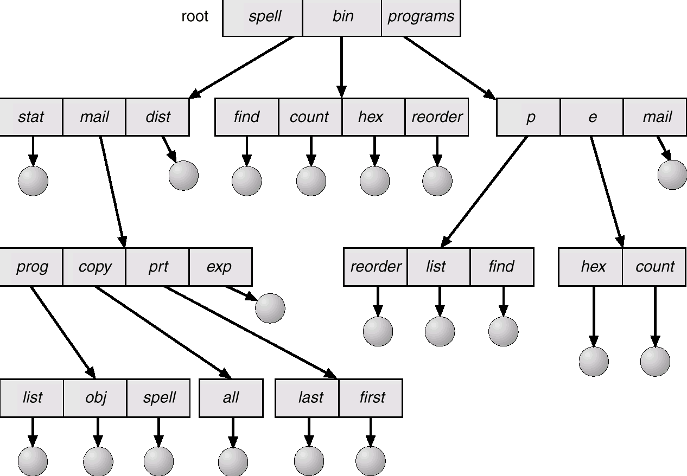
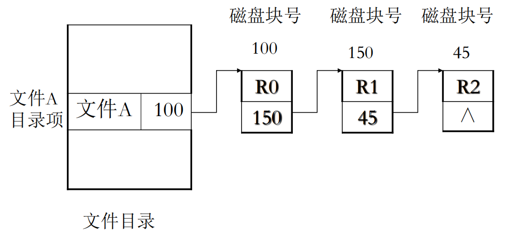
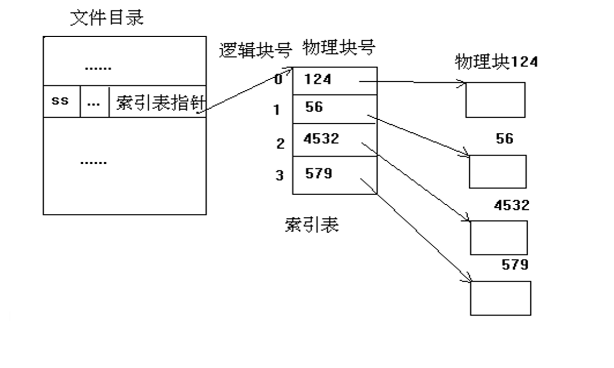
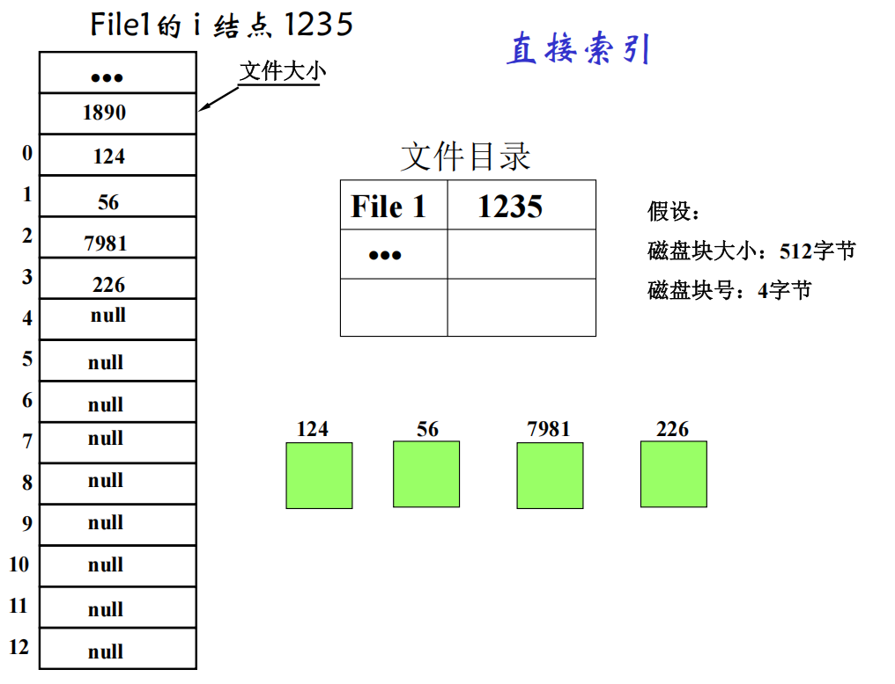
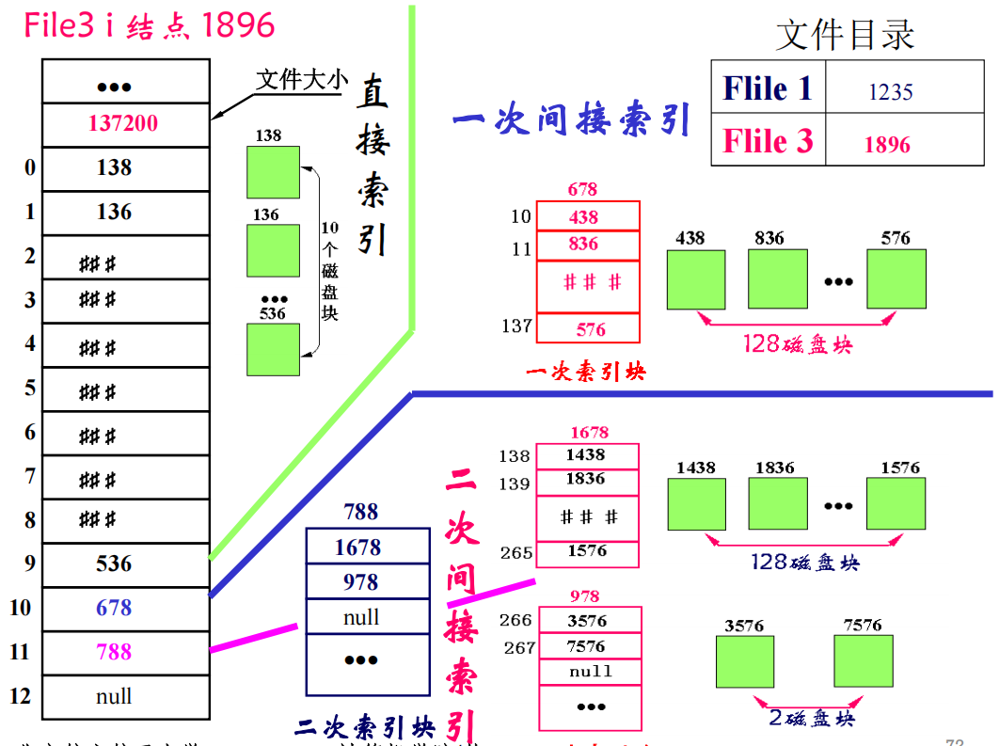
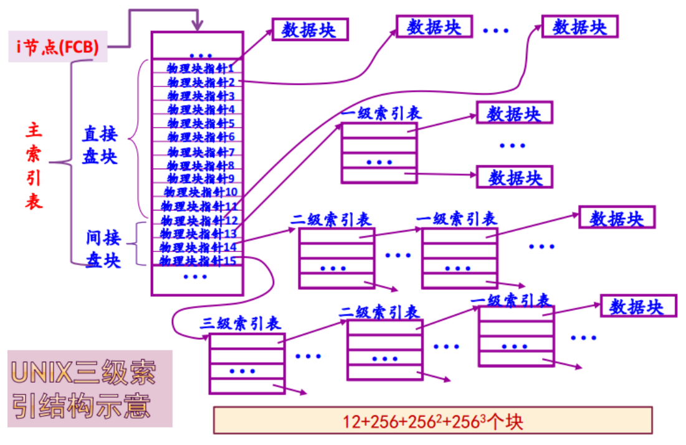

# 文件系统-文件的实现-总结笔记

## 1 文件系统基本概念

数据持久化的三个基本要求：**长期、大量的存储数据且可以共享**。文件系统是满足这些要求的关键组件。

### 1.1 文件系统的定义与目的
- **定义**：操作系统中与文件管理有关的那部分软件、被管理的文件以及实施管理所需数据结构的总体。
- **目的**：为系统管理者和用户提供对文件的透明存取（按名存取），无需了解物理机制和查找方法。

### 1.2 文件系统的任务
- 方便的文件访问（符号名称标识）
- 并发文件访问和控制
- 统一的用户接口
- 多种文件访问权限
- 执行效率和差错恢复

### 1.3 文件系统的功能
- 统一管理磁盘空间（实施磁盘空间的分配与回收）
- 实现按名存取（名字空间→磁盘空间）
- 向用户提供方便易用的接口及统计信息
- 提供与I/O系统的统一接口
- 实现文件共享、保护与保密
- 提高文件系统性能

## 2 文件系统的模型

### 2.1 三个层次
1. **文件系统接口**（通过向用户提供两种类型的接口）
   - 命令行接口（用户和文件系统交互）
   - 程序接口（用户程序和文件系统的交互）
2. **对象操作管理的软件集合**（核心功能）
   - 对文件存储空间的管理、目录的管理、逻辑地址到物理地址转换的机制、读写管理、共享与保护
3. **文件系统管理的对象及其属性**
   - 文件
   - 目录
   - 磁盘存储空间
如图：

### 2.2 文件基本操作
- Create, Delete, Open, Close, Read, Write, Append, Seek, Get/Set attributes, Rename

### 2.3 文件系统必须解决的问题
- 统一I/O接口、命名冲突与共享、合适的存取方法、磁盘空间分配、执行效率

### 2.4 理想文件系统的特性
- 对用户透明的机制、有效的实现操作命令、设备独立性、灵活的文件结构和存取、高效空间分配、信息安全性、方便共享

## 3 文件的概念

### 3.1 文件的本质
- 单独的连续的逻辑存储空间（字节序列，与进程的地址空间无关）
- 文件名表示的一组带标识的字节序列
- 抽象存储空间和设备（“一切皆文件”：所有I/O设备均可抽象为文件）

### 3.2 文件管理视角
- **用户视角：使用逻辑文件**、关心命名、保护、访问（创建/打开/关闭/读/写等）
- **操作系统视角：组织管理物理文件**、关心存储空间管理、文件系统的布局、文件的存储位置、磁盘运作等

### 3.3 文件命名与类型
用户通过文件名来访问文件
- 文件名格式：文件名.扩展名（长度有限制，区分大小写依系统而定，Linux区分大小写但Windows不区分）
- **文件类型**：
  - 按性质和用途：系统文件、用户文件、库文件
  - 按数据形式：源文件、目标文件、可执行文件
  - 按对文件实施的保护级别分：只读文件、读写文件、执行文件、不保护文件
  - 按逻辑结构分：有结构文件、无结构文件
  - 按文件的物理结构分：顺序文件、链接文件、索引文件
- **UNIX文件类型**：普通文件、目录文件、特殊文件（字符/块设备）、管道文件、套接字
- **常见文件类型**：可执行文件、目标文件、源代码、批处理、文本、字处理、库、打印/视图、归档、多媒体等

### 3.4 文件的逻辑结构
- 字节序列（以字节为单位的流式结构）
- 记录序列（记录式文件）
- 树形结构
图示：

#### 3.5 文件存取方式与存储介质
- 存取方式：
  - 顺序存取（访问）
  - 随机存取：提供读写位置（当前位置）
- 存储介质：
  - 磁盘（含SSD）、磁带、光盘等
  - 物理块（块/簇）：数据存储、传输和分配的单位

## 4 目录的概念

### 4.1 提出目录的原因
- 组织分类大量文件
- 根据文件名快速定位文件
- 解决重名、别名、分组功能

### 4.2 目录管理
- 目录是由文件说明索引组成的特殊文件，内容为文件访问和控制信息（不包括文件内容）

### 4.3 目录内容（文件属性）
- **基本信息**：文件名、别名的数目、文件类型、文件组织
- **地址信息**：存放设备/卷和存储块位置、文件长度
- **访问控制信息**：文件所有者、访问权限（读/写/执行等）
- **使用信息**：创建时间、最后一次读/写访问时间和用户

### 4.4 目录操作
- Create, Delete, Opendir, Closedir, Readdir, Rename, Link, Unlink

### 4.5 目录分类
- **单级文件目录**：结构简单，但有命名冲突、检索慢（尤其文件多时）、共享不便
  如图：
  

- **二级文件目录**：根目录下每个用户一个目录，适用于多用户
  如图：
  

- **多级文件目录（层次目录）**：几乎所有现代文件系统采用，支持绝对路径、相对路径、当前目录、上一级目录（..）
  如图：
  
  特点：
  - 层次清楚，便于管理和保护
  - 可解决文件重名问题
  - 查找速度快（每次只查找目录的一个子集）
  - 目录级别太多时，会增加路径检索时间

## 5 文件系统实现方法

### 5.1 文件的实现

#### 5.1.1 要解决的两个问题
- 如何描述一个文件（文件控制块FCB）
- 如何存放文件（分配磁盘块，记录逻辑块与物理块的映射）

#### 5.1.2 文件控制块（FCB）
- **为管理文件而设置的数据结构，保存管理文件所需的所有信息（元数据）**
  - 文件名、文件号、文件大小、文件地址、时间戳、保护、口令、创建者、拥有者、共享计数、各种标志等
- **基本信息**：文件名（字符串）、物理位置、逻辑结构、物理结构（如顺序，索引等）
- **访问控制信息**：所有者（属主）、访问权限
- **使用信息**：创建/修改/访问时间等

### 5.2 文件物理结构

#### 5.2.1 连续（顺序）结构
- 优点：简单、支持顺序和随机存取、速度快、无额外空间开销
- 缺点：文件长度固定、不易动态增长和修改
- 适用：变化不大的顺序访问文件

#### 5.2.2 串联（链接）结构

如图：

- 物理块通过链接字（指针）链接，链首指针在FCB中
- 优点：空间利用率高（较好的利用了辅存空间）、动态扩充容易、顺序存取效率高
- 缺点：随机存取效率低（访问最后内容=访问整个文件）、可靠性问题（指针出错）、链接指针占用空间

#### 5.2.3 索引结构
- 为每个文件建立索引表（**逻辑块号→物理块号**）
- FCB中只记录索引表地址
- **索引文件**由**索引区和数据区**组成，访问需两步：查索引表（由逻辑块号查得物理块号）→查数据区（由此物理块号从磁盘上获得所要求的数据）
  如图：
  

- 优点：兼具顺序和随机存取、支持动态增长、充分利用外存空间
- 缺点：索引表带来系统开销（空间和时间）

#### 5.2.4 索引表的组织方式
- 链接模式：一个盘块一个索引表，多个索引表链接
- 多级索引：一级索引表存放二级索引表的地址
- 综合模式：直接索引与间接索引结合（如UNIX的i结点）

示例
**直接索引**

**直接索引+间接索引**

**总结**

