# 文件系统学习笔记：目录的实现与相关机制

## 1. 目录的主要功能与实现问题

### 1.1. 主要功能
- 根据用户给出的ASCII文件名（路径名），快速定位到对应的文件控制块（FCB）

### 1.2. 需要解决的三个问题
- 目录项的内容
- 长文件名处理
- 目录的搜索方法

## 2. 目录项的两类实现方法

| 方法 | 原理 | 典型系统 |
|------|------|----------|
| 直接法 | 目录项 = 文件名 + FCB（属性、位置） | MS-DOS / Windows |
| 间接法 | 目录项 = 文件名 + FCB地址（索引号） | Unix（inode） |

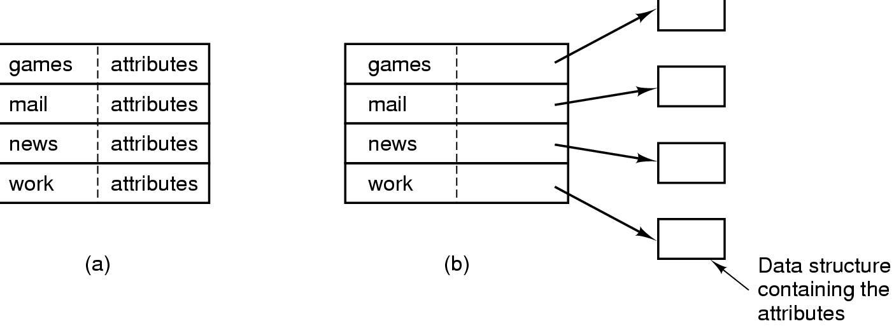

## 3. 长文件名的三种实现方法

1. **固定长度（如255字符）**  
   - 缺点：浪费空间，很少文件用长名
2. **可变长度目录项**  
   - 结构：目录项长度 + 固定属性信息 + 可变文件名  
   - 缺点：删除后空间回收困难
3. **固定长度目录项 + 文件名统一放在目录文件末尾**  
   - 兼顾固定长度管理与长文件名支持

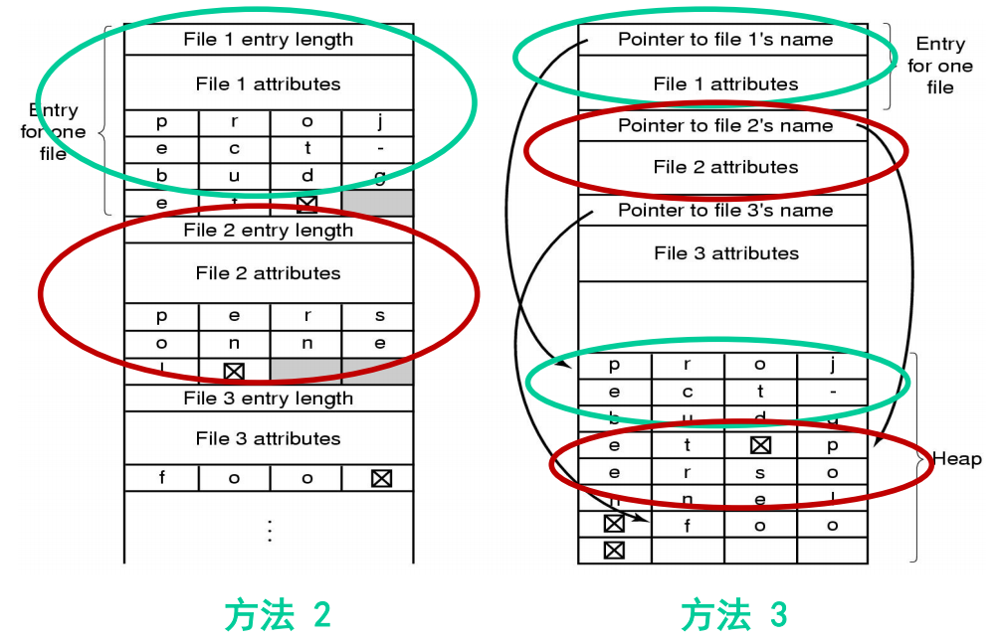

## 4. 目录查询技术

### 4.1. 顺序查寻法
- 依次扫描目录表目，比较文件名  
- 适用：表目不多时

### 4.2. Hash方法（散列法）
- 利用Hash函数将文件名映射为表目索引  
- 高效，常用于符号表查询

## 5. 文件共享与链接

### 5.1. 有向无环图（DAG）目录组织
- 实现文件共享，同一物理文件可被多个用户以不同或相同文件名访问

### 5.2. 硬链接（Hard Link）
- 多个目录项指向同一个inode（索引节点）
- 删除一个链接不影响其他链接，只有所有链接删除后才释放文件
- 把文件名理解为指针，指向文件内容，那么你删除一个指针，其他指针仍然存在，文件内容不受影响

### 5.3. 软链接/符号链接（Symbolic Link）
- 一个特殊文件，存放指向另一个文件的路径  
- 可以跨文件系统，原文件删除后链接失效（毕竟它只是一个路径字符串）

## 6. 内存中的文件系统管理

### 6.1. 内存管理结构
- 系统打开文件表
- 进程打开文件表
- 内存inode表（空闲链表 + 哈希表）

### 6.2. 目录进入与退出
- 进入目录：增加内存inode引用计数，必要时读入磁盘inode
- 退出目录：关闭文件或修改当前目录时减少引用

### 6.3. 目录路径查找示例
- 路径 `/usr/include/sys` → 分解为 `usr`, `include`, `sys`  
- 逐级进入目录，查找目录项，建立内存inode

## 7. 文件的保护

### 7.1. 三种保护方法
1. **建立副本**：多介质保存，简单但开销大
2. **定时转储**：定期备份到其他介质，当文件发生故障，就用备份的文件来复原，如Unix的dump
3. **存取权限控制**：防止未授权访问、冒充、误用
  - 审定用户权限
  - 比较权限与操作要求
  - 检查与文件保密性是否冲突
  - 存取控制实现方案
    - 存取控制矩阵、存取控制表、用户权限表、口令
    - 典型权限：读(R)、写(W)、执行(X)，分为属主、同组、其他三类

### 7.2. 文件一致性检查
- 工具：Windows的scandisk，Unix的fsck
- 两类一致性：
  - **磁盘块一致性**：每个磁盘块记录在文件中出现次数 + 在空闲块中出现次数
  如图：
  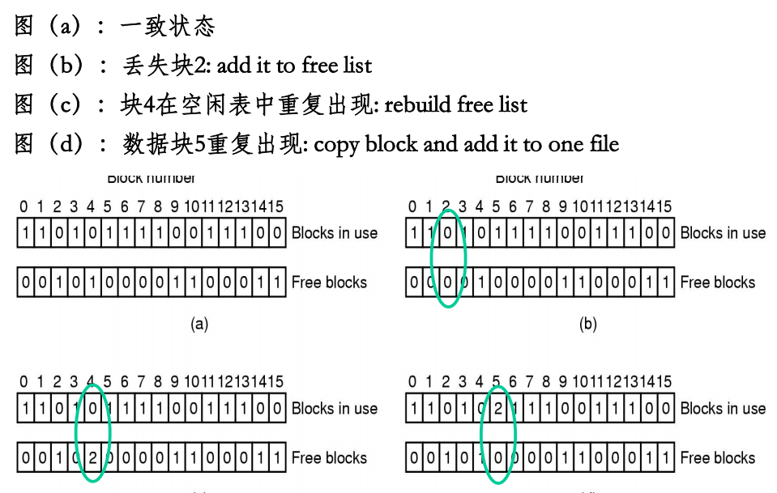
  - **文件一致性**：每个文件记录inode引用次数 + 目录引用次数

### 7.3. 著名的安全漏洞示例
- Windows 2000中文输入法帮助绕过登录
- Unix的lpr命令删除口令文件
- Finger程序缓冲区溢出攻击

### 7.4. 安全性设计原则
- 系统设计公开
- 缺省属性不可访问
- 检查当前权限
- 赋予进程最小权限
- 保护机制简单一致，嵌入底层
- 方案可接受

## 8. 文件的并发访问

### 8.1. 目的
- 提供多进程并发访问同一文件的机制
- 如果文件的目录内容不在内存，则将其从外存读入，否则，仍使用已在内存的目录内容
- 多个进程访问同一个文件都使用内存中同一个目录内容，保证了文件系统的一致性。

### 8.2. 文件锁定（file lock）
- Solaris 8的`lockf`函数，四种模式：
  - `F_UNLOCK`：解锁
  - `F_LOCK`：阻塞锁定
  - `F_TLOCK`：非阻塞锁定
  - `F_TEST`：测试是否锁定

## 9. 文件系统性能

### 9.1. 性能瓶颈
- 磁盘服务速度慢，应尽可能减少磁盘访问
- 提高性能的方法
  - 目录项（FCB）分解、当前目录、磁盘碎片整理
  - 块高速缓存、磁盘调度、提前读取
  - 合理分配磁盘空间、信息优化分布
  - RAID技术

### 9.2. 块高速缓存（Block Cache）
- 在内存中缓存磁盘块副本
- 读请求先检查缓存，命中则直接读，否则先读入缓存，再拷贝到所需的地方
- 利用访问局部性原理

### 9.3. 块高速缓存的管理
- 双向链表 + 散列（按块号）组织
  如图：
  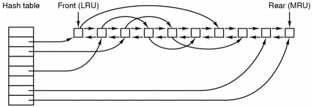

- 双向链表：用于实现置换算法（如近似 LRU）：将可能再次使用的块放链尾，最久未使用的块靠近头部，淘汰使用概率低的块
- 散列表：根据**设备号+块号**计算散列值，然后在散列表中快速定位缓存块，解决链表查找效率低的问题
- 查找机制：
  1. 计算散列值，定位散列表桶
  2. 遍历桶内链表，比较设备号和块号
  3. 找到匹配的缓存块，将该缓存块从双向链表的当前位置摘下，移到链表尾部（表示最近使用），然后直接读取缓存中的数据。
  4. 如果未找到匹配的缓存块，则需要从磁盘读取数据到一个新的缓存块中，并将该新块插入到散列表中和双向链表尾部。
- 置换算法：当需要淘汰一个缓存块时，选择双向链表头部的块（最久未使用的块）进行淘汰。
- 写入策略：考虑文件系统一致性

### 9.4. 日志结构文件系统（LFS）

#### 9.4.1. 背景
- 读操作可由缓存满足，写操作成为瓶颈
- 传统文件系统写数据涉及多次实际的写操作，需多次寻道

#### 9.4.2. 核心思想
- 将磁盘视为日志（log），所有写操作追加到日志头（顺序写）
- 数据块和元数据先放缓存，凑成段（segment，0.5MB或1MB）后一次性写入磁盘

#### 9.4.3. 数据结构
- inode（包含物理块指针，位置不固定，会随写入而移动）
- inode map（inode在磁盘上的位置表，将文件编号（inode number）映射到该 inode 当前所在的磁盘位置（segment 内偏移））
- 段摘要（每个数据块的信息（如所属 inode 编号、块号））
- 段使用情况表（有效数据量）
- CR检查点（记录inode map位置、段使用情况表位置、当前日志头位置等，一切从CR开始读取）
如图：
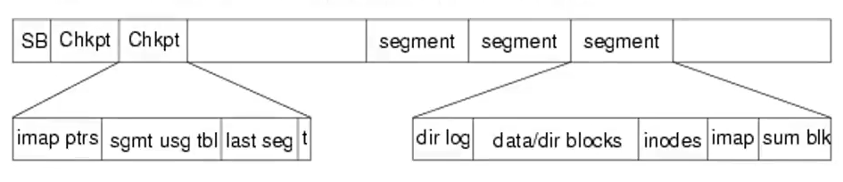

#### 9.4.4. 读写过程
- 写操作：向内存segment缓冲区添加数据块，写满后刷入磁盘，同时把inode 中的物理块指针更新为新位置，并更新inode map（即让指针指向新的副本，旧副本仍在磁盘上但无人使用）
- 读操作：与Unix类似，但通过内存中的inode map定位

#### 9.4.5. 碎片与清理（Cleaning）
- 问题：不断写操作导致segment碎片化（空间用完了，但有效数据并不多）
- 清理进程：将未填满的segment紧缩，腾出连续空闲空间
- 清理策略：
  - 冷segment利用率75%时清理，热segment利用率15%时清理
  - 通过 Inode Map 或直接读取当前 inode，看看该块的 (inode号, 块内偏移) 是否仍然指向这个磁盘位置。如果指向，则是有效；否则是垃圾。
  - 把有效数据块复制到新的segment，更新inode map，释放旧segment
- **具体例子**：假设磁盘有两个 Segment：S0 和 S1。
  - 初始：你创建文件 A，写入块 a1, a2。它们落在 S0。
  - 你修改 A 的第 1 块为 a1'。LFS 将 a1' 写入 S1（当前活跃段），更新 inode A 指向 a1' 和 a2（a2 仍在 S0）。
  - 现在 S0 中包含：a2（有效），a1（垃圾）。清理程序发现 S0 有效比例 50%，决定清理它。
    - 读取 S0，识别出 a2 是有效数据，将 a2 复制到当前写缓冲区（例如 S2 中），并更新 inode A 的第二个块指针，指向 S2 中的新 a2 位置。
    - 现在 S0 中全是垃圾（a1 和 a2 的旧副本），标记 S0 为空闲。
  - 以后写新文件时，可以使用 S0 这个完整的空 Segment。

#### 9.4.6. 检查点与恢复
- 快速恢复：无需全盘fsck，仅恢复最后一个检查点之后的数据，只需数秒

#### 9.4.7. 优缺点
- 优点：大幅提高写、创建、删除文件性能
- 缺点：清理进程增加CPU开销；读性能与传统系统相当

## 10. 文件系统实例分析

### 10.1. FAT文件系统

#### 10.1.1. 特点
- 多级目录，无文件别名，无用户访问权限控制
- 类型：FAT12（≤32MB）、FAT16（≤2GB）、FAT32（≤2TB）

#### 10.1.2. 结构
- 分区结构：引导扇区(DBR) | FAT1 | FAT2 | 根目录 | 其他目录和数据
- 簇（cluster）：由若干扇区组成，大小可配置（1~64扇区）
- FAT表：2字节
- 目录项：32字节，包含文件名、属性、时间戳、起始簇号、文件大小等信息

#### 10.1.3. 引导扇区
- 主引导记录（DBR）：第一个扇区，包含分区引导代码和文件系统参数
  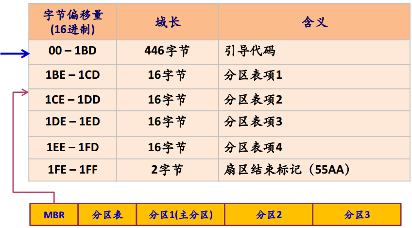
- 分区引导记录（PBR）：每个分区的第一个扇区，包含分区引导代码和文件系统参数
  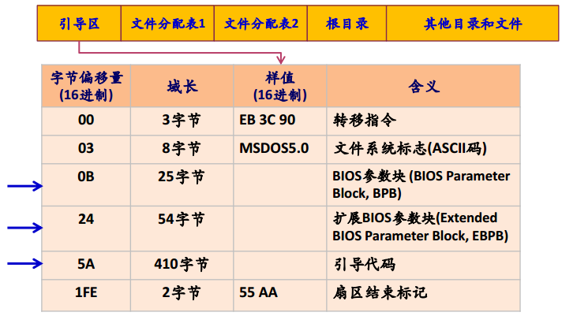

#### 10.1.4. 目录项（32字节）
- FAT：可以把文件分配表看成是一个整数数组，每个整数代表磁盘分区的一个簇号。
- 状态：未使用、坏簇、系统保留、被文件占用（下一簇簇号）、最后一簇（0xFFFF）

| 偏移 | 长度 | 含义 |
|------|------|------|
| 00h | 8 | 文件名 |
| 08h | 3 | 扩展名 |
| 0Bh | 1 | 属性字节（只读、隐藏、系统、卷标、目录、归档） |
| 16h | 2 | 最后修改时间 |
| 18h | 2 | 最后修改日期 |
| 1Ah | 2 | 起始簇号 |
| 1Ch | 4 | 文件大小 |

### 10.2. UFS（Unix文件系统）

#### 10.2.1. 特点
- 多级目录，支持文件别名（inode方式和符号链接）
- 用户访问权限控制（R/W/X）
- 文件类型：常规文件、目录文件、特殊设备文件、FIFO

#### 10.2.2. 卷结构
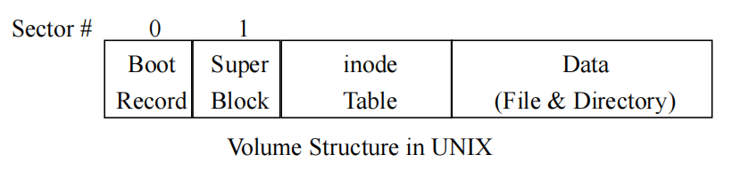

#### 10.2.3. 进程与系统打开文件表
如图：
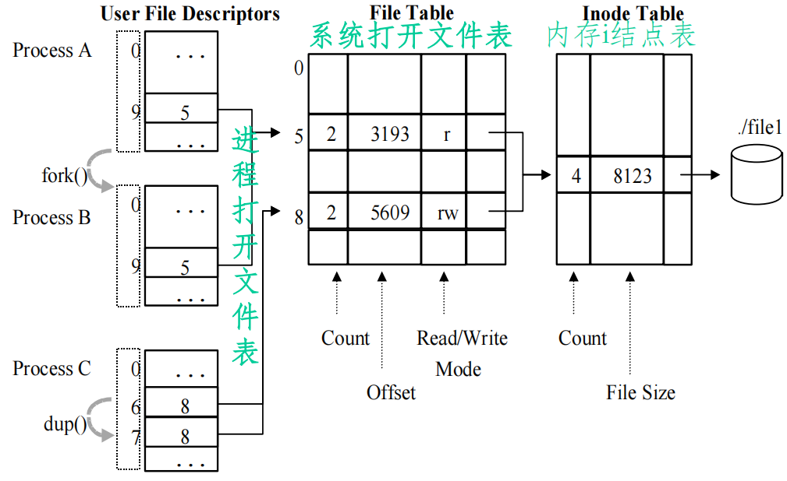

- 进程打开文件表
- 系统打开文件表
- 内存inode结点：空闲链表 + 哈希表（解决冲突）

#### 10.2.4. 目录路径查找
- 分解路径为目录名，逐级进入目录查找
- 示例：`/usr/include/sys/types.h` → 依次进入 `/usr`, `/usr/include`, `/usr/include/sys`

### 10.3. EXT2文件系统

#### 10.3.1. 整体结构
- 磁盘划分为大小相同的块（如1KB），组成块组
- 每个块组包含：超块（1块）、组描述符（n组）、块位图（1组）、inode位图（1组）、inode表（n个）、数据块（n个）

#### 10.3.2. inode结构
- 模式（文件类型+权限）
- 所有者信息（UID/GID）
- 大小
- 时间戳（创建、修改、写入）
- 数据块指针：12个直接指针 + 间接指针（一级、二级、三级）

#### 10.3.3. 超块（Superblock）
- 幻数（0xEF53）
- 修订级别
- 数据块大小
- 每组的块数、inode数等

#### 10.3.4. 块组描述符
- 数据块位图位置
- inode位图位置
- inode表起始块号
- 空闲块计数、空闲inode计数、已用目录计数

#### 10.3.5. 目录项
- 目录是一种特殊文件，其数据块包含目录项列表，每个目录项指向对应inode
  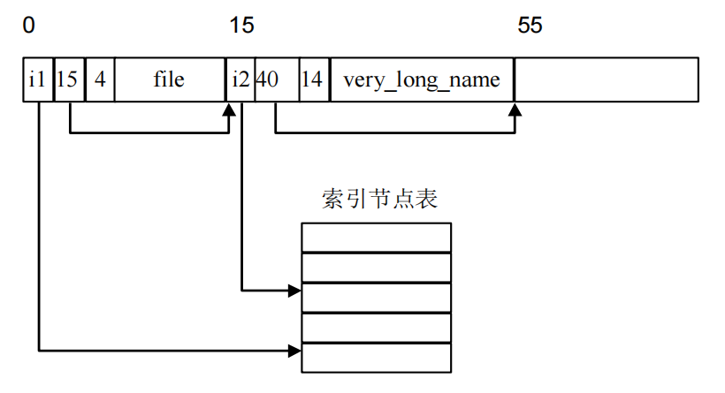
- 查找过程
  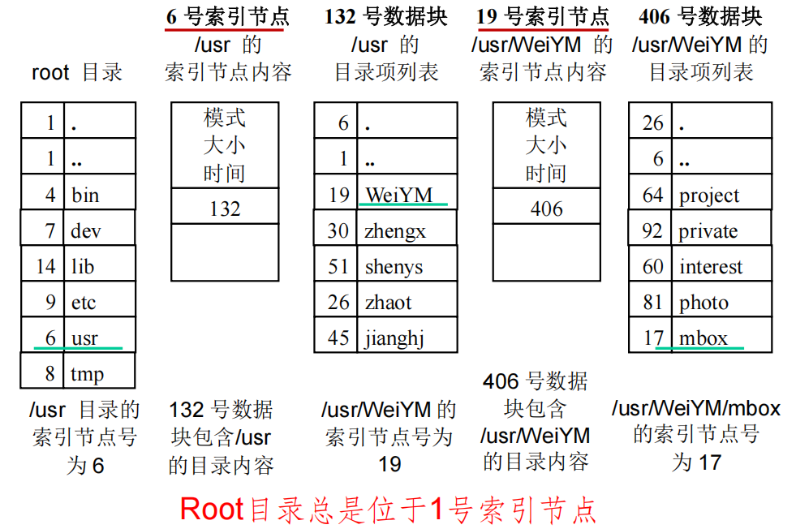

### 10.4. 虚拟文件系统（VFS）

#### 10.4.1. 作用
- 提供文件系统无关的接口，屏蔽不同底层文件系统的差异

#### 10.4.2. VFS超级块（super_block）
- 设备标识符
- mounted指针（指向挂载文件系统第一个inode）
- covered指针（指向挂载点所在目录的inode）
- 数据块大小
- 超块操作集
- 文件系统类型
- 文件系统特殊信息

#### 10.4.3. VFS inode（vnode）
- 设备标识符 + inode编号（全局唯一）
- 模式（类型+权限）
- 用户标识符
- 时间戳
- 块大小
- inode操作集
- 引用计数、锁定标志、脏标志
- 文件系统特殊信息

#### 10.4.4. VFS支持的文件类型
- VREG（常规文件）
- VDIR（目录）
- VBLK（块设备）
- VCHR（字符设备）

### 11. 文件系统的注册与挂载

#### 11.1. 注册
- 内核维护`file_systems`链表，存储已注册的`file_system_type`

#### 11.2. 挂载过程
1. 根据文件系统名称搜索链表，若未找到则尝试加载模块
2. 检查物理块设备是否已挂载
3. 查找挂载点的VFS inode，确保该点未挂载其他文件系统
4. 分配VFS超级块，调用文件系统的超块读取例程
5. 将文件系统信息映射到VFS超级块

那就这样结束了，说句实话，到后面基本上纯概念了，如果只是想拿个高分，与其考虑专门记笔记不如多刷往年题拟合一下选择和判断题（当然要是想深究就没必要看我这个笔记了，耽误时间）。由于本人并非OS大佬而且对这个知识点也不感冒，就不深入写了，如有补充，欢迎评论留言

完结撒花！！